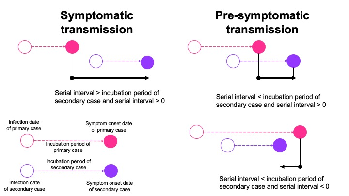

:::::::::::::::::::::::::::::::::::::: questions 
 
- ¿Cómo responder ante un brote de una enfermedad desconocida?

::::::::::::::::::::::::::::::::::::::::::::::::

::::::::::::::::::::::::::::::::::::: objectives

Al final de este taller usted podrá: 
 
- Comprender los conceptos clave de las distribuciones de rezagos epidemiológicos para la Enfermedad X. 
 
- Comprender las estructuras de datos y las herramientas para el análisis de datos de rastreo de contactos. 
 
- Aprender a ajustar las estimaciones del intervalo serial y el período de incubación de la Enfermedad X teniendo en cuenta la censura por intervalo utilizando un marco de trabajo Bayesiano.
 
- Aprender a utilizar estos parámetros para informar estrategias de control en un brote de un patógeno desconocido. 
::::::::::::::::::::::::::::::::::::::::::::::::


## 1. Introducción

La Enfermedad X representa un hipotético, pero plausible, brote de una enfermedad infecciosa en el futuro. Este término fue acuñado por la Organización Mundial de la Salud (OMS) y sirve como un término general para un patógeno desconocido que podría causar una epidemia grave a nivel internacional. Este concepto representa la naturaleza impredecible de la aparición de enfermedades infecciosas y resalta la necesidad de una preparación global y mecanismos de respuesta rápida. La Enfermedad X simboliza el potencial de una enfermedad inesperada y de rápida propagación, y resalta la necesidad de sistemas de salud flexibles y adaptables, así como capacidades de investigación para identificar, comprender y combatir patógenos desconocidos.

En esta práctica, va a aprender a estimar los rezagos epidemiológicos, el tiempo entre dos eventos epidemiológicos, utilizando un conjunto de datos simulado de la Enfermedad X.

La Enfermedad X es causada por un patógeno desconocido y se transmite directamente de persona a persona. Específicamente, la practica se centrará en estimar el período de incubación y el intervalo serial.


## 2. Agenda

Parte 1. Individual o en grupo.

Parte 2. En grupos de 6 personas. Construir estrategia de rastreo de contactos  y aislamiento y preparar presentación de máximo 10 mins.


## 3. Conceptos claves

#### **3.1. Rezagos epidemiológicos: Período de incubación e intervalo serial**

En epidemiología, las distribuciones de rezagos se refieren a los *retrasos temporales* entre dos eventos clave durante un brote. Por ejemplo: el tiempo entre el inicio de los síntomas y el diagnóstico, el tiempo entre la aparición de síntomas y la muerte, entre muchos otros.

Este taller se enfocará en dos rezagos clave conocidos como el período de incubación y el intervalo serial. Ambos son cruciales para informar la respuesta de salud pública.

El [**período de incubación**]{.underline} es el tiempo entre la infección y la aparición de síntomas.

El [**intervalo serial**]{.underline} es el tiempo entre la aparición de síntomas entre el caso primario y secundario.

La relación entre estos parámetros tiene un impacto en si la enfermedad se transmite antes [(**transmisión pre-sintomática**)]{.underline} o después de que los síntomas [(**transmisión sintomática**)]{.underline} se hayan desarrollado en el caso primario (Figura 1). 



Figura 1. Relación entre el período de incubación y el intervalo serial en el momento de la transmisión (*Adaptado de Nishiura et al. 2020)*

#### 3.2. Distribuciones comunes de rezagos y posibles sesgos

##### **3.2.1 Sesgos potenciales**

Cuando se estiman rezagos epidemiológicos, es importante considerar posibles sesgos:


[**Censura**]{.underline} significa que sabemos que un evento ocurrió, pero no sabemos exactamente cuándo sucedió. La mayoría de los datos epidemiológicos están "doblemente censurados" debido a la incertidumbre que rodea tanto los tiempos de eventos primarios como secundarios. No tener en cuenta la censura puede llevar a estimaciones sesgadas de la desviación estándar del resago (Park et al. en progreso).


[**Truncamiento a la derecha**]{.underline} es un tipo de sesgo de muestreo relacionado con el proceso de recolección de datos. Surge porque solo se pueden observar los casos que han sido reportados. No tener en cuenta el truncamiento a la derecha durante la fase de crecimiento de una epidemia puede llevar a una subestimación del rezago medio (Park et al. en progreso).


El sesgo [**dinámico (o de fase epidémica**)]{.underline} es otro tipo de sesgo de muestreo. Afecta a los datos retrospectivos y está relacionado con la fase de la epidemia: durante la fase de crecimiento exponencial, los casos que desarrollaron síntomas recientemente están sobrerrepresentados en los datos observados, mientras que durante la fase de declive, estos casos están subrepresentados, lo que lleva a la estimación de intervalos de retraso más cortos y más largos, respectivamente (Park et al. en progreso).

##### **3.2.2 Distribuciones de rezagos**

Tres distribuciones de probabilidad comunes utilizadas para caracterizar rezagos en epidemiología de enfermedades infecciosas (Tabla 1):

+----------------+-----------------------------------------+
| Distribución   | Parámetros                              |
+================+:=======================================:+
| **Weibull**    | `shape` y `scale`  (forma y escala)     |
+----------------+-----------------------------------------+
| **gamma**      | `shape` y `scale`  (forma y escala)     |
+----------------+-----------------------------------------+
| **log normal** | `log mean` y `log standard deviation`   |
|                |(media y desviación estándar logarítmica)|
+----------------+-----------------------------------------+

: Tabla 1. Tres de las distribuciones de probabilidad más comunes para rezagos epidemiológicos.


## 4. Paquetes de *R* para la practica

En esta practica se usarán los siguientes paquetes de `R`:

-   `dplyr` para manejo de datos 

-   `epicontacts` para visualizar los datos de rastreo de contactos 

-   `ggplot2` y `patchwork` para gráficar

-   `incidence` para visualizar curvas epidemicas

-   `rstan` para estimar el período de incubación

-   `coarseDataTools` vía `EpiEstim` para estimar el intervalo serial

Instrucciones de instalación para los paquetes: 


Para cargar los paquetes, escriba:


```r
library(dplyr)
library(epicontacts)
library(incidence)
library(coarseDataTools)
library(EpiEstim)
library(ggplot2)
library(loo)
library(patchwork)
library(rstan)
```

Para este taller, las autoras han creado algunas funciones que serán necesarias para el buen funcionamiento del mismo. Por favor, copie el siguiente texto, selecciónelo y ejecútelo para tener estas funciones en su ambiente global y poderlas utilizar. 


```r
## Calcule la verosimilitud DIC mediante integración
diclik <- function(par1, par2, EL, ER, SL, SR, dist){
	
	## Si la ventana de síntomas es mayor que la ventana de exposición
	if(SR-SL>ER-EL){
		dic1 <- integrate(fw1, lower=SL-ER, upper=SL-EL,
						  subdivisions=10,
						  par1=par1, par2=par2,
						  EL=EL, ER=ER, SL=SL, SR=SR,
						  dist=dist)$value
		if (dist == "W"){
			dic2 <- (ER-EL)*
				(pweibull(SR-ER, shape=par1, scale=par2) - pweibull(SL-EL, shape=par1, scale=par2))
		} else if (dist == "off1W"){
			dic2 <- (ER-EL)*
				(pweibullOff1(SR-ER, shape=par1, scale=par2) - pweibullOff1(SL-EL, shape=par1, scale=par2))
		} else if (dist == "G"){
			dic2 <- (ER-EL)*
				(pgamma(SR-ER, shape=par1, scale=par2) - pgamma(SL-EL, shape=par1, scale=par2))
		} else if (dist == "off1G"){
			dic2 <- (ER-EL)*
				(pgammaOff1(SR-ER, shape=par1, scale=par2) - pgammaOff1(SL-EL, shape=par1, scale=par2))
		} else if (dist == "L") {
			dic2 <- (ER-EL)*
				(plnorm(SR-ER, par1, par2) - plnorm(SL-EL, par1, par2))
		} else if (dist == "off1L") {
			dic2 <- (ER-EL)*
				(plnormOff1(SR-ER, par1, par2) - plnormOff1(SL-EL, par1, par2))
		} else {
			stop("distribution not supported")
		}
		dic3 <- integrate(fw3, lower=SR-ER, upper=SR-EL,
						  subdivisions=10,
						  par1=par1, par2=par2,
						  EL=EL, ER=ER, SL=SL, SR=SR,
						  dist=dist)$value
		return(dic1 + dic2 + dic3)
	}
	
## Si la ventana de exposición es mayor que la ventana de síntomas
	else{
		dic1 <- integrate(fw1, lower=SL-ER, upper=SR-ER, subdivisions=10,
						  par1=par1, par2=par2,
						  EL=EL, ER=ER, SL=SL, SR=SR,
						  dist=dist)$value
		if (dist == "W"){
			dic2 <- (SR-SL)*
				(pweibull(SL-EL, shape=par1, scale=par2) - pweibull(SR-ER, shape=par1, scale=par2))
		} else if (dist == "off1W"){
			dic2 <- (SR-SL)*
				(pweibullOff1(SL-EL, shape=par1, scale=par2) - pweibullOff1(SR-ER, shape=par1, scale=par2))
		} else if (dist == "G"){
			dic2 <- (SR-SL)*
				(pgamma(SL-EL, shape=par1, scale=par2) - pgamma(SR-ER, shape=par1, scale=par2))
		} else if (dist == "off1G"){
			dic2 <- (SR-SL)*
				(pgammaOff1(SL-EL, shape=par1, scale=par2) - pgammaOff1(SR-ER, shape=par1, scale=par2))
		} else if (dist == "L"){
			dic2 <- (SR-SL)*
				(plnorm(SL-EL, par1, par2) - plnorm(SR-ER, par1, par2))
		} else if (dist == "off1L"){
			dic2 <- (SR-SL)*
				(plnormOff1(SL-EL, par1, par2) - plnormOff1(SR-ER, par1, par2))
		} else {
			stop("distribution not supported")
		}
		dic3 <- integrate(fw3, lower=SL-EL, upper=SR-EL,
						  subdivisions=10,
						  par1=par1, par2=par2,
						  EL=EL, ER=ER, SL=SL, SR=SR,
						  dist=dist)$value
		return(dic1 + dic2 + dic3)
	}
}

## Esta verosimilitud DIC está diseñada para datos que tienen intervalos superpuestos
diclik2 <- function(par1, par2, EL, ER, SL, SR, dist){
	if(SL>ER) {
		
		return(diclik(par1, par2, EL, ER, SL, SR, dist))
	} else {
		
		lik1 <- integrate(diclik2.helper1, lower=EL, upper=SL,
						  SL=SL, SR=SR, par1=par1, par2=par2, dist=dist)$value
		lik2 <- integrate(diclik2.helper2, lower=SL, upper=ER,
						  SR=SR, par1=par1, par2=par2, dist=dist)$value
		return(lik1+lik2)
	}
}

## Funciones de verosimilitud para diclik2
diclik2.helper1 <- function(x, SL, SR, par1, par2, dist){
	if (dist =="W"){
		pweibull(SR-x, shape=par1, scale=par2) - pweibull(SL-x, shape=par1, scale=par2)
	} else if (dist =="off1W") {
		pweibullOff1(SR-x, shape=par1, scale=par2) - pweibullOff1(SL-x, shape=par1, scale=par2)
	} else if (dist =="G") {
		pgamma(SR-x, shape=par1, scale=par2) - pgamma(SL-x, shape=par1, scale=par2)
	} else if (dist=="off1G"){
		pgammaOff1(SR-x, shape=par1, scale=par2) - pgammaOff1(SL-x, shape=par1, scale=par2)
	} else if (dist == "L"){
		plnorm(SR-x, par1, par2) - plnorm(SL-x, par1, par2)
	} else if (dist == "off1L"){
		plnormOff1(SR-x, par1, par2) - plnormOff1(SL-x, par1, par2)
	} else {
		stop("distribution not supported")     
	}
}

diclik2.helper2 <- function(x, SR, par1, par2, dist){
	if (dist =="W"){
		pweibull(SR-x, shape=par1, scale=par2)
	} else if (dist =="off1W") {
		pweibullOff1(SR-x, shape=par1, scale=par2)
	} else if (dist =="G") {
		pgamma(SR-x, shape=par1, scale=par2)
	} else if (dist =="off1G") {
		pgammaOff1(SR-x, shape=par1, scale=par2)
	} else if (dist=="L"){
		plnorm(SR-x, par1, par2)
	} else if (dist=="off1L"){
		plnormOff1(SR-x, par1, par2)
	} else {
		stop("distribution not supported")     
	}
}


## Funciones que manipulan/calculan la verosimilitud para los datos censurados
## Las funciones codificadas aquí se toman directamente de las
## notas de verosimilitud censurada por intervalos dobles.
fw1 <- function(t, EL, ER, SL, SR, par1, par2, dist){
	## Función que calcula la primera función para la integral DIC
	if (dist=="W"){
		(ER-SL+t) * dweibull(x=t,shape=par1,scale=par2)
	} else if (dist=="off1W") {
		(ER-SL+t) * dweibullOff1(x=t,shape=par1,scale=par2)
	} else if (dist=="G") {
		(ER-SL+t) * dgamma(x=t, shape=par1, scale=par2)
	} else if (dist=="off1G") {
		(ER-SL+t) * dgammaOff1(x=t, shape=par1, scale=par2)
	} else if (dist =="L"){
		(ER-SL+t) * dlnorm(x=t, meanlog=par1, sdlog=par2)
	} else if (dist =="off1L"){
		(ER-SL+t) * dlnormOff1(x=t, meanlog=par1, sdlog=par2)
	} else {
		stop("distribution not supported")
	}
}

fw3 <- function(t, EL, ER, SL, SR, par1, par2, dist){
## Función que calcula la tercera función para la integral DIC
  if (dist == "W"){
		(SR-EL-t) * dweibull(x=t, shape=par1, scale=par2)
	} else if (dist == "off1W"){
		(SR-EL-t) * dweibullOff1(x=t, shape=par1, scale=par2)
	}  else if (dist == "G"){
		(SR-EL-t) * dgamma(x=t, shape=par1, scale=par2)
	}  else if (dist == "off1G"){
		(SR-EL-t) * dgammaOff1(x=t, shape=par1, scale=par2)
	} else if (dist == "L") {
		(SR-EL-t) * dlnorm(x=t, meanlog=par1, sdlog=par2)
	} else if (dist == "off1L"){
		(SR-EL-t) * dlnormOff1(x=t, meanlog=par1, sdlog=par2)
	} else {
		stop("distribution not supported")
	}
}
```

## 5. Datos

Esta práctica está partida en dos grupos para abordar dos enfermedades desconocidas con diferentes modos de transmisión.

Cargue los datos simulados que están guardados como un archivo .RDS, de acuerdo a su grupo asignado. Puede encontrar esta información en la carpeta [Enfermedad X](https://drive.google.com/drive/folders/1v8gMuEJx24ottM0VR4X_Ile60EV18ay3?usp=sharing). Descargue la carpeta, extráigala en el computador y abra el proyecto de R.

Hay dos elementos de interés:

-   `linelist`, un archivo que contiene una lista de casos de la Enfermedad X, un caso por fila. 

-   `contacts`,  un archivo con datos de rastreo de contactos que contiene información sobre pares de casos primarios y secundarios.


```r
# Grupo 2
dat <- readRDS("data/practical_data_group2.RDS")
linelist <- dat$linelist
contacts <- dat$contacts
```

## 6. Exploración de los datos

#### **6.1. Exploración de los datos en `linelist`**

Empiece con `linelist`. Estos datos fueron recolectados como parte de la vigilancia epidemiológica rutinaria. Cada fila representa un caso de la Enfermedad X, y hay 7 variables:

-   `id`: número único de identificación del caso

-   `date_onset`: fecha de inicio de los síntomas del paciente

-   `sex`: : M = masculino; F = femenino

-   `age`: edad del paciente en años

-   `exposure`: información sobre cómo el paciente podría haber estado expuesto

-   `exposure_start`: primera fecha en que el paciente estuvo expuesto

-   `exposure_end`: última fecha en que el paciente estuvo expuesto

::: {.alert .alert-secondary}
                                
 *💡 **Preguntas (1)***                                          
                                                                 
 -   *¿Cuántos casos hay en los datos de `linelist`?*             
                                                                 
 -   *¿Qué proporción de los casos son femeninos?*                  
                                                                 
 -   *¿Cuál es la distribución de edades de los casos?*                    
                                                                 
 -   *¿Qué tipo de información sobre la exposición está disponible?* 

:::


```r
# Inspecionar los datos
head(linelist)
```

```{.output}
  id date_onset sex age  exposure exposure_start exposure_end
1  1 2023-05-01   M   5 Breathing           <NA>         <NA>
2  2 2023-05-10   F  59 Breathing     2023-05-01   2023-05-01
3  3 2023-05-12   F   5 Breathing     2023-05-06   2023-05-06
4  4 2023-05-16   F   7 Breathing     2023-05-12   2023-05-12
5  5 2023-05-18   F   7 Breathing     2023-05-07   2023-05-07
6  6 2023-05-20   F  72 Breathing     2023-05-16   2023-05-16
```

```r
# P1
nrow(linelist)
```

```{.output}
[1] 128
```

```r
# P2
table(linelist$sex)[2]/nrow(linelist)
```

```{.output}
      M 
0.65625 
```

```r
# P3
summary(linelist$age)
```

```{.output}
   Min. 1st Qu.  Median    Mean 3rd Qu.    Max. 
   0.00    4.00   34.50   36.54   68.00   81.00 
```

```r
# P4
table(linelist$exposure, exclude = F)[1]/nrow(linelist)
```

```{.output}
Breathing 
 0.734375 
```

::: {.alert .alert-secondary}
   
 *💡 **Discusión***    
                     
- ¿Por qué cree que falta la información de exposición en algunos casos?       
                     
- Ahora, grafique la curva epidémica. ¿En qué parte del brote cree que está (principio, medio, final)? 

:::


```r
i <- incidence(linelist$date_onset)
plot(i) + 
  theme_classic() + 
  scale_fill_manual(values = "purple") +
  theme(legend.position = "none")
```


Parece que la epidemia todavía podría esta creciendo.

#### **6.2.  Exploración de los datos de `rastreo de contactos`**

Ahora vea los datos de rastreo de contactos, que se obtuvieron a través de entrevistas a los pacientes. A los pacientes se les preguntó sobre actividades e interacciones recientes para identificar posibles fuentes de infección. Se emparejaron pares de casos primarios y secundarios si el caso secundario nombraba al caso primario como un contacto. Solo hay información de un subconjunto de los casos porque no todos los pacientes pudieron ser contactados para una entrevista.

Note que para este ejercicio, se asumirá que los casos secundarios solo tenían un posible infectante. En realidad, la posibilidad de que un caso tenga múltiples posibles infectantes necesita ser evaluada.

Los datos de rastreo de contactos tienen 4 variables:

-   `primary_case_id`: número de identificación único para el caso primario (infectante)

-   `secondary_case_id`: número de identificación único para el caso secundario (infectado)

-   `primary_onset_date`: fecha de inicio de síntomas del caso primario

-   `secondary_onset_date`: fecha de inicio de síntomas del caso secundario


```r
x <- make_epicontacts(linelist = linelist,
                       contacts = contacts,
                       from = "primary_case_id",
                       to = "secondary_case_id",
                       directed = TRUE) # Esto indica que los contactos son directos (i.e., este gráfico traza una flecha desde los casos primarios a los secundarios)
```

```{.warning}
Warning in make_epicontacts(linelist = linelist, contacts = contacts, from =
"primary_case_id", : Cycle(s) detected in the contact network: this may be
unwanted
```

```r
plot(x)
```

<!--html_preserve--><div id="htmlwidget-75c83dac1afec25e936d" style="width:90%;height:700px;" class="visNetwork html-widget"></div>
<script type="application/json" data-for="htmlwidget-75c83dac1afec25e936d">{"x":{"nodes":{"id":[2,3,5,6,7,8,11,12,13,15,18,20,22,23,24,25,26,27,28,29,30,31,32,33,34,35,36,39,40,42,43,44,45,46,47,48,49,50,51,55,56,57,58,59,60,61,62,64,65,66,68,69,71,73,77,78,79,81,83,84,87,90,92,93,94,96,97,102,104,105,106,107,109,110,115,119,120,122,127],"date_onset":["2023-05-10","2023-05-12","2023-05-18","2023-05-20","2023-05-22","2023-05-22","2023-05-27","2023-05-30","2023-05-31","2023-06-05","2023-06-08","2023-06-09","2023-06-10","2023-06-10","2023-06-10","2023-06-11","2023-06-14","2023-06-14","2023-06-14","2023-06-14","2023-06-15","2023-06-15","2023-06-15","2023-06-16","2023-06-16","2023-06-16","2023-06-16","2023-06-17","2023-06-17","2023-06-18","2023-06-18","2023-06-18","2023-06-18","2023-06-18","2023-06-19","2023-06-20","2023-06-20","2023-06-20","2023-06-20","2023-06-21","2023-06-21","2023-06-22","2023-06-22","2023-06-22","2023-06-22","2023-06-22","2023-06-22","2023-06-23","2023-06-23","2023-06-23","2023-06-23","2023-06-23","2023-06-24","2023-06-24","2023-06-24","2023-06-24","2023-06-24","2023-06-25","2023-06-25","2023-06-25","2023-06-26","2023-06-26","2023-06-26","2023-06-27","2023-06-27","2023-06-27","2023-06-27","2023-06-28","2023-06-28","2023-06-28","2023-06-28","2023-06-29","2023-06-29","2023-06-29","2023-06-29","2023-06-30","2023-06-30","2023-06-30","2023-06-30"],"sex":["F","F","F","F","M","M","F","M","M","M","M","M","M","M","M","M","F","M","F","F","M","M","M","M","M","M","F","F","F","F","M","F","M","M","F","M","M","F","M","M","M","M","F","M","F","F","M","M","M","F","M","M","M","M","M","M","M","F","M","M","M","F","F","M","M","M","M","F","M","M","M","M","M","M","M","M","F","F","M"],"age":[59,5,7,72,6,3,4,76,4,71,2,67,74,7,65,5,3,4,74,3,6,76,2,64,6,1,71,63,67,71,6,67,8,0,66,70,73,5,66,77,75,62,4,63,63,70,70,2,4,6,2,0,5,66,69,2,3,4,4,5,5,66,5,78,64,73,66,5,2,2,61,4,64,67,70,71,66,68,69],"exposure":["Breathing","Breathing","Breathing","Breathing","Breathing",null,"Breathing","Breathing",null,null,null,"Breathing","Breathing","Breathing",null,"Breathing","Breathing","Breathing","Breathing","Breathing",null,null,"Breathing","Breathing","Breathing","Breathing",null,"Breathing","Breathing","Breathing","Breathing","Breathing","Breathing","Breathing","Breathing","Breathing","Breathing","Breathing","Breathing",null,null,null,"Breathing","Breathing","Breathing","Breathing","Breathing","Breathing",null,null,"Breathing","Breathing","Breathing",null,null,"Breathing","Breathing","Breathing","Breathing","Breathing","Breathing","Breathing",null,"Breathing","Breathing",null,null,"Breathing","Breathing","Breathing",null,"Breathing","Breathing","Breathing","Breathing",null,"Breathing","Breathing","Breathing"],"exposure_start":["2023-05-01","2023-05-06","2023-05-07","2023-05-16","2023-05-11","2023-05-19","2023-05-18","2023-05-24","2023-05-21","2023-05-26","2023-05-24","2023-06-03","2023-06-02","2023-06-02","2023-06-05","2023-06-02","2023-06-05","2023-06-08","2023-06-01","2023-06-02","2023-06-08","2023-06-10","2023-06-03","2023-06-10","2023-06-12","2023-06-07","2023-06-01","2023-06-10","2023-06-12","2023-06-05","2023-06-13","2023-06-16","2023-06-13","2023-06-08","2023-06-07","2023-06-11","2023-06-13","2023-06-14","2023-06-11",null,null,null,null,null,null,null,null,null,null,null,null,null,null,null,null,null,null,null,null,null,null,null,null,null,null,null,null,null,null,null,null,null,null,null,null,null,null,null,null],"exposure_end":["2023-05-01","2023-05-06","2023-05-07","2023-05-16","2023-05-11","2023-05-19","2023-05-18","2023-05-24","2023-05-21","2023-05-26","2023-05-25","2023-06-03","2023-06-02","2023-06-02","2023-06-05","2023-06-02","2023-06-07","2023-06-09","2023-06-01","2023-06-02","2023-06-08","2023-06-10","2023-06-03","2023-06-12","2023-06-12","2023-06-07","2023-06-01","2023-06-10","2023-06-12","2023-06-06","2023-06-14","2023-06-17","2023-06-13","2023-06-08","2023-06-09","2023-06-11","2023-06-13","2023-06-14","2023-06-11",null,null,null,null,null,null,null,null,null,null,null,null,null,null,null,null,null,null,null,null,null,null,null,null,null,null,null,null,null,null,null,null,null,null,null,null,null,null,null,null],"label":["2","3","5","6","7","8","11","12","13","15","18","20","22","23","24","25","26","27","28","29","30","31","32","33","34","35","36","39","40","42","43","44","45","46","47","48","49","50","51","55","56","57","58","59","60","61","62","64","65","66","68","69","71","73","77","78","79","81","83","84","87","90","92","93","94","96","97","102","104","105","106","107","109","110","115","119","120","122","127"],"title":["<p> id: 2<br>date_onset: 2023-05-10<br>sex: F<br>age: 59<br>exposure: Breathing<br>exposure_start: 2023-05-01<br>exposure_end: 2023-05-01 <\/p>","<p> id: 3<br>date_onset: 2023-05-12<br>sex: F<br>age: 5<br>exposure: Breathing<br>exposure_start: 2023-05-06<br>exposure_end: 2023-05-06 <\/p>","<p> id: 5<br>date_onset: 2023-05-18<br>sex: F<br>age: 7<br>exposure: Breathing<br>exposure_start: 2023-05-07<br>exposure_end: 2023-05-07 <\/p>","<p> id: 6<br>date_onset: 2023-05-20<br>sex: F<br>age: 72<br>exposure: Breathing<br>exposure_start: 2023-05-16<br>exposure_end: 2023-05-16 <\/p>","<p> id: 7<br>date_onset: 2023-05-22<br>sex: M<br>age: 6<br>exposure: Breathing<br>exposure_start: 2023-05-11<br>exposure_end: 2023-05-11 <\/p>","<p> id: 8<br>date_onset: 2023-05-22<br>sex: M<br>age: 3<br>exposure: NA<br>exposure_start: 2023-05-19<br>exposure_end: 2023-05-19 <\/p>","<p> id: 11<br>date_onset: 2023-05-27<br>sex: F<br>age: 4<br>exposure: Breathing<br>exposure_start: 2023-05-18<br>exposure_end: 2023-05-18 <\/p>","<p> id: 12<br>date_onset: 2023-05-30<br>sex: M<br>age: 76<br>exposure: Breathing<br>exposure_start: 2023-05-24<br>exposure_end: 2023-05-24 <\/p>","<p> id: 13<br>date_onset: 2023-05-31<br>sex: M<br>age: 4<br>exposure: NA<br>exposure_start: 2023-05-21<br>exposure_end: 2023-05-21 <\/p>","<p> id: 15<br>date_onset: 2023-06-05<br>sex: M<br>age: 71<br>exposure: NA<br>exposure_start: 2023-05-26<br>exposure_end: 2023-05-26 <\/p>","<p> id: 18<br>date_onset: 2023-06-08<br>sex: M<br>age: 2<br>exposure: NA<br>exposure_start: 2023-05-24<br>exposure_end: 2023-05-25 <\/p>","<p> id: 20<br>date_onset: 2023-06-09<br>sex: M<br>age: 67<br>exposure: Breathing<br>exposure_start: 2023-06-03<br>exposure_end: 2023-06-03 <\/p>","<p> id: 22<br>date_onset: 2023-06-10<br>sex: M<br>age: 74<br>exposure: Breathing<br>exposure_start: 2023-06-02<br>exposure_end: 2023-06-02 <\/p>","<p> id: 23<br>date_onset: 2023-06-10<br>sex: M<br>age: 7<br>exposure: Breathing<br>exposure_start: 2023-06-02<br>exposure_end: 2023-06-02 <\/p>","<p> id: 24<br>date_onset: 2023-06-10<br>sex: M<br>age: 65<br>exposure: NA<br>exposure_start: 2023-06-05<br>exposure_end: 2023-06-05 <\/p>","<p> id: 25<br>date_onset: 2023-06-11<br>sex: M<br>age: 5<br>exposure: Breathing<br>exposure_start: 2023-06-02<br>exposure_end: 2023-06-02 <\/p>","<p> id: 26<br>date_onset: 2023-06-14<br>sex: F<br>age: 3<br>exposure: Breathing<br>exposure_start: 2023-06-05<br>exposure_end: 2023-06-07 <\/p>","<p> id: 27<br>date_onset: 2023-06-14<br>sex: M<br>age: 4<br>exposure: Breathing<br>exposure_start: 2023-06-08<br>exposure_end: 2023-06-09 <\/p>","<p> id: 28<br>date_onset: 2023-06-14<br>sex: F<br>age: 74<br>exposure: Breathing<br>exposure_start: 2023-06-01<br>exposure_end: 2023-06-01 <\/p>","<p> id: 29<br>date_onset: 2023-06-14<br>sex: F<br>age: 3<br>exposure: Breathing<br>exposure_start: 2023-06-02<br>exposure_end: 2023-06-02 <\/p>","<p> id: 30<br>date_onset: 2023-06-15<br>sex: M<br>age: 6<br>exposure: NA<br>exposure_start: 2023-06-08<br>exposure_end: 2023-06-08 <\/p>","<p> id: 31<br>date_onset: 2023-06-15<br>sex: M<br>age: 76<br>exposure: NA<br>exposure_start: 2023-06-10<br>exposure_end: 2023-06-10 <\/p>","<p> id: 32<br>date_onset: 2023-06-15<br>sex: M<br>age: 2<br>exposure: Breathing<br>exposure_start: 2023-06-03<br>exposure_end: 2023-06-03 <\/p>","<p> id: 33<br>date_onset: 2023-06-16<br>sex: M<br>age: 64<br>exposure: Breathing<br>exposure_start: 2023-06-10<br>exposure_end: 2023-06-12 <\/p>","<p> id: 34<br>date_onset: 2023-06-16<br>sex: M<br>age: 6<br>exposure: Breathing<br>exposure_start: 2023-06-12<br>exposure_end: 2023-06-12 <\/p>","<p> id: 35<br>date_onset: 2023-06-16<br>sex: M<br>age: 1<br>exposure: Breathing<br>exposure_start: 2023-06-07<br>exposure_end: 2023-06-07 <\/p>","<p> id: 36<br>date_onset: 2023-06-16<br>sex: F<br>age: 71<br>exposure: NA<br>exposure_start: 2023-06-01<br>exposure_end: 2023-06-01 <\/p>","<p> id: 39<br>date_onset: 2023-06-17<br>sex: F<br>age: 63<br>exposure: Breathing<br>exposure_start: 2023-06-10<br>exposure_end: 2023-06-10 <\/p>","<p> id: 40<br>date_onset: 2023-06-17<br>sex: F<br>age: 67<br>exposure: Breathing<br>exposure_start: 2023-06-12<br>exposure_end: 2023-06-12 <\/p>","<p> id: 42<br>date_onset: 2023-06-18<br>sex: F<br>age: 71<br>exposure: Breathing<br>exposure_start: 2023-06-05<br>exposure_end: 2023-06-06 <\/p>","<p> id: 43<br>date_onset: 2023-06-18<br>sex: M<br>age: 6<br>exposure: Breathing<br>exposure_start: 2023-06-13<br>exposure_end: 2023-06-14 <\/p>","<p> id: 44<br>date_onset: 2023-06-18<br>sex: F<br>age: 67<br>exposure: Breathing<br>exposure_start: 2023-06-16<br>exposure_end: 2023-06-17 <\/p>","<p> id: 45<br>date_onset: 2023-06-18<br>sex: M<br>age: 8<br>exposure: Breathing<br>exposure_start: 2023-06-13<br>exposure_end: 2023-06-13 <\/p>","<p> id: 46<br>date_onset: 2023-06-18<br>sex: M<br>age: 0<br>exposure: Breathing<br>exposure_start: 2023-06-08<br>exposure_end: 2023-06-08 <\/p>","<p> id: 47<br>date_onset: 2023-06-19<br>sex: F<br>age: 66<br>exposure: Breathing<br>exposure_start: 2023-06-07<br>exposure_end: 2023-06-09 <\/p>","<p> id: 48<br>date_onset: 2023-06-20<br>sex: M<br>age: 70<br>exposure: Breathing<br>exposure_start: 2023-06-11<br>exposure_end: 2023-06-11 <\/p>","<p> id: 49<br>date_onset: 2023-06-20<br>sex: M<br>age: 73<br>exposure: Breathing<br>exposure_start: 2023-06-13<br>exposure_end: 2023-06-13 <\/p>","<p> id: 50<br>date_onset: 2023-06-20<br>sex: F<br>age: 5<br>exposure: Breathing<br>exposure_start: 2023-06-14<br>exposure_end: 2023-06-14 <\/p>","<p> id: 51<br>date_onset: 2023-06-20<br>sex: M<br>age: 66<br>exposure: Breathing<br>exposure_start: 2023-06-11<br>exposure_end: 2023-06-11 <\/p>","<p> id: 55<br>date_onset: 2023-06-21<br>sex: M<br>age: 77<br>exposure: NA<br>exposure_start: NA<br>exposure_end: NA <\/p>","<p> id: 56<br>date_onset: 2023-06-21<br>sex: M<br>age: 75<br>exposure: NA<br>exposure_start: NA<br>exposure_end: NA <\/p>","<p> id: 57<br>date_onset: 2023-06-22<br>sex: M<br>age: 62<br>exposure: NA<br>exposure_start: NA<br>exposure_end: NA <\/p>","<p> id: 58<br>date_onset: 2023-06-22<br>sex: F<br>age: 4<br>exposure: Breathing<br>exposure_start: NA<br>exposure_end: NA <\/p>","<p> id: 59<br>date_onset: 2023-06-22<br>sex: M<br>age: 63<br>exposure: Breathing<br>exposure_start: NA<br>exposure_end: NA <\/p>","<p> id: 60<br>date_onset: 2023-06-22<br>sex: F<br>age: 63<br>exposure: Breathing<br>exposure_start: NA<br>exposure_end: NA <\/p>","<p> id: 61<br>date_onset: 2023-06-22<br>sex: F<br>age: 70<br>exposure: Breathing<br>exposure_start: NA<br>exposure_end: NA <\/p>","<p> id: 62<br>date_onset: 2023-06-22<br>sex: M<br>age: 70<br>exposure: Breathing<br>exposure_start: NA<br>exposure_end: NA <\/p>","<p> id: 64<br>date_onset: 2023-06-23<br>sex: M<br>age: 2<br>exposure: Breathing<br>exposure_start: NA<br>exposure_end: NA <\/p>","<p> id: 65<br>date_onset: 2023-06-23<br>sex: M<br>age: 4<br>exposure: NA<br>exposure_start: NA<br>exposure_end: NA <\/p>","<p> id: 66<br>date_onset: 2023-06-23<br>sex: F<br>age: 6<br>exposure: NA<br>exposure_start: NA<br>exposure_end: NA <\/p>","<p> id: 68<br>date_onset: 2023-06-23<br>sex: M<br>age: 2<br>exposure: Breathing<br>exposure_start: NA<br>exposure_end: NA <\/p>","<p> id: 69<br>date_onset: 2023-06-23<br>sex: M<br>age: 0<br>exposure: Breathing<br>exposure_start: NA<br>exposure_end: NA <\/p>","<p> id: 71<br>date_onset: 2023-06-24<br>sex: M<br>age: 5<br>exposure: Breathing<br>exposure_start: NA<br>exposure_end: NA <\/p>","<p> id: 73<br>date_onset: 2023-06-24<br>sex: M<br>age: 66<br>exposure: NA<br>exposure_start: NA<br>exposure_end: NA <\/p>","<p> id: 77<br>date_onset: 2023-06-24<br>sex: M<br>age: 69<br>exposure: NA<br>exposure_start: NA<br>exposure_end: NA <\/p>","<p> id: 78<br>date_onset: 2023-06-24<br>sex: M<br>age: 2<br>exposure: Breathing<br>exposure_start: NA<br>exposure_end: NA <\/p>","<p> id: 79<br>date_onset: 2023-06-24<br>sex: M<br>age: 3<br>exposure: Breathing<br>exposure_start: NA<br>exposure_end: NA <\/p>","<p> id: 81<br>date_onset: 2023-06-25<br>sex: F<br>age: 4<br>exposure: Breathing<br>exposure_start: NA<br>exposure_end: NA <\/p>","<p> id: 83<br>date_onset: 2023-06-25<br>sex: M<br>age: 4<br>exposure: Breathing<br>exposure_start: NA<br>exposure_end: NA <\/p>","<p> id: 84<br>date_onset: 2023-06-25<br>sex: M<br>age: 5<br>exposure: Breathing<br>exposure_start: NA<br>exposure_end: NA <\/p>","<p> id: 87<br>date_onset: 2023-06-26<br>sex: M<br>age: 5<br>exposure: Breathing<br>exposure_start: NA<br>exposure_end: NA <\/p>","<p> id: 90<br>date_onset: 2023-06-26<br>sex: F<br>age: 66<br>exposure: Breathing<br>exposure_start: NA<br>exposure_end: NA <\/p>","<p> id: 92<br>date_onset: 2023-06-26<br>sex: F<br>age: 5<br>exposure: NA<br>exposure_start: NA<br>exposure_end: NA <\/p>","<p> id: 93<br>date_onset: 2023-06-27<br>sex: M<br>age: 78<br>exposure: Breathing<br>exposure_start: NA<br>exposure_end: NA <\/p>","<p> id: 94<br>date_onset: 2023-06-27<br>sex: M<br>age: 64<br>exposure: Breathing<br>exposure_start: NA<br>exposure_end: NA <\/p>","<p> id: 96<br>date_onset: 2023-06-27<br>sex: M<br>age: 73<br>exposure: NA<br>exposure_start: NA<br>exposure_end: NA <\/p>","<p> id: 97<br>date_onset: 2023-06-27<br>sex: M<br>age: 66<br>exposure: NA<br>exposure_start: NA<br>exposure_end: NA <\/p>","<p> id: 102<br>date_onset: 2023-06-28<br>sex: F<br>age: 5<br>exposure: Breathing<br>exposure_start: NA<br>exposure_end: NA <\/p>","<p> id: 104<br>date_onset: 2023-06-28<br>sex: M<br>age: 2<br>exposure: Breathing<br>exposure_start: NA<br>exposure_end: NA <\/p>","<p> id: 105<br>date_onset: 2023-06-28<br>sex: M<br>age: 2<br>exposure: Breathing<br>exposure_start: NA<br>exposure_end: NA <\/p>","<p> id: 106<br>date_onset: 2023-06-28<br>sex: M<br>age: 61<br>exposure: NA<br>exposure_start: NA<br>exposure_end: NA <\/p>","<p> id: 107<br>date_onset: 2023-06-29<br>sex: M<br>age: 4<br>exposure: Breathing<br>exposure_start: NA<br>exposure_end: NA <\/p>","<p> id: 109<br>date_onset: 2023-06-29<br>sex: M<br>age: 64<br>exposure: Breathing<br>exposure_start: NA<br>exposure_end: NA <\/p>","<p> id: 110<br>date_onset: 2023-06-29<br>sex: M<br>age: 67<br>exposure: Breathing<br>exposure_start: NA<br>exposure_end: NA <\/p>","<p> id: 115<br>date_onset: 2023-06-29<br>sex: M<br>age: 70<br>exposure: Breathing<br>exposure_start: NA<br>exposure_end: NA <\/p>","<p> id: 119<br>date_onset: 2023-06-30<br>sex: M<br>age: 71<br>exposure: NA<br>exposure_start: NA<br>exposure_end: NA <\/p>","<p> id: 120<br>date_onset: 2023-06-30<br>sex: F<br>age: 66<br>exposure: Breathing<br>exposure_start: NA<br>exposure_end: NA <\/p>","<p> id: 122<br>date_onset: 2023-06-30<br>sex: F<br>age: 68<br>exposure: Breathing<br>exposure_start: NA<br>exposure_end: NA <\/p>","<p> id: 127<br>date_onset: 2023-06-30<br>sex: M<br>age: 69<br>exposure: Breathing<br>exposure_start: NA<br>exposure_end: NA <\/p>"],"color.highlight.background":["#CCDDFF","#C2DBF4","#B8DAEA","#AFD9E0","#A5D7D5","#9CD6CB","#92D5C1","#88D4B7","#7FD2AC","#7ED0A6","#8DCDA8","#9DC9A9","#ACC6AB","#BCC2AC","#CBBEAE","#DABBAF","#EAB7B1","#F9B4B2","#F8B1B4","#EDB0B5","#E3AEB7","#D8ACB8","#CEAABA","#C3A9BC","#B8A7BD","#AEA5BF","#A4A4C1","#AEA8AA","#B9AD94","#C3B17E","#CEB667","#D8BB51","#E3BF3B","#EDC425","#F8C80E","#FFCA04","#FFC513","#FFBF22","#FFBA31","#FFB540","#FFB04E","#FFAB5D","#FFA56C","#FFA07B","#FBA681","#F5B184","#EFBC87","#E9C78A","#E3D28D","#DDDD90","#D7E893","#D1F396","#CCFF99","#CEF39D","#D0E8A1","#D2DDA6","#D4D2AA","#D6C7AE","#D9BCB3","#DBB1B7","#DDA6BC","#E0A0BD","#E3A5B9","#E7ABB4","#EBB0B0","#EFB5AC","#F2BAA7","#F6BFA3","#FAC59E","#FDCA9A","#FBCC9C","#F5CCA3","#EFCCA9","#E9CCAF","#E4CCB4","#DECCBA","#D8CCC1","#D2CCC6","#CDCDCD"],"color.background":["#CCDDFF","#C2DBF4","#B8DAEA","#AFD9E0","#A5D7D5","#9CD6CB","#92D5C1","#88D4B7","#7FD2AC","#7ED0A6","#8DCDA8","#9DC9A9","#ACC6AB","#BCC2AC","#CBBEAE","#DABBAF","#EAB7B1","#F9B4B2","#F8B1B4","#EDB0B5","#E3AEB7","#D8ACB8","#CEAABA","#C3A9BC","#B8A7BD","#AEA5BF","#A4A4C1","#AEA8AA","#B9AD94","#C3B17E","#CEB667","#D8BB51","#E3BF3B","#EDC425","#F8C80E","#FFCA04","#FFC513","#FFBF22","#FFBA31","#FFB540","#FFB04E","#FFAB5D","#FFA56C","#FFA07B","#FBA681","#F5B184","#EFBC87","#E9C78A","#E3D28D","#DDDD90","#D7E893","#D1F396","#CCFF99","#CEF39D","#D0E8A1","#D2DDA6","#D4D2AA","#D6C7AE","#D9BCB3","#DBB1B7","#DDA6BC","#E0A0BD","#E3A5B9","#E7ABB4","#EBB0B0","#EFB5AC","#F2BAA7","#F6BFA3","#FAC59E","#FDCA9A","#FBCC9C","#F5CCA3","#EFCCA9","#E9CCAF","#E4CCB4","#DECCBA","#D8CCC1","#D2CCC6","#CDCDCD"],"color.highlight.border":["black","black","black","black","black","black","black","black","black","black","black","black","black","black","black","black","black","black","black","black","black","black","black","black","black","black","black","black","black","black","black","black","black","black","black","black","black","black","black","black","black","black","black","black","black","black","black","black","black","black","black","black","black","black","black","black","black","black","black","black","black","black","black","black","black","black","black","black","black","black","black","black","black","black","black","black","black","black","black"],"color.border":["black","black","black","black","black","black","black","black","black","black","black","black","black","black","black","black","black","black","black","black","black","black","black","black","black","black","black","black","black","black","black","black","black","black","black","black","black","black","black","black","black","black","black","black","black","black","black","black","black","black","black","black","black","black","black","black","black","black","black","black","black","black","black","black","black","black","black","black","black","black","black","black","black","black","black","black","black","black","black"],"size":[20,20,20,20,20,20,20,20,20,20,20,20,20,20,20,20,20,20,20,20,20,20,20,20,20,20,20,20,20,20,20,20,20,20,20,20,20,20,20,20,20,20,20,20,20,20,20,20,20,20,20,20,20,20,20,20,20,20,20,20,20,20,20,20,20,20,20,20,20,20,20,20,20,20,20,20,20,20,20],"borderWidth":[2,2,2,2,2,2,2,2,2,2,2,2,2,2,2,2,2,2,2,2,2,2,2,2,2,2,2,2,2,2,2,2,2,2,2,2,2,2,2,2,2,2,2,2,2,2,2,2,2,2,2,2,2,2,2,2,2,2,2,2,2,2,2,2,2,2,2,2,2,2,2,2,2,2,2,2,2,2,2]},"edges":{"from":[2,3,6,5,8,8,13,12,18,18,20,22,24,15,22,20,27,26,29,26,36,26,34,33,46,47,51,49,45,44,32,58,50,56,59,61,61,69,61,66,65,40,83,96,97,77,105,97,66,87,94,105,62],"to":[3,5,7,8,11,13,15,18,20,23,25,27,28,29,30,31,33,35,39,40,42,43,48,50,55,57,59,60,62,64,66,68,71,73,77,78,79,81,84,90,92,93,102,104,106,107,109,110,115,119,120,122,127],"primary_onset_date":["2023-05-10","2023-05-12","2023-05-20","2023-05-18","2023-05-22","2023-05-22","2023-05-31","2023-05-30","2023-06-08","2023-06-08","2023-06-09","2023-06-10","2023-06-10","2023-06-05","2023-06-10","2023-06-09","2023-06-14","2023-06-14","2023-06-14","2023-06-14","2023-06-16","2023-06-14","2023-06-16","2023-06-16","2023-06-18","2023-06-19","2023-06-20","2023-06-20","2023-06-18","2023-06-18","2023-06-15","2023-06-22","2023-06-20","2023-06-21","2023-06-22","2023-06-22","2023-06-22","2023-06-23","2023-06-22","2023-06-23","2023-06-23","2023-06-17","2023-06-25","2023-06-27","2023-06-27","2023-06-24","2023-06-28","2023-06-27","2023-06-23","2023-06-26","2023-06-27","2023-06-28","2023-06-22"],"secondary_onset_date":["2023-05-12","2023-05-18","2023-05-22","2023-05-22","2023-05-27","2023-05-31","2023-06-05","2023-06-08","2023-06-09","2023-06-10","2023-06-11","2023-06-14","2023-06-14","2023-06-14","2023-06-15","2023-06-15","2023-06-16","2023-06-16","2023-06-17","2023-06-17","2023-06-18","2023-06-18","2023-06-20","2023-06-20","2023-06-21","2023-06-22","2023-06-22","2023-06-22","2023-06-22","2023-06-23","2023-06-23","2023-06-23","2023-06-24","2023-06-24","2023-06-24","2023-06-24","2023-06-24","2023-06-25","2023-06-25","2023-06-26","2023-06-26","2023-06-27","2023-06-28","2023-06-28","2023-06-28","2023-06-29","2023-06-29","2023-06-29","2023-06-29","2023-06-30","2023-06-30","2023-06-30","2023-06-30"],"width":[3,3,3,3,3,3,3,3,3,3,3,3,3,3,3,3,3,3,3,3,3,3,3,3,3,3,3,3,3,3,3,3,3,3,3,3,3,3,3,3,3,3,3,3,3,3,3,3,3,3,3,3,3],"color":["black","black","black","black","black","black","black","black","black","black","black","black","black","black","black","black","black","black","black","black","black","black","black","black","black","black","black","black","black","black","black","black","black","black","black","black","black","black","black","black","black","black","black","black","black","black","black","black","black","black","black","black","black"],"arrows.to":[true,true,true,true,true,true,true,true,true,true,true,true,true,true,true,true,true,true,true,true,true,true,true,true,true,true,true,true,true,true,true,true,true,true,true,true,true,true,true,true,true,true,true,true,true,true,true,true,true,true,true,true,true]},"nodesToDataframe":true,"edgesToDataframe":true,"options":{"width":"100%","height":"100%","nodes":{"shape":"dot"},"manipulation":{"enabled":false},"interaction":{"zoomSpeed":1},"edges":{"arrows":{"to":{"scaleFactor":2}}},"physics":{"stabilization":false}},"groups":null,"width":"90%","height":"700px","idselection":{"enabled":false,"style":"width: 150px; height: 26px","useLabels":true,"main":"Select by id"},"byselection":{"enabled":true,"style":"width: 150px; height: 26px","multiple":false,"hideColor":"rgba(200,200,200,0.5)","highlight":false,"variable":"id","main":"Select by id","values":[2,3,5,6,7,8,11,12,13,15,18,20,22,23,24,25,26,27,28,29,30,31,32,33,34,35,36,39,40,42,43,44,45,46,47,48,49,50,51,55,56,57,58,59,60,61,62,64,65,66,68,69,71,73,77,78,79,81,83,84,87,90,92,93,94,96,97,102,104,105,106,107,109,110,115,119,120,122,127]},"main":null,"submain":null,"footer":null,"background":"rgba(0, 0, 0, 0)","tooltipStay":300,"tooltipStyle":"position: fixed;visibility:hidden;padding: 5px;white-space: nowrap;font-family: verdana;font-size:14px;font-color:#000000;background-color: #EEEEEE;-moz-border-radius: 3px;-webkit-border-radius: 3px;border-radius: 3px;border: 1px solid #000000;","legend":{"width":0.1,"useGroups":false,"position":"left","ncol":1,"stepX":100,"stepY":100,"zoom":false},"opts_manipulation":{"datacss":"table.legend_table {\n  font-size: 11px;\n  border-width:1px;\n  border-color:#d3d3d3;\n  border-style:solid;\n}\ntable.legend_table td {\n  border-width:1px;\n  border-color:#d3d3d3;\n  border-style:solid;\n  padding: 2px;\n}\ndiv.table_content {\n  width:80px;\n  text-align:center;\n}\ndiv.table_description {\n  width:100px;\n}\n\n.operation {\n  font-size:20px;\n}\n\n.network-popUp {\n  display:none;\n  z-index:299;\n  width:250px;\n  /*height:150px;*/\n  background-color: #f9f9f9;\n  border-style:solid;\n  border-width:1px;\n  border-color: #0d0d0d;\n  padding:10px;\n  text-align: center;\n  position:fixed;\n  top:50%;  \n  left:50%;  \n  margin:-100px 0 0 -100px;  \n\n}","addNodeCols":["id","label"],"editNodeCols":["id","label"],"tab_add_node":"<span id=\"addnode-operation\" class = \"operation\">node<\/span> <br><table style=\"margin:auto;\"><tr><td>id<\/td><td><input id=\"addnode-id\"  type= \"text\" value=\"new value\"><\/td><\/tr><tr><td>label<\/td><td><input id=\"addnode-label\"  type= \"text\" value=\"new value\"><\/td><\/tr><\/table><input type=\"button\" value=\"save\" id=\"addnode-saveButton\"><\/button><input type=\"button\" value=\"cancel\" id=\"addnode-cancelButton\"><\/button>","tab_edit_node":"<span id=\"editnode-operation\" class = \"operation\">node<\/span> <br><table style=\"margin:auto;\"><tr><td>id<\/td><td><input id=\"editnode-id\"  type= \"text\" value=\"new value\"><\/td><\/tr><tr><td>label<\/td><td><input id=\"editnode-label\"  type= \"text\" value=\"new value\"><\/td><\/tr><\/table><input type=\"button\" value=\"save\" id=\"editnode-saveButton\"><\/button><input type=\"button\" value=\"cancel\" id=\"editnode-cancelButton\"><\/button>"},"highlight":{"enabled":true,"hoverNearest":false,"degree":1,"algorithm":"all","hideColor":"rgba(200,200,200,1)","labelOnly":true},"collapse":{"enabled":true,"fit":false,"resetHighlight":true,"clusterOptions":null,"keepCoord":true,"labelSuffix":"(cluster)"},"iconsRedraw":true},"evals":[],"jsHooks":[]}</script><!--/html_preserve-->

::: {.alert .alert-secondary}
                                                                                
 *💡 **Preguntas (2)***                                                                                         
        
-   Describa los grupos (clusters).                                                                                     
-   ¿Ve algún evento potencial de superpropagación (donde un caso propaga el patógeno a muchos otros casos)? 

:::

# *`_______Pausa 1 _________`*

------------------------------------------------------------------------

## 7. Estimación del período de incubación 

Ahora, enfoquese en el período de incubación. Se utilizará los datos del `linelist` para esta parte. Se necesitan ambos el tiempo de inicio de sintomas y el timpo de la posible exposición. Note que en los datos hay dos fechas de exposición, una de inicio y una de final. Algunas veces la fecha exacta de exposición es desconocida y en su lugar se obtiene la ventana de exposición durante la entrevista.

::: {.alert .alert-secondary}
*💡 **Preguntas (3)***

-   ¿Para cuántos casos tiene datos tanto de la fecha de inicio de síntomas como de exposición?

-   Calcule las ventanas de exposición. ¿Cuántos casos tienen una única fecha de exposición?
:::


```r
ip <- filter(linelist, !is.na(exposure_start) &
               !is.na(exposure_end))
nrow(ip)
```

```{.output}
[1] 50
```

```r
ip$exposure_window <- as.numeric(ip$exposure_end - ip$exposure_start)

table(ip$exposure_window)
```

```{.output}

 0  1  2 
38  8  4 
```

### 7.1. Estimación naive del período de incubación

Empiece calculando una estimación naive del período de incubación.


```r
# Máximo tiempo de período de incubación
ip$max_ip <- ip$date_onset - ip$exposure_start
summary(as.numeric(ip$max_ip))
```

```{.output}
   Min. 1st Qu.  Median    Mean 3rd Qu.    Max. 
   1.00    6.00    8.00    8.16   10.00   15.00 
```

```r
# Mínimo tiempo de período de incubación
ip$min_ip <- ip$date_onset - ip$exposure_end
summary(as.numeric(ip$min_ip))
```

```{.output}
   Min. 1st Qu.  Median    Mean 3rd Qu.    Max. 
   1.00    5.25    7.00    7.84   10.00   15.00 
```

### 7.2. Censura estimada ajustada del período de incubación

Ahora, ajuste  tres distribuciones de probabilidad a los datos del período de incubación teniendo en cuenta la censura doble. Adapte un código de `stan` que fue publicado por Miura et al. durante el brote global de mpox de 2022. Este método no tiene en cuenta el truncamiento a la derecha ni el sesgo dinámico. 

Recuerde que el interés principal es considerar tres distribuciones de probabilidad: *Weibull*, *gamma* y *log normal* (Ver Tabla 1).

`Stan` es un programa de software que implementa el algoritmo Monte Carlo Hamiltoniano (HMC por su siglas en inglés de Hamiltonian Monte Carlo). HMC es un método de Monte Carlo de cadena de Markov (MCMC) para ajustar modelos complejos a datos utilizando estadísticas bayesianas.


#### **7.1.1. Corra el modelo en Stan**

Ajuste las tres distribuciones en este bloque de código.


```r
# Prepare los datos
earliest_exposure <- as.Date(min(ip$exposure_start))

ip <- ip |>
  mutate(date_onset = as.numeric(date_onset - earliest_exposure),
         exposure_start = as.numeric(exposure_start - earliest_exposure),
         exposure_end = as.numeric(exposure_end - earliest_exposure)) |>
  select(id, date_onset, exposure_start, exposure_end)

# Configure algunas opciones para ejecutar las cadenas MCMC en paralelo
# Ejecución de las cadenas MCMC en paralelo significa que se ejecutaran varias cadenas al mismo tiempo usando varios núcleos de su computador
options(mc.cores=parallel::detectCores())

input_data <- list(N = length(ip$exposure_start), # NNúmero de observaciones
              tStartExposure = ip$exposure_start,
              tEndExposure = ip$exposure_end,
              tSymptomOnset = ip$date_onset)

# tres distribuciones de probabilidad
distributions <- c("weibull", "gamma", "lognormal") 

# Código de Stan 
code <- sprintf("
  data{
    int<lower=1> N;
    vector[N] tStartExposure;
    vector[N] tEndExposure;
    vector[N] tSymptomOnset;
  }
  parameters{
    real<lower=0> par[2];
    vector<lower=0, upper=1>[N] uE;	// Uniform value for sampling between start and end exposure
  }
  transformed parameters{
    vector[N] tE; 	// infection moment
    tE = tStartExposure + uE .* (tEndExposure - tStartExposure);
  }
model{
    // Contribution to likelihood of incubation period
    target += %s_lpdf(tSymptomOnset -  tE  | par[1], par[2]);
  }
  generated quantities {
    // likelihood for calculation of looIC
    vector[N] log_lik;
    for (i in 1:N) {
      log_lik[i] = %s_lpdf(tSymptomOnset[i] -  tE[i]  | par[1], par[2]);
    }
  }
", distributions, distributions)
names(code) <- distributions

# La siguiente línea puede tomar ~1.5 min
models <- mapply(stan_model, model_code = code)

# Toma ~40 sec.
fit <- mapply(sampling, models, list(input_data), 
              iter=3000, # Número de iteraciones (largo de la cadena MCMC)
              warmup=1000, # Número de muestras a descartar al inicio de MCMC
              chain=4) # Número de cadenas MCMC a ejecutar

pos <- mapply(function(z) rstan::extract(z)$par, fit, SIMPLIFY=FALSE) # muestreo posterior 
```

#### **7.1.2. Revisar si hay convergencia**

Ahora verifique la convergencia del modelo. Observe los valores de r-hat, los tamaños de muestra efectivos y las trazas MCMC. R-hat compara las estimaciones entre y dentro de cadenas para los parámetros del modelo; valores cercanos a 1 indican que las cadenas se han mezclado bien (Vehtari et al. 2021). El tamaño de muestra efectivo estima el número de muestras independientes después de tener en cuenta la dependencia en las cadenas MCMC (Lambert 2018). Para un modelo con 4 cadenas MCMC, se recomienda un tamaño total de muestra efectiva de al menos 400 (Vehtari et al. 2021).

Para cada modelo con distribución ajustada:

::: {.alert .alert-secondary}
*💡 **Preguntas (4)***

-   ¿Los valores de r-hat son cercanos a 1?

-   ¿Las 4 cadenas MCMC generalmente se superponen y permanecen alrededor de los mismos valores (se ven como orugas peludas)?

:::

#### **7.1.2.1. Convergencia para Gamma**


```r
print(fit$gamma, digits = 3, pars = c("par[1]","par[2]")) 
```

```{.output}
Inference for Stan model: anon_model.
4 chains, each with iter=3000; warmup=1000; thin=1; 
post-warmup draws per chain=2000, total post-warmup draws=8000.

        mean se_mean    sd  2.5%   25%   50%   75% 97.5% n_eff  Rhat
par[1] 4.959   0.013 0.928 3.292 4.318 4.901 5.558 6.933  4916 1.001
par[2] 0.623   0.002 0.123 0.403 0.536 0.615 0.701 0.885  4973 1.001

Samples were drawn using NUTS(diag_e) at Tue Feb  6 01:57:25 2024.
For each parameter, n_eff is a crude measure of effective sample size,
and Rhat is the potential scale reduction factor on split chains (at 
convergence, Rhat=1).
```

```r
rstan::traceplot(fit$gamma, pars = c("par[1]","par[2]"))
```


#### **7.1.2.2. Convergencia para log normal**


```r
print(fit$lognormal, digits = 3, pars = c("par[1]","par[2]")) 
```

```{.output}
Inference for Stan model: anon_model.
4 chains, each with iter=3000; warmup=1000; thin=1; 
post-warmup draws per chain=2000, total post-warmup draws=8000.

        mean se_mean    sd  2.5%   25%   50%   75% 97.5% n_eff Rhat
par[1] 1.969   0.001 0.077 1.819 1.917 1.971 2.021 2.119 10560    1
par[2] 0.537   0.001 0.057 0.439 0.497 0.532 0.572 0.661  8821    1

Samples were drawn using NUTS(diag_e) at Tue Feb  6 01:57:31 2024.
For each parameter, n_eff is a crude measure of effective sample size,
and Rhat is the potential scale reduction factor on split chains (at 
convergence, Rhat=1).
```

```r
rstan::traceplot(fit$lognormal, pars = c("par[1]","par[2]")) 
```


#### **7.1.2.3. Convergencia para Weibull**


```r
print(fit$weibull, digits = 3, pars = c("par[1]","par[2]")) 
```

```{.output}
Inference for Stan model: anon_model.
4 chains, each with iter=3000; warmup=1000; thin=1; 
post-warmup draws per chain=2000, total post-warmup draws=8000.

        mean se_mean    sd  2.5%   25%   50%   75%  97.5% n_eff Rhat
par[1] 2.590   0.003 0.293 2.041 2.392 2.580 2.778  3.190 10768    1
par[2] 9.072   0.006 0.538 8.058 8.705 9.067 9.420 10.173  9512    1

Samples were drawn using NUTS(diag_e) at Tue Feb  6 01:57:19 2024.
For each parameter, n_eff is a crude measure of effective sample size,
and Rhat is the potential scale reduction factor on split chains (at 
convergence, Rhat=1).
```

```r
rstan::traceplot(fit$weibull, pars = c("par[1]","par[2]")) 
```


#### **7.1.3. Calcule los criterios de comparación de los modelos**

Calcule el criterio de información ampliamente aplicable (WAIC) y el criterio de información de dejar-uno-fuera (LOOIC) para comparar los ajustes de los modelos. El modelo con mejor ajuste es aquel con el WAIC o LOOIC más bajo. En esta sección también se resumirá las distribuciones y se hará algunos gráficos.

::: {.alert .alert-secondary}
*💡 **Preguntas (5)***

-   ¿Qué modelo tiene mejor ajuste?
:::

#### 


```r
# Calcule WAIC para los tres modelos
waic <- mapply(function(z) waic(extract_log_lik(z))$estimates[3,], fit)
waic
```

```{.output}
            weibull     gamma lognormal
Estimate 264.887271 269.98822 279.74057
SE         9.044278  12.03663  14.53144
```

```r
# Para looic, se necesita proveer los tamaños de muestra relativos
# al llamar a loo. Este paso lleva a mejores estimados de los tamaños de 
# muestra PSIS efectivos y del error de Monte Carlo 

# Extraer la verosimilitud puntual logarítmica para la distribución Weibull
loglik <- extract_log_lik(fit$weibull, merge_chains = FALSE)
# Obtener los tamaños de muestra relativos efectivos
r_eff <- relative_eff(exp(loglik), cores = 2)
# Calcula LOOIC
loo_w <- loo(loglik, r_eff = r_eff, cores = 2)$estimates[3,]
# Imprimir los resultados
loo_w[1]
```

```{.output}
Estimate 
  264.91 
```

```r
# Extraer la verosimilitud puntual logarítmica para la distribución gamma 
loglik <- extract_log_lik(fit$gamma, merge_chains = FALSE)
r_eff <- relative_eff(exp(loglik), cores = 2)
loo_g <- loo(loglik, r_eff = r_eff, cores = 2)$estimates[3,]
loo_g[1]
```

```{.output}
Estimate 
270.1291 
```

```r
# Extraer la verosimilitud puntual logarítmica para la distribución log normal 
loglik <- extract_log_lik(fit$lognormal, merge_chains = FALSE)
r_eff <- relative_eff(exp(loglik), cores = 2)
loo_l <- loo(loglik, r_eff = r_eff, cores = 2)$estimates[3,]
loo_l[1]
```

```{.output}
Estimate 
280.0494 
```

#### **7.1.4. Reporte los resultados**

La cola derecha de la distribución del período de incubación es importante para diseñar estrategias de control (por ejemplo, cuarentena), los percentiles del 25 al 75 informan sobre el momento más probable en que podría ocurrir la aparición de síntomas, y la distribución completa puede usarse como una entrada en modelos matemáticos o estadísticos, como para pronósticos (Lessler et al. 2009).

Obtenga las estadísticas resumidas.


```r
# Necesitamos convertir los parámetros de las distribuciones a la media y desviación estándar del rezago

# En Stan, los parámetros de las distribuciones son:
# Weibull: forma y escala
# Gamma: forma e inversa de la escala (aka rate)
# Log Normal: mu y sigma
# Referencia: https://mc-stan.org/docs/2_21/functions-reference/positive-continuous-distributions.html

# Calcule las medias
means <- cbind(
  pos$weibull[, 2] * gamma(1 + 1 / pos$weibull[, 1]), # media de Weibull
  pos$gamma[, 1] / pos$gamma[, 2], # media de gamma
  exp(pos$lognormal[, 1] + pos$lognormal[, 2]^2 / 2) # media de log normal
)

# Calcule las desviaciones estándar
standard_deviations <- cbind(
  sqrt(pos$weibull[, 2]^2 * (gamma(1 + 2 / pos$weibull[, 1]) - (gamma(1 + 1 / pos$weibull[, 1]))^2)),
  sqrt(pos$gamma[, 1] / (pos$gamma[, 2]^2)),
  sqrt((exp(pos$lognormal[, 2]^2) - 1) * (exp(2 * pos$lognormal[, 1] + pos$lognormal[, 2]^2)))
)

# Imprimir los rezagos medios e intervalos creíbles del 95%
probs <- c(0.025, 0.5, 0.975)

res_means <- apply(means, 2, quantile, probs)
colnames(res_means) <- colnames(waic) 
res_means
```

```{.output}
       weibull    gamma lognormal
2.5%  7.145038 7.045619  7.126776
50%   8.058864 7.974494  8.272215
97.5% 9.053505 9.091407  9.822863
```

```r
res_sds <- apply(standard_deviations, 2, quantile, probs)
colnames(res_sds) <- colnames(waic) 
res_sds
```

```{.output}
       weibull    gamma lognormal
2.5%  2.803945 2.930911  3.548811
50%   3.339177 3.597242  4.717500
97.5% 4.138248 4.598181  6.875713
```

```r
# Informe la mediana e intervalos creíbles del 95% para los cuantiles de cada distribución

quantiles_to_report <- c(0.025, 0.05, 0.5, 0.95, 0.975, 0.99)

# Weibull
cens_w_percentiles <- sapply(quantiles_to_report, function(p) quantile(qweibull(p = p, shape = pos$weibull[,1], scale = pos$weibull[,2]), probs = probs))
colnames(cens_w_percentiles) <- quantiles_to_report
print(cens_w_percentiles)
```

```{.output}
         0.025     0.05      0.5     0.95    0.975     0.99
2.5%  1.415413 1.994896 6.867348 12.41392 13.36283 14.43677
50%   2.179124 2.865882 7.867872 13.85795 15.02381 16.36956
97.5% 3.029472 3.783727 8.883503 15.99624 17.56909 19.46594
```

```r
# Gamma
cens_g_percentiles <- sapply(quantiles_to_report, function(p) quantile(qgamma(p = p, shape = pos$gamma[,1], rate = pos$gamma[,2]), probs = probs))
colnames(cens_g_percentiles) <- quantiles_to_report
print(cens_g_percentiles)
```

```{.output}
         0.025     0.05      0.5     0.95    0.975     0.99
2.5%  1.762368 2.274217 6.531511 12.70603 14.12544 15.85698
50%   2.558984 3.107902 7.437829 14.66686 16.42085 18.61916
97.5% 3.287101 3.864910 8.459961 17.44363 19.78446 22.73699
```

```r
# Log normal
cens_ln_percentiles <- sapply(quantiles_to_report, function(p) quantile(qlnorm(p = p, meanlog = pos$lognormal[,1], sdlog= pos$lognormal[,2]), probs = probs))
colnames(cens_ln_percentiles) <- quantiles_to_report
print(cens_ln_percentiles)
```

```{.output}
         0.025     0.05      0.5     0.95    0.975     0.99
2.5%  1.857022 2.267587 6.165228 14.03391 16.22996 19.25586
50%   2.526191 2.988046 7.175237 17.20275 20.32658 24.70323
97.5% 3.169201 3.664470 8.320280 22.53320 27.57000 34.90694
```

Para cada modelo, encuentre estos elementos para el período de incubación estimado en la salida de arriba y escribalos abajo.

-   Media e intervalo de credibilidad del 95%

-   Desviación estándar e intervalo de credibilidad del 95%

-   Percentiles (e.g., 2.5, 5, 25, 50, 75, 95, 97.5, 99)

-   Los parámetros de las distribuciones ajustadas (e.g., shape y scale para distribución gamma)

#### **7.1.5. Grafique los resultados**


```r
# Prepare los resultados para graficarlos
df <- data.frame(
#Tome los valores de las medias para trazar la función de densidad acumulatica empirica
  inc_day = ((input_data$tSymptomOnset-input_data$tEndExposure)+(input_data$tSymptomOnset-input_data$tStartExposure))/2
)

x_plot <- seq(0, 30, by=0.1) # Esto configura el rango del eje x (número de días)

Gam_plot <- as.data.frame(list(dose= x_plot, 
                               pred= sapply(x_plot, function(q) quantile(pgamma(q = q, shape = pos$gamma[,1], rate = pos$gamma[,2]), probs = c(0.5))),
                               low = sapply(x_plot, function(q) quantile(pgamma(q = q, shape = pos$gamma[,1], rate = pos$gamma[,2]), probs = c(0.025))),
                               upp = sapply(x_plot, function(q) quantile(pgamma(q = q, shape = pos$gamma[,1], rate = pos$gamma[,2]), probs = c(0.975)))
))

Wei_plot <- as.data.frame(list(dose= x_plot, 
                               pred= sapply(x_plot, function(q) quantile(pweibull(q = q, shape = pos$weibull[,1], scale = pos$weibull[,2]), probs = c(0.5))),
                               low = sapply(x_plot, function(q) quantile(pweibull(q = q, shape = pos$weibull[,1], scale = pos$weibull[,2]), probs = c(0.025))),
                               upp = sapply(x_plot, function(q) quantile(pweibull(q = q, shape = pos$weibull[,1], scale = pos$weibull[,2]), probs = c(0.975)))
))

ln_plot <- as.data.frame(list(dose= x_plot, 
                              pred= sapply(x_plot, function(q) quantile(plnorm(q = q, meanlog = pos$lognormal[,1], sdlog= pos$lognormal[,2]), probs = c(0.5))),
                              low = sapply(x_plot, function(q) quantile(plnorm(q = q, meanlog = pos$lognormal[,1], sdlog= pos$lognormal[,2]), probs = c(0.025))),
                              upp = sapply(x_plot, function(q) quantile(plnorm(q = q, meanlog = pos$lognormal[,1], sdlog= pos$lognormal[,2]), probs = c(0.975)))
))

# Grafique las curvas de la distribución acumulada 
gamma_ggplot <- ggplot(df, aes(x=inc_day)) +
  stat_ecdf(geom = "step")+ 
  xlim(c(0, 30))+
  geom_line(data=Gam_plot, aes(x=x_plot, y=pred), color=RColorBrewer::brewer.pal(11, "RdBu")[11], linewidth=1) +
  geom_ribbon(data=Gam_plot, aes(x=x_plot,ymin=low,ymax=upp), fill = RColorBrewer::brewer.pal(11, "RdBu")[11], alpha=0.1) +
  theme_bw(base_size = 11)+
  labs(x="Incubation period (days)", y = "Proportion")+
  ggtitle("Gamma")

weibul_ggplot <- ggplot(df, aes(x=inc_day)) +
  stat_ecdf(geom = "step")+ 
  xlim(c(0, 30))+
  geom_line(data=Wei_plot, aes(x=x_plot, y=pred), color=RColorBrewer::brewer.pal(11, "RdBu")[11], linewidth=1) +
  geom_ribbon(data=Wei_plot, aes(x=x_plot,ymin=low,ymax=upp), fill = RColorBrewer::brewer.pal(11, "RdBu")[11], alpha=0.1) +
  theme_bw(base_size = 11)+
  labs(x="Incubation period (days)", y = "Proportion")+
  ggtitle("Weibull")

lognorm_ggplot <- ggplot(df, aes(x=inc_day)) +
  stat_ecdf(geom = "step")+ 
  xlim(c(0, 30))+
  geom_line(data=ln_plot, aes(x=x_plot, y=pred), color=RColorBrewer::brewer.pal(11, "RdBu")[11], linewidth=1) +
  geom_ribbon(data=ln_plot, aes(x=x_plot,ymin=low,ymax=upp), fill = RColorBrewer::brewer.pal(11, "RdBu")[11], alpha=0.1) +
  theme_bw(base_size = 11)+
  labs(x="Incubation period (days)", y = "Proportion")+
  ggtitle("Log normal")

(lognorm_ggplot|gamma_ggplot|weibul_ggplot) + plot_annotation(tag_levels = 'A') 
```


En los gráficos anteriores, la línea negra es la distribución acumulativa empírica (los datos), mientras que la curva azul es la distribución de probabilidad ajustada con los intervalos de credibilidad del 95%. Asegúrese de que la curva azul esté sobre la línea negra.


::: {.alert .alert-secondary}
*💡 **Preguntas (6)***

-   ¿Son los ajustes de las distribuciones lo que espera?
:::

#### 

# *`_______Pausa 2 _________`*

## 8. Estimación del intervalo serial 

Ahora, estime el intervalo serial. Nuevamente, se realizará primero una estimación navie calculando la diferencia entre la fecha de inicio de síntomas entre el par de casos primario y secundario. 

1.  ¿Existen casos con intervalos seriales negativos en los datos (por ejemplo, el inicio de los síntomas en el caso secundario ocurrió antes del inicio de los síntomas en el caso primario)?

2.  Informe la mediana del intervalo serial, así como el mínimo y el máximo.

3.  Grafique la distribución del intervalo serial.

### 8.1. Estimación naive 


```r
contacts$diff <- as.numeric(contacts$secondary_onset_date - contacts$primary_onset_date)
summary(contacts$diff)
```

```{.output}
   Min. 1st Qu.  Median    Mean 3rd Qu.    Max. 
  1.000   2.000   3.000   3.717   5.000  10.000 
```

```r
hist(contacts$diff, xlab = "Serial interval (days)", breaks = 25, main = "", col = "pink")
```


### 8.2. Estimación ajustada por censura

Ahora se estimará el intervalo serial utilizando una implementación del paquete `courseDataTools` dentro del paquete R `EpiEstim`. Este método tiene en cuenta la censura doble y permite comparar diferentes distribuciones de probabilidad, pero no se ajusta por truncamiento a la derecha o sesgo dinámico.

Se considerará tres distribuciones de probabilidad y deberá seleccionar la que mejor se ajuste a los datos utilizando WAIC o LOOIC. Recuerde que la distribución con mejor ajuste tendrá el WAIC o LOOIC más bajo.

Ten en cuenta que en `coarseDataTools`, los parámetros para las distribuciones son ligeramente diferentes que en rstan. Aquí, los parámetros para la distribución gamma son shape y scale (forma y escala) (<https://cran.r-project.org/web/packages/coarseDataTools/coarseDataTools.pdf>).

Solo se ejecutará una cadena MCMC para cada distribución en interés del tiempo, pero en la práctica debería ejecutar más de una cadena para asegurarse de que el MCMC converge en la distribución objetivo. Usará las distribuciones a priori predeterminadas, que se pueden encontrar en la documentación del paquete (ver 'detalles' para la función dic.fit.mcmc aquí:
 (<https://cran.r-project.org/web/packages/coarseDataTools/coarseDataTools.pdf>).

#### 8.2.1. Preparación de los datos


```r
# Formatee los datos de intervalos censurados del intervalo serial

# Cada línea representa un evento de transmisión
# EL/ER muestran el límite inferior/superior de la fecha de inicio de los síntomas en el caso primario (infector)
# SL/SR muestran lo mismo para el caso secundario (infectado)
# type tiene entradas 0 que corresponden a datos censurados doblemente por intervalo
# (ver Reich et al. Statist. Med. 2009)


si_data <- contacts |>
  select(-primary_case_id, -secondary_case_id, -primary_onset_date, -secondary_onset_date,) |>
  rename(SL = diff) |>
  mutate(type = 0, EL = 0, ER = 1, SR = SL + 1) |>
  select(EL, ER, SL, SR, type)
```

#### 8.2.2. Ajuste una distribución gamma para el SI

Primero, ajuste una distribución gamma al intervalo serial.


```r
overall_seed <- 3 # semilla para el generador de números aleatorios para MCMC
MCMC_seed <- 007

# Ejecutaremos el modelo durante 4000 iteraciones con las primeras 1000 muestras descartadas como burning
n_mcmc_samples <- 3000 # número de muestras a extraer de la posterior (después del burning)

params = list(
  dist = "G", # Ajuste de una distribución Gamma para el Intervalo Serial (SI)
  method = "MCMC", # MCMC usando coarsedatatools
  burnin = 1000, # número de muestras de burning (muestras descartadas al comienzo de MCMC) 
  n1 = 50, # n1 es el número de pares de media y desviación estándar del SI que se extraen
  n2 = 50) # n2 es el tamaño de la muestra posterior extraída para cada par de media y desviación estándar del SI


mcmc_control <- make_mcmc_control(
seed = MCMC_seed,
burnin = params$burnin)

dist <- params$dist

config <- make_config(
list(
si_parametric_distr = dist,
mcmc_control = mcmc_control,
seed = overall_seed,
n1 = params$n1,
n2 = params$n2))

# Ajuste el SI
si_fit_gamma <- coarseDataTools::dic.fit.mcmc(
dat = si_data,
dist = dist,
init.pars = init_mcmc_params(si_data, dist),
burnin = mcmc_control$burnin,
n.samples = n_mcmc_samples,
seed = mcmc_control$seed)
```

```{.output}
Running 4000 MCMC iterations 
MCMCmetrop1R iteration 1 of 4000 
function value = -111.23595
theta = 
   0.97585
   0.33706
Metropolis acceptance rate = 0.00000

MCMCmetrop1R iteration 1001 of 4000 
function value = -111.40012
theta = 
   0.94710
   0.38251
Metropolis acceptance rate = 0.56244

MCMCmetrop1R iteration 2001 of 4000 
function value = -111.35806
theta = 
   1.00559
   0.24014
Metropolis acceptance rate = 0.56822

MCMCmetrop1R iteration 3001 of 4000 
function value = -111.05888
theta = 
   1.24687
   0.07129
Metropolis acceptance rate = 0.55382


@@@@@@@@@@@@@@@@@@@@@@@@@@@@@@@@@@@@@@@@@@@@@@@@@@@@@@@@@
The Metropolis acceptance rate was 0.55450
@@@@@@@@@@@@@@@@@@@@@@@@@@@@@@@@@@@@@@@@@@@@@@@@@@@@@@@@@
```

Ahora observe los resultados.


```r
# Verificar convergencia de las cadenas MCMC 
converg_diag_gamma <- check_cdt_samples_convergence(si_fit_gamma@samples)
```

```{.output}

Gelman-Rubin MCMC convergence diagnostic was successful.
```

```r
converg_diag_gamma
```

```{.output}
[1] TRUE
```


```r
# Guardar las muestras MCMC en un dataframe
si_samples_gamma <- data.frame(
type = 'Symptom onset',
shape = si_fit_gamma@samples$var1,
scale = si_fit_gamma@samples$var2,
p50 = qgamma(
p = 0.5, 
shape = si_fit_gamma@samples$var1, 
scale = si_fit_gamma@samples$var2)) |>
mutate( # La ecuación de conversión se encuentra aquí: https://en.wikipedia.org/wiki/Gamma_distribution
mean = shape*scale,
sd = sqrt(shape*scale^2)
) 

# Obtener la media, desviación estándar y 95% CrI

si_summary_gamma <- 
  si_samples_gamma %>%
summarise(
mean_mean = quantile(mean,probs=.5),
mean_l_ci = quantile(mean,probs=.025),
mean_u_ci = quantile(mean,probs=.975),
sd_mean = quantile(sd, probs=.5),
sd_l_ci = quantile(sd,probs=.025),
sd_u_ci = quantile(sd,probs=.975)
)
si_summary_gamma
```

```{.output}
  mean_mean mean_l_ci mean_u_ci  sd_mean  sd_l_ci sd_u_ci
1  3.738845  3.172504  4.443017 2.113928 1.710506 2.81809
```


```r
# Obtenga las mismas estadísticas de resumen para los parámetros de la distribución
si_samples_gamma |>
summarise(
shape_mean = quantile(shape, probs=.5),
shape_l_ci = quantile(shape, probs=.025),
shape_u_ci = quantile(shape, probs=.975),
scale_mean = quantile(scale, probs=.5),
scale_l_ci = quantile(scale, probs=.025),
scale_u_ci = quantile(scale, probs=.975)
)
```


```r
# Necesita esto para hacer gráficos más tarde
gamma_shape <- si_fit_gamma@ests['shape',][1]
gamma_rate <- 1 / si_fit_gamma@ests['scale',][1]
```

#### 8.2.3. Ajuste de una distribución log normal para el intervalo serial

Ahora, ajuste una distribución log normal a los datos del intervalo serial.


```r
# Ejecute el modelo durante 4000 iteraciones, descartando las primeras 1000 muestras como burning
n_mcmc_samples <- 3000 # número de muestras a extraer de la posterior (después del burning)

params = list(
  dist = "L", # Ajustando una distribución log-normal para el Intervalo Serial (SI)
  method = "MCMC", # MCMC usando coarsedatatools
  burnin = 1000, # número de muestras de burning (muestras descartadas al comienzo de MCMC) 
  n1 = 50, # n1 es el número de pares de media y desviación estándar de SI que se extraen
  n2 = 50) # n2 es el tamaño de la muestra posterior extraída para cada par de media y desviación estándar de SI


mcmc_control <- make_mcmc_control(
seed = MCMC_seed,
burnin = params$burnin)

dist <- params$dist

config <- make_config(
list(
si_parametric_distr = dist,
mcmc_control = mcmc_control,
seed = overall_seed,
n1 = params$n1,
n2 = params$n2))

# Ajuste del intervalo serial
si_fit_lnorm <- coarseDataTools::dic.fit.mcmc(
dat = si_data,
dist = dist,
init.pars = init_mcmc_params(si_data, dist),
burnin = mcmc_control$burnin,
n.samples = n_mcmc_samples,
seed = mcmc_control$seed)
```

```{.output}
Running 4000 MCMC iterations 
MCMCmetrop1R iteration 1 of 4000 
function value = -124.47163
theta = 
   1.15301
  -0.57001
Metropolis acceptance rate = 0.00000

MCMCmetrop1R iteration 1001 of 4000 
function value = -124.65099
theta = 
   1.11123
  -0.50103
Metropolis acceptance rate = 0.55944

MCMCmetrop1R iteration 2001 of 4000 
function value = -124.62101
theta = 
   1.10651
  -0.57518
Metropolis acceptance rate = 0.56322

MCMCmetrop1R iteration 3001 of 4000 
function value = -124.52928
theta = 
   1.11807
  -0.53964
Metropolis acceptance rate = 0.55315


@@@@@@@@@@@@@@@@@@@@@@@@@@@@@@@@@@@@@@@@@@@@@@@@@@@@@@@@@
The Metropolis acceptance rate was 0.55675
@@@@@@@@@@@@@@@@@@@@@@@@@@@@@@@@@@@@@@@@@@@@@@@@@@@@@@@@@
```

Revise los resultados.


```r
# Revise la convergencia de las cadenas MCMC 
converg_diag_lnorm <- check_cdt_samples_convergence(si_fit_lnorm@samples)
```

```{.output}

Gelman-Rubin MCMC convergence diagnostic was successful.
```

```r
converg_diag_lnorm
```

```{.output}
[1] TRUE
```


```r
# Guarde las muestras de MCMC en un dataframe
si_samples_lnorm <- data.frame(
type = 'Symptom onset',
meanlog = si_fit_lnorm@samples$var1,
sdlog = si_fit_lnorm@samples$var2,
p50 = qlnorm(
p = 0.5, 
meanlog = si_fit_lnorm@samples$var1, 
sdlog = si_fit_lnorm@samples$var2)) |>
mutate( # La ecuación para la conversión está aquí https://en.wikipedia.org/wiki/Log-normal_distribution
mean = exp(meanlog + (sdlog^2/2)), 
sd = sqrt((exp(sdlog^2)-1) * (exp(2*meanlog + sdlog^2)))
)
```


```r
# Obtenga la media, desviación estándar e intervalo de credibilidad del 95% 
si_summary_lnorm <- 
  si_samples_lnorm %>%
summarise(
mean_mean = quantile(mean,probs=.5),
mean_l_ci = quantile(mean,probs=.025),
mean_u_ci = quantile(mean,probs=.975),
sd_mean = quantile(sd, probs=.5),
sd_l_ci = quantile(sd,probs=.025),
sd_u_ci = quantile(sd,probs=.975)
)
si_summary_lnorm
```

```{.output}
  mean_mean mean_l_ci mean_u_ci  sd_mean  sd_l_ci sd_u_ci
1  3.793359  3.240027  4.580169 2.435338 1.798801 3.68492
```


```r
# Obtenga las estadísticas resumen para los parámetros de la distribución
si_samples_lnorm |>
summarise(
meanlog_mean = quantile(meanlog, probs=.5),
meanlog_l_ci = quantile(meanlog, probs=.025),
meanlog_u_ci = quantile(meanlog, probs=.975),
sdlog_mean = quantile(sdlog, probs=.5),
sdlog_l_ci = quantile(sdlog, probs=.025),
sdlog_u_ci = quantile(sdlog, probs=.975)
)
```

```{.output}
  meanlog_mean meanlog_l_ci meanlog_u_ci sdlog_mean sdlog_l_ci sdlog_u_ci
1     1.158491      0.99676     1.321946   0.588786  0.4841528  0.7375097
```


```r
lognorm_meanlog <- si_fit_lnorm@ests['meanlog',][1]
lognorm_sdlog <- si_fit_lnorm@ests['sdlog',][1]
```

#### 8.2.4. Ajuste de una distribución Weibull para el intervalo serial

Finalmente, ajuste de una distribución Weibull para los datos del intervalo serial.


```r
# Ejecutaremos el modelo durante 4000 iteraciones, descartando las primeras 1000 muestras como burning
n_mcmc_samples <- 3000 # número de muestras a extraer de la posterior (después del burning)

params = list(
  dist = "W", # Ajustando una distribución Weibull para el Intervalo Serial (SI)
  method = "MCMC", # MCMC usando coarsedatatools
  burnin = 1000, # número de muestras de burning (muestras descartadas al comienzo de MCMC) 
  n1 = 50, # n1 es el número de pares de media y desviación estándar de SI que se extraen
  n2 = 50) # n2 es el tamaño de la muestra posterior extraída para cada par de media y desviación estándar de SI

mcmc_control <- make_mcmc_control(
seed = MCMC_seed,
burnin = params$burnin)

dist <- params$dist

config <- make_config(
list(
si_parametric_distr = dist,
mcmc_control = mcmc_control,
seed = overall_seed,
n1 = params$n1,
n2 = params$n2))

# Ajuste el intervalo serial 
si_fit_weibull <- coarseDataTools::dic.fit.mcmc(
dat = si_data,
dist = dist,
init.pars = init_mcmc_params(si_data, dist),
burnin = mcmc_control$burnin,
n.samples = n_mcmc_samples,
seed = mcmc_control$seed)
```

Revise los resultados.


```r
# Revise covengencia
converg_diag_weibull <- check_cdt_samples_convergence(si_fit_weibull@samples)
```

```{.output}

Gelman-Rubin MCMC convergence diagnostic was successful.
```

```r
converg_diag_weibull
```

```{.output}
[1] TRUE
```


```r
# Guarde las muestra MCMC en un dataframe
si_samples_weibull <- data.frame(
type = 'Symptom onset',
shape = si_fit_weibull@samples$var1,
scale = si_fit_weibull@samples$var2,
p50 = qweibull(
p = 0.5, 
shape = si_fit_weibull@samples$var1, 
scale = si_fit_weibull@samples$var2)) |>
mutate( # La ecuación para conversión está aquí https://en.wikipedia.org/wiki/Weibull_distribution
mean = scale*gamma(1+1/shape),
sd = sqrt(scale^2*(gamma(1+2/shape)-(gamma(1+1/shape))^2))
)
```


```r
# Obtenga las estadísticas resumen
si_summary_weibull <- 
  si_samples_weibull %>%
summarise(
mean_mean = quantile(mean,probs=.5),
mean_l_ci = quantile(mean,probs=.025),
mean_u_ci = quantile(mean,probs=.975),
sd_mean = quantile(sd, probs=.5),
sd_l_ci = quantile(sd,probs=.025),
sd_u_ci = quantile(sd,probs=.975)
)
si_summary_weibull
```

```{.output}
  mean_mean mean_l_ci mean_u_ci  sd_mean  sd_l_ci  sd_u_ci
1  3.757238  3.140149  4.499024 2.196696 1.822893 2.911148
```


```r
# Obtenga las estadísticas resumen para los parámetros de la distribución.
si_samples_weibull |>
summarise(
shape_mean = quantile(shape, probs=.5),
shape_l_ci = quantile(shape, probs=.025),
shape_u_ci = quantile(shape, probs=.975),
scale_mean = quantile(scale, probs=.5),
scale_l_ci = quantile(scale, probs=.025),
scale_u_ci = quantile(scale, probs=.975)
)
```

```{.output}
  shape_mean shape_l_ci shape_u_ci scale_mean scale_l_ci scale_u_ci
1   1.746377   1.370014   2.136543   4.205609   3.510558   5.033811
```


```r
weibull_shape <- si_fit_weibull@ests['shape',][1]
weibull_scale <- si_fit_weibull@ests['scale',][1]
```

#### 8.2.5. Grafique los resultados para el intervalo serial

Ahora, grafique el ajuste de las tres distribuciones. Asegúrese que la distribución ajuste bien los datos del intervalo serial.


```r
ggplot()+
	theme_classic()+
	geom_bar(data = contacts, aes(x=diff), fill = "#FFAD05") +
	scale_y_continuous(limits = c(0,14), breaks = c(0,2,4,6,8,10,12,14), expand = c(0,0)) +
	stat_function(
		linewidth=.8,
		fun = function(z, shape, rate)(dgamma(z, shape, rate) * length(contacts$diff)),
		args = list(shape = gamma_shape, rate = gamma_rate),
		aes(linetype  = 'Gamma')
	) +
	stat_function(
		linewidth=.8,
		fun = function(z, meanlog, sdlog)(dlnorm(z, meanlog, sdlog) * length(contacts$diff)),
		args = list(meanlog = lognorm_meanlog, sdlog = lognorm_sdlog),
		aes(linetype ='Log normal')
	) +
	stat_function(
		linewidth=.8,
		fun = function(z, shape, scale)(dweibull(z, shape, scale) * length(contacts$diff)),
		args = list(shape = weibull_shape, scale = weibull_scale),
		aes(linetype ='Weibull')
	) +
	scale_linetype_manual(values = c('solid','twodash','dotted')) +
	labs(x = "Days", y = "Number of case pairs") + 
	theme(
		legend.position = c(0.75, 0.75),
		plot.margin = margin(.2,5.2,.2,.2, "cm"),
		legend.title = element_blank(),
	) 
```

```{.warning}
Warning: Removed 1 rows containing missing values (`geom_bar()`).
```


Ahora calcule el WAIC y LOOIC. `coarseDataTools` no tiene una forma integrada de hacer esto, por lo que se necesita calcular la verosimilitud a partir de las cadenas MCMC y utilizar el paquete `loo` en R.


```r
# Cargue las funciones de verosimilitud de coarseDataTools
calc_looic_waic <- function(symp, symp_si, dist){
# Prepare los datos y parámetros para el paquete loo
# Se necesita: una matriz de tamaño S por N, donde S es el tamaño de la muestra posterior (con todas las cadenas fusionadas)
# y N es el número de puntos de datos

  
  mat <- matrix(NA, nrow = length(symp_si@samples$var1), ncol = nrow(si_data)) 
  
for (i in 1:nrow(symp)) {
  for (j in 1:length(symp_si@samples$var1)){
    L <- diclik2(par1 = symp_si@samples$var1[j],
                 par2 = symp_si@samples$var2[j], 
                 EL = symp$EL[i], ER = symp$ER[i], SL = symp$SL[i], SR = symp$SR[i], 
                 dist = dist)
    mat[j,i] <- L
  }
}
  return(list(waic = waic(log(mat)),
              looic = loo(log(mat)))) # now we have to take the log to get log likelihood

}

compare_gamma <- calc_looic_waic(symp = si_data, symp_si = si_fit_gamma, dist = "G")
compare_lnorm <- calc_looic_waic(symp = si_data, symp_si = si_fit_lnorm, dist = "L")
compare_weibull <- calc_looic_waic(symp = si_data, symp_si = si_fit_weibull, dist = "W")

# Imprima resultados
compare_gamma[["waic"]]$estimates
```

```{.output}
             Estimate         SE
elpd_waic -111.811222  6.0132834
p_waic       1.815109  0.3574362
waic       223.622445 12.0265669
```

```r
compare_lnorm[["waic"]]$estimates
```

```{.output}
             Estimate         SE
elpd_waic -110.587639  6.1404111
p_waic       1.557061  0.2554848
waic       221.175278 12.2808221
```

```r
compare_weibull[["waic"]]$estimates
```

```{.output}
             Estimate         SE
elpd_waic -113.501071  5.5285344
p_waic       1.740995  0.4026191
waic       227.002141 11.0570687
```

```r
compare_gamma[["looic"]]$estimates
```

```{.output}
            Estimate         SE
elpd_loo -111.815455  6.0154899
p_loo       1.819342  0.3599221
looic     223.630910 12.0309798
```

```r
compare_lnorm[["looic"]]$estimates
```

```{.output}
            Estimate         SE
elpd_loo -110.589464  6.1405675
p_loo       1.558886  0.2558582
looic     221.178929 12.2811350
```

```r
compare_weibull[["looic"]]$estimates
```

```{.output}
            Estimate         SE
elpd_loo -113.513181  5.5335946
p_loo       1.753106  0.4083724
looic     227.026363 11.0671891
```

Incluya lo siguiente cuando reporte el intervalo serial:

-   Media e intervalo de credibilidad del 95% 

-   Desviación estándar y e intervalo de credibilidad del 95% 

-   Los parámetros de la distribución ajustada (e.g., shape y scale para distribución gamma)

::: {.alert .alert-secondary}
*💡 **Preguntas (7)***

-   ¿Qué distribución tiene el menor WAIC y LOOIC??
:::


```r
si_summary_gamma
```

```{.output}
  mean_mean mean_l_ci mean_u_ci  sd_mean  sd_l_ci sd_u_ci
1  3.738845  3.172504  4.443017 2.113928 1.710506 2.81809
```

```r
si_summary_lnorm
```

```{.output}
  mean_mean mean_l_ci mean_u_ci  sd_mean  sd_l_ci sd_u_ci
1  3.793359  3.240027  4.580169 2.435338 1.798801 3.68492
```

```r
si_summary_weibull
```

```{.output}
  mean_mean mean_l_ci mean_u_ci  sd_mean  sd_l_ci  sd_u_ci
1  3.757238  3.140149  4.499024 2.196696 1.822893 2.911148
```

# *`_______Pausa 3 _________`*

## 9. Medidas de control 

### 9.1 Analicemos el resultado juntos

::: {.alert .alert-secondary}
Ahora ha finalizado el análisis estadístico 🥳

-   Compare el período de incubación y el intervalo serial.

-   ¿Cuál es más largo?

-   ¿Ocurre la transmisión pre-sintomática con la Enfermedad X? 

<!-- -->

-   ¿Serán medidas efectivas aislar a los individuos sintomáticos y rastrear y poner en cuarentena a sus contactos?

-   Si no lo son, ¿qué otras medidas se pueden implementar para frenar el brote?

:::

### 9.2 Diseño de una estrategía de rastreo de contactos

Basado en los rezagos estimados así como la demografía de los casos, diseñe una estrategia de rastreo de contactos para el brote, incluyendo un plan de comunicaciones (Pista: piense sobre la logística).

## 10. Valores verdaderos

Los valores verdaderos usados para simular las epidemías fueron:

+---------------+:---------------:+:-------------:+:-------------------------:+
|               | Distribución    | Media (días)   | Desviación estándar (días) |
+---------------+-----------------+---------------+---------------------------+
| Grupo 1       | Log normal      | 5.7           | 4.6                       |
+---------------+-----------------+---------------+---------------------------+
| Grupo 2       | Weibull         | 7.1           | 3.7                       |
+---------------+-----------------+---------------+---------------------------+

: Tabla 2. Valores verdaderos del ***período de incubación.***

+--------------+:---------------:+:------------:+:-------------------------:+
|              | Distribución    | Media (días)  | Desviación estándar (días) |
+--------------+-----------------+--------------+---------------------------+
| Group 1      | Gamma           | 8.4          | 4.9                       |
+--------------+-----------------+--------------+---------------------------+
| Group 2      | Gamma           | 4.8          | 3.3                       |
+--------------+-----------------+--------------+---------------------------+

: Tabla 3. Valores verdaderos del ***intervalo serial***.

¿Cómo se comparan sus estimaciones con los valores verdaderos? Discuta las posibles razones para las diferencias.

::::::::::::::::::::::::::::::::::::: keypoints 

Revise si al final de esta lección adquirió estas competencias:


- Comprender los conceptos clave de las distribuciones de retrasos epidemiológicos para la Enfermedad X.

- Entender las estructuras de datos y las herramientas para el análisis de datos de rastreo de contactos.

- Aprender cómo ajustar las estimaciones del intervalo serial y del período de incubación de la Enfermedad X teniendo en cuenta la censura por intervalo usando un marco de trabajo Bayesiano.

- Aprender a utilizar estos parámetros para informar estrategias de control en un brote de un patógeno desconocido.

::::::::::::::::::::::::::::::::::::::::::::::::

## 11. Recursos adicionales 

En este práctica, en gran medida se ignoraron los sesgos de truncamiento a la derecha y sesgo dinámico, en parte debido a la falta de herramientas fácilmente disponibles que implementen las mejores prácticas. Para aprender más sobre cómo estos sesgos podrían afectar la estimación de las distribuciones de retraso epidemiológico en tiempo real, recomendamos un tutorial sobre el paquete `dynamicaltruncation` en R de Sam Abbott y Sang Woo Park (<https://github.com/parksw3/epidist-paper>).

## 12. Contribuidores

Kelly Charniga, Zachary Madewell, Zulma M. Cucunubá


## 13. Referencias

1.  Reich NG et al. Estimating incubation period distributions with coarse data. Stat Med. 2009;28:2769--84. PubMed <https://doi.org/10.1002/sim.3659>
2.  Miura F et al. Estimated incubation period for monkeypox cases confirmed in the Netherlands, May 2022. Euro Surveill. 2022;27(24):pii=2200448. <https://doi.org/10.2807/1560-7917.ES.2022.27.24.2200448>
3.  Abbott S, Park Sang W. Adjusting for common biases in infectious disease data when estimating distributions. 2022 [cited 7 November 2023]. <https://github.com/parksw3/dynamicaltruncation>
4.  Lessler J et al. Incubation periods of acute respiratory viral infections: a systematic review, The Lancet Infectious Diseases. 2009;9(5):291-300. [https://doi.org/10.1016/S1473-3099(09)70069-6](https://doi.org/10.1016/S1473-3099(09)70069-6){.uri}.
5.  Cori A et al. Estimate Time Varying Reproduction Numbers from Epidemic Curves. 2022 [cited 7 November 2023]. <https://github.com/mrc-ide/EpiEstim>
6.  Lambert B. A Student's Guide to Bayesian Statistics. Los Angeles, London, New Delhi, Singapore, Washington DC, Melbourne: SAGE, 2018.
7.  Vehtari A et al. Rank-normalization, folding, and localization: An improved R-hat for assessing convergence of MCMC. Bayesian Analysis 2021: Advance publication 1-28. <https://doi.org/10.1214/20-BA1221>
8.  Nishiura H et al. Serial interval of novel coronavirus (COVID-19) infections. Int J Infect Dis. 2020;93:284-286. <https://doi.org/10.1016/j.ijid.2020.02.060>
