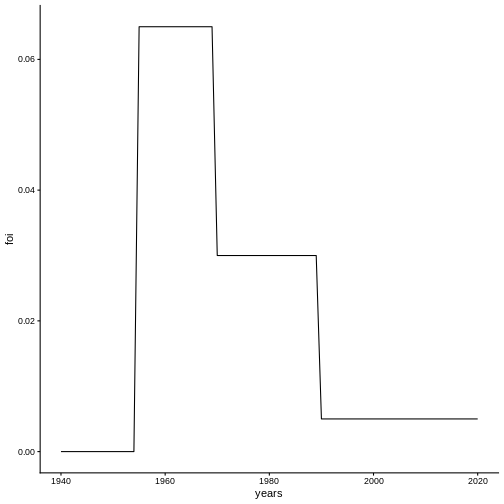
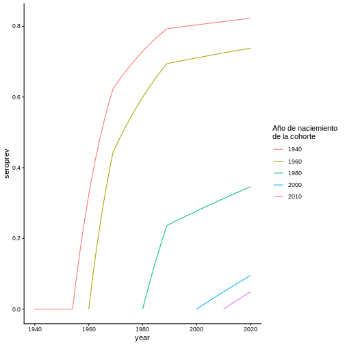
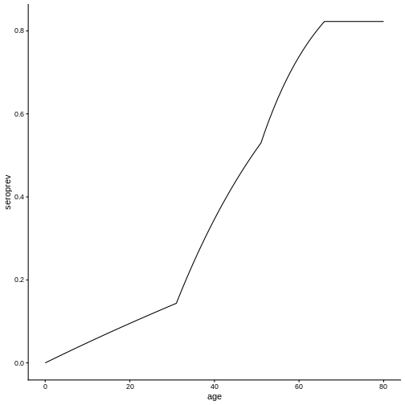
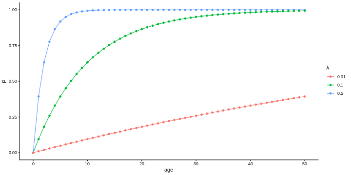
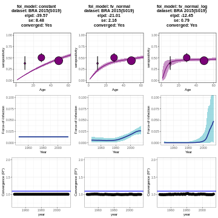
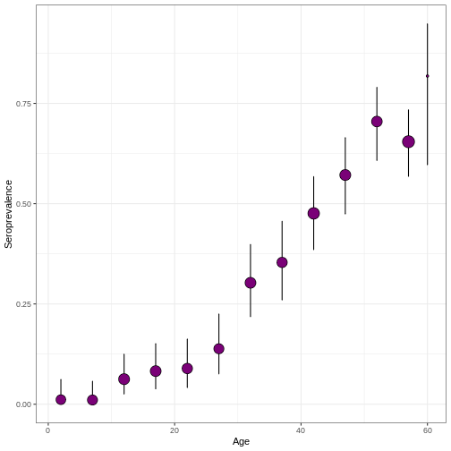
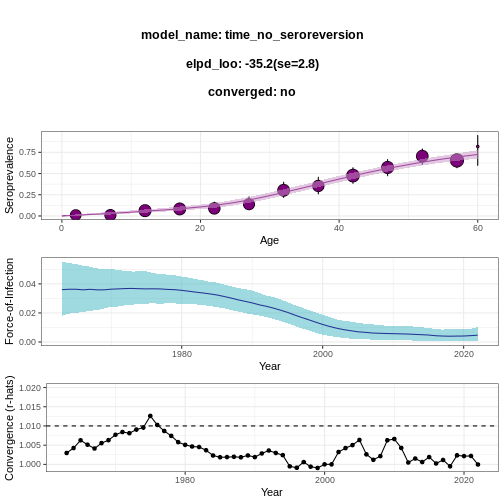

:::::::::::::::::::::::::::::::::::::: questions

- ¿Cómo estimar retrospectivamente la *Fuerza de Infección* de un patógeno a partir de *encuestas serológicas poblacionales de prevalencia desagregadas por edad* mediante la implementación de *modelos Bayesianos* usando **serofoi**?

::::::::::::::::::::::::::::::::::::::::::::::::

::::::::::::::::::::::::::::::::::::: objectives

Al final de este taller usted podrá:

- Explorar y analizar una encuesta serológica típica.

- Aprender a estimar la Fuerza de Infección en un caso de uso específico.

- Visualizar e interpretar los resultados.

::::::::::::::::::::::::::::::::::::::::::::::::


## 1. Introducción

<!-- Aquí se espera que usted comparta información sobre un problema de salud pública. La metodología es de resolución de casos.
(También es posible pedir a los participantes que describan la base de datos)
-->

**serofoi** es un paquete de R para estimar retrospectivamente la *Fuerza de Infección* de un patógeno a partir de *encuestas serológicas poblacionales de prevalencia desagregadas por edad* mediante la implementación de *modelos Bayesianos*.
Para ello, **serofoi** utiliza el paquete *Rstan*, que proporciona una interfaz para el lenguaje de programación estadística *Stan*, mediante el cual se implementan métodos de Monte-Carlo basados en cadenas de Markov.

Como un caso particular, estudiaremos un brote de Chikungunya, una enfermedad viral descubierta en Tanzania en el año 1952 que se caracteriza por causar fuertes fiebres, dolor articular, jaqueca, sarpullidos, entre otros síntomas.
Desde el año 2013, casos de esta enfermedad comenzaron a ser reportados en América y desde entonces la enfermedad ha sido endémica en varios países latinoamericanos.
Durante este tutorial, vamos a analizar una encuesta serológica realizada entre octubre y diciembre de 2015 en Bahía, Brasil, la cual fue realizada poco tiempo después de una epidemia de esta enfermedad, con el fin de caracterizar los patrones endémicos o epidémicos en la zona.

## 2. Objetivos

<!-- Aquí se espera que usted incluya los objetivos del taller. ¿Qué es lo que usted espera que los estudiantes aprendan del taller? ¿Qué se espera que los estudiantes puedan hacer al terminar el taller? Los objetivos deben empezar con un verbo en infinitivo. -->

- Explorar y analizar una encuesta serológica típica.

- Aprender a estimar la Fuerza de Infección en un caso de uso específico.

- Visualizar e interpretar los resultados.

## 3. Conceptos básicos a desarrollar

<!-- En esta práctica se desarrollarán los siguientes conceptos: -->

<!-- Aquí se espera que usted mencione los conceptos más importantes del taller (deben ser conceptos técnicos que se puedan encontrar en la literatura) -->

En esta práctica se desarrollarán los siguientes conceptos:

- Encuestas serologícas (*sero*)

- Fuerza de infección (*foi*)

- Modelos serocatalíticos

- Estadística Bayesiana

- Visualización e interpretación de resultados de modelos FoI

La Fuerza de Infección (FoI, por sus siglas en inglés), también conocida cómo la tasa de riesgo o la presión de infección, representa la tasa a la que los individuos susceptibles se infectan dado que estuvieron expuestos a un patógeno.
En otras palabras, la FoI cuantifica el riesgo de que un individuo susceptible se infecte en un periodo de tiempo.

Como veremos a continuación, este concepto es clave en el modelamiento de enfermedades infecciosas.
Para ilustrar el concepto, consideremos una población expuesta a un patógeno y llamemos $P(t)$ a la proporción de individuos que han sido infectados al tiempo $t$.
Suponiendo que no hay sero-reversión, la cantidad $1 - P(t)$ representa la cantidad de individuos susceptibles a la enfermedad, de tal forma que la velocidad de infección está dada por:

$$
\tag{1} \frac{dP(t)}{d t} = \lambda(t) (1- P(t)),
$$

en donde $\lambda(t)$ representa la tasa a la que los individuos susceptibles se infectan por unidad de tiempo (días, meses, años, ...), es decir la FoI.
La ecuación diferencial (1) se asemeja a la de una reacción química en donde $P(t)$ representa la proporción de sustrato que no ha entrado en contacto con un reactivo catalítico, por lo que este tipo de modelos se conocen como **modelos serocatalíticos** (Muench, 1959).

A pesar de la simpleza del modelo representado por la ecuación (1), en comparación con modelos compartimentales (por ejemplo), la dificultad para conocer una condición inicial para la seropositividad en algún punto del pasado imposibilita su uso práctico.
Para sortear esta limitación, es común aplicar el modelo para cohortes de edad en lugar de para el total de la población.
Para ello, etiquetemos cada cohorte de edad de acuerdo con su año de nacimiento $\tau$, y supongamos que los individuos son seronegativos al nacer:

$$
\frac{dP^\tau (t)}{dt} = \lambda(t) (1 - P^\tau(t)).
$$

Con condiciones iniciales dadas por $P^\tau(\tau) = 0$.
Esta ecuación se puede resolver analíticamente, dando como resultado (Hens et al, 2010):

$$
P^{\tau} (t) = 1 - \exp\left(-\int_{\tau}^{t} \lambda (t') dt' \right).
$$

Suponiendo que la FoI se mantiene constante a lo largo de cada año, la versión discreta de esta ecuación es:

$$
\tag{2}
P^\tau(t) = 1 - \exp\left(-\sum_{i = \tau}^{t} \lambda_i \right),
$$

Como un ejemplo, consideremos la FoI representada en la siguiente figura:



A partir de esta FoI, es posible calcular la seroprevalencia para distintas cohortes por medio de la ecuación (2):



Cuando conocemos los datos de una encuesta serológica, la información a la que tenemos acceso es a una fotografía de la seroprevalencia en el momento su realización $t_{sur}$ como función de la edad de los individuos en ese momento, la cual coincide con la ecuación (2) ya que los individuos envejecen al mismo ritmo al que pasa el tiempo; es decir:

$$
\tag{3}
P^{t_{sur}}(a^\tau) = 1 - \exp\left(-\sum_{i = \tau}^{t_{sur}} \lambda_i \right).
$$

En el caso del ejemplo, esto nos da la siguiente gráfica:



Note que los valores de seroprevalencia de cada edad en esta gráfica corresponden a los valores de seroprevalencia al momento de la encuesta (2020) en la gráfica anterior.

La misión que cumple **serofoi** es estimar la fuerza de infección histórica $\lambda(t)$ a partir de esta fotografía del perfil serológico de la población al momento de la encuesta. para lo cual se requieren encuestas serológicas que cumplan con los siguientes criterios de inclusión:

- Basadas en poblacionales (no hospitalaria).
- Estudio de tipo transversal (un solo tiempo) .
- Que indique la prueba diagnóstica utilizada.
- Que identifique la edad del paciente en el momento de la encuesta.

En casos donde la FoI pueda considerarse constante, la ecuación (3) da como resultado:

$$
\tag{4}
P_{sur}(a^\tau(t_{sur})) = 1 - \exp (-\lambda a^\tau),
$$

en donde se tuvo en cuenta qué, al momento de la introducción del patógeno ($t = 0$), la proporción de individuos infectados fue $P(0) = 0$ (condición inicial).
Note que el término de la suma en la ecuación (3) da como resultado la edad de cada cohorte al considerar la fuerza de infección constante.



**Figura 1.**
Curvas de prevalencia en función de la edad para distintos valores de FoI constante.

En este ejemplo hemos escogido, por simplicidad, que la FoI fuese constante; sin embargo, este no es necesariamente el caso.
Identificar si la FoI sigue una tendencia constante o variante en el tiempo puede ser de vital importancia para la identificación y caracterización de la propagación de una enfermedad.
Es acá donde el paquete de R**serofoi** juega un papel importante, ya que este permite estimar retrospectivamente la FoI de un patógeno, recuperando así su evolución temporal, por medio de modelos Bayesianos pre-establecidos.

Los modelos actuales del paquete **serofoi** asumen los siguientes supuestos biológicos:

- No hay sero-reversión (sin pérdida de inmunidad).
- La FoI no depende de la edad.
- Bajos o nulos niveles de migración en las poblaciones.
- Diferencias pequeñas entre las tasas de mortalidad de susceptibles e
  infectados.

## 3.2. Modelos Bayesianos

A diferencia del enfoque frecuentista, donde la probabilidad se asocia con la frecuencia relativa de la ocurrencia de los eventos, la estadística Bayesiana se basa en el uso de la probabilidad condicional de los eventos respecto al conocimiento (o estado de información) que podamos tener sobre los datos o sobre los parámetros que queramos estimar.

Por lo general, cuando proponemos un modelo lo que buscamos es disminuir la incertidumbre sobre algún parámetro, de tal forma que nos aproximemos a su valor tan óptimamente como nos lo permita nuestro conocimiento previo del fenómeno y de las mediciones realizadas (datos).

La inferencia Bayesiana se sustenta en el teorema de Bayes, el cual establece que: dado un conjunto de datos $\vec{y} = (y_1, …, y_N)$, el cual representa un único evento, y la variable aleatoria $\theta$, que representa un parámetro de interés para nosotros (en nuestro caso, la FoI $\lambda$), la distribución de probabilidad conjunta de las variables aleatorias asociadas está dada por:

$$ \tag{4}
p(\vec{y}, \theta) = p(\vec{y} | \theta) p(\theta) = p(\theta | \vec{y}) p(\vec{y}),
$$

de donde se desprende la distribución aposteriori de $\theta$, es decir una versión actualizada de la distribución de probabilidad de la FoI condicionada a nuestros datos:

$$\tag{5}
p(\theta, \vec{y}) =  \frac{p(\vec{y} | \theta) p(\theta)}{p(\vec{y})},
$$

La distribución $p(\vec{y} | \theta)$, que corresponde a la información interna a los datos condicionada al valor del parámetro $\theta$, suele estar determinada por la naturaleza del experimento: no es lo mismo escoger pelotas dentro de una caja reemplazándolas que dejándolas por fuera de la caja (e.g.).
En el caso particular de la FoI, contamos con datos como el número total de encuestas por edad y el número de casos positivos, por lo que es razonable asignar una distribución binomial a la probabilidad, como veremos a continuación.

### 3.3.1. Modelo FoI constante

En nuestro caso particular, el parámetro que queremos estimar es la FoI ($\lambda$).
La distribución de probabilidad apriori de $\lambda$ representa nuestras suposiciones informadas o el conocimiento previo que tengamos sobre el comportamiento de la FoI.
En este contexto, el estado de mínima información sobre $\lambda$ está representado por una distribución uniforme:

$$\tag{6}
\lambda \sim U(0, 2),
$$

lo que significa que partimos de la premisa de que todos los valores de la fuerza de infección entre $0$ y $2$ son igualmente probables.
Por otro lado, de la teoría de modelos sero-catalíticos sabemos que la seroprevalencia en un año dado está descrita por un proceso cumulativo con la edad (Hens et al, 2010):

$$\tag{7}
P(a, t) = 1 - \exp\left(  -\sum_{i=t-a+1}^{t} \lambda_i  \right),
$$

en donde $\lambda_i$ corresponde a la FoI al tiempo $t$.
Como en este caso la FoI es constante, la ec. (7) se reduce a:

$$\tag{8}
P(a, t) = 1 - \exp\left(  -\lambda a \right),
$$

Si $n(a, t_{sur})$ es el número de muestras positivas por edad obtenidas en un estudio serológico desarrollado en el año $t_{sur}$, entonces podemos estimar la distribución de los casos seropositivos por edad condicionada al valor de $\lambda$ como una distribución binomial:

$$\tag{9}
p(a, t) \sim Binom(n(a, t), P(a, t)) \\
\lambda \sim U(0, 2)
$$

### 3.3.2. Modelo FOI dependientes del tiempo

Actualmente, **serofoi** permite la implementación de dos modelos dependientes del tiempo: uno de variación lenta de la FoI (**time**) y otro de variación rápida (**time-log**) de la FoI.

Cada uno de ellos se basa en distintas distribuciones previas para $\lambda$, las cuales se muestran en la tabla 1.

| Model Type | Logarithmic Scale | Probability of positive case at age $a$ | Prior distribution                                                            | 
| ---------- | ----------------- | --------------------------------------- | ----------------------------------------------------------------------------- |
| `"constant"`           | `FALSE`                  | $\sim binom(n(a,t), P(a,t))$            | $\lambda\sim uniform(0,2)$                                                    | 
| `"time"`           | `FALSE`                  | $\sim binom(n(a,t), P(a,t))$            | $\lambda\sim normal(\lambda(t-1),\sigma)\ \lambda(t=1)\sim normal(0,1)$       | 
| `"time"`           | `TRUE`                  | $\sim binom(n(a,t), P(a,t))$            | $\lambda\sim normal(log(\lambda(t-1)),\sigma)\ \lambda(t=1)\sim normal(-6,4)$ | 

**Tabla 1.**
Distribuciones a priori de los distintos modelos soportados por **serofoi**. $\sigma$ representa la desviación estándar.

Como se puede observar, las distribuciones previas de $\lambda$ en ambos casos están dadas por distribuciones Gaussianas con desviación estándar $\sigma$ y centradas en $\lambda$ (modelo de variación lenta - `"time"`) y $\log(\lambda)$ (modelo de variación rápida - `"time"` con `is_log_foi = TRUE`).
De esta manera, la FoI en un tiempo $t$ está distribuida de acuerdo a una distribución normal alrededor del valor que esta tenía en el tiempo inmediatamente anterior.
El logaritmo en el modelo $\log(\lambda)$ permite identificar cambios drásticos en la tendencia temporal de la FoI.

### 4. Contenido del taller

<!-- Aquí debe agregar el contenido del taller. Sea claro. Pruebe los códigos. Recuerde que si bien estará usted para dirigir el taller, el taller debe ser claro para poder ser ejecutado. -->

#### 4.1 Instalación de **serofoi**

Previo a la instalación de **serofoi**, cree un proyecto en R en la carpeta de su escogencia en su máquina local; esto con el fin de organizar el espacio de trabajo en donde se guardarán los códigos que desarrolle durante la sesión.

Antes de realizar la instalación de **serofoi**, es necesario instalar y configurar C++ Toolchain (instrucciones para [windows](https://github.com/stan-dev/rstan/wiki/Configuring-C---Toolchain-for-Windows)/ [mac](https://github.com/stan-dev/rstan/wiki/Configuring-C---Toolchain-for-Mac)/ [linux](https://github.com/stan-dev/rstan/wiki/Configuring-C-Toolchain-for-Linux)).
Después de haber configurado C++ Toolchain, ejecute las siguientes líneas de código para instalar el paquete:


``` r
if(!require("pak")) install.packages("pak")
pak::pak("epiverse-trace/serofoi")
```

Opcionalmente, es posible modificar la configuración de R para que los modelos a implementar corran en paralelo, aprovechando los núcleos del procesador de su computador.
Esto tiene el efecto de disminuir los tiempos de cómputo de las implementaciones en Stan.
Para activar esta opción ejecute:


``` r
options(mc.cores=parallel::detectCores())
```

Finalmente, cargue el paquete ejecutando:


``` r
library(serofoi)
```

#### 4.2 Caso de uso: Chikungunya

En esta sección vamos a analizar una encuesta serológica realizada entre octubre y diciembre de 2015 en Bahía, Brasil, la cual fue realizada poco tiempo después de una epidemia de esta enfermedad en la zona.
Nuestro objetivo es caracterizar la propagación de la enfermedad por medio de la implementación de los distintos modelos y determinar cuál de estos describe mejor la situación.
Primero, carguemos y preparemos los datos que utilizaremos en este análisis.
La base`chik2015` contiene los datos correspondientes a esta encuesta serológica:


``` r
data(chik2015)
chik2015
```

``` output
  survey_year n_sample n_seropositive age_min age_max
1        2015      144             63      40      59
2        2015      148             69      60      79
3        2015       45             17       1      19
4        2015      109             55      20      39
```

Para correr el modelo de FoI constante y visualizar los resultados del mismo, corra las siguientes líneas de código:


``` r
chik_constant <- fit_seromodel(serosurvey = chik2015,
                               model_type = "constant",
                               iter = 1000)

chik_constant_plot <- plot_seromodel(seromodel = chik_constant,
                                     serosurvey = chik2015,
                                     size_text = 12)
```

Ahora, corra los modelos dependientes del tiempo con `iter =1500`.
Luego visualice conjuntamente las tres gráficas por medio de la función `plot_grid()` del paquete `cowplot`:


``` r
install.packages("cowplot")

cowplot::plot_grid(chik_constant_plot,
                   chik_normal_plot,
                   chik_normal_log_plot,
                   ncol = 3)
```

**NOTA:**
Debido a que el número de trayectorias es relativamente alto, con el fin de asegurar la convergencia de los modelos, el tiempo de cómputo de los modelos dependientes del tiempo puede tardar varios minutos.

*Pista: Debería obtener la siguiente gráfica:*




El poder predictivo de un modelo Bayesiano se puede caracterizar por medio del *elpd*(Expected Log Predictive Density).
El modelo que mejor ajusta la encuesta epidemiológica es aquel que tiene valores más altos de*elpd* y valores más bajos de error estándar (se).

:::::::::::::::::::::::::::::::::: instructor

**Comparación de los modelos:**

El poder predictivo de un modelo Bayesiano se puede caracterizar por medio del *elpd* (Expected Log Predictive Density), el cuál corresponde al valor esperado de la log-verosimilitud (*log-likelihood*) de un único dato nuevo $y'$ respecto a su distribución real (la cual queremos aproximar con el modelo):

$$
\text{elpd} = \mathbb{E}_{\text{real}}[\log(p(y'|\vec{y}))] = \int p^{\text{real}}(y') \log(p(y'|\vec{y})) \, dy'
$$

donde $\vec{y}$ corresponde a los datos.

Existen varios métodos para estimar el *elpd*que permiten aproximar la precisión predictiva de un modelo Bayesiano.
El criterio de información de Watanabe-Akaike (WAIC) es uno de ellos:

$$
\text{WAIC} = -2 \hat{lpd} + 2 p_{\text{waic}}
$$

donde $p_{\text{waic}}$ es el número efectivo de parámetros y $\hat{lpd}$ corresponde al logaritmo del promedio de la verosimilitud respecto a la distribución posterior para un dato $y_i \in \vec{y}$:

$$
\hat{lpd} = \log(\mathbb{E}_{\text{post}}[p(y_i|\theta)])
$$

El objetivo de restar el número efectivo de parámetros del modelo es dar cuenta de la posibilidad de sobreajustar el modelo (*overfitting*).
El WAIC nos permite caracterizar la capacidad predictiva del modelo: cuanto más bajo sea su valor, mejor.

Similarmente, podemos computar el *looic* (*leave-one-out information criterion*), también conocido como *loo-cv* (*leave-one-out cross-validation*), el cual consiste en utilizar un único punto de los datos para probar el poder predictivo del modelo usando el resto de la muestra como muestra de entrenamiento.
Este proceso se repite con cada dato de la muestra y sus respectivas densidades posteriores logarítmicas se suman (Lambert 2018), es decir:

$$
\text{looic} = \sum_{y_i} \log(p(y_i | \vec{y}_{i}))
$$

donde $\vec{y}_{i}$ representa a la muestra de datos extrayendo $y_i$.

::::::::::::::::::::::::::::::::::

## 5. Reflexión

<!-- Aquí se espera que incluya preguntas/actividades que permita reflexionar al grupo sobre los alcances y limitaciones de lo aprendido en la resolución del problema expuesto en el taller. Así como reflexiones que conlleven a un mejor aprendizaje y aplicación al campo de la salud pública. -->

::::::::::::::::::::: discussion

Según los criterios explicados anteriormente, responda:

- ¿Cuál de los tres modelos se ajusta mejor a esta encuesta serológica?

- ¿Cómo interpreta estos resultados?

:::::::::::::::::::::

::::::::::::::::::: instructor

**Desafío: caso simulado**

El desafío se realiza con 4 equipos (cada uno de 4-5 personas), que contarán con el apoyo de un coordinador y 4 monitores.

Cada equipo debe generar un diagnóstico de la situación en las diferentes regiones, así como comparar la evolución de la enfermedad con el fin de evaluar las estrategías de control en cada región.

Fuente:
[Reto](https://docs.google.com/document/d/11j99fA8SBMUn1FD6oJBOvc-Nmr9aq5hd/edit?usp=sharing&ouid=108718106243006326200&rtpof=true&sd=true)

:::::::::::::::::::

::::::::::::::::::::::::::::::::: challenge

**Desafío: caso simulado**

En los pasados 3 años, en zonas rurales fronterizas de dos países contíguos de América Latina se han identificado casos de encefalitis de origen desconocido en humanos.
Algunos de estos casos de encefalitis han requerido hospitalización e incluso se han reportado fallecimientos.
Los habitantes de la zona también señalan que una epidemia similar de casos en que las personas*"perdían la conciencia después de una fuerte fiebre"*  habían ocurrido en la misma zona algunas décadas atrás.

En  2023 se realizó una encuesta de seroprevalencia para los 4 virus con mayor sospecha de estar circulando en la zona fronteriza donde se presentan los casos de encefalitis.
Estos 4 virus son biológicamente distintivos entre ellos, es decir no tienen reacción cruzada en las pruebas serológicas.
Para cada uno de estos virus, la encuesta de seroprevalencia recoge una muestra probabilística y representativa de la población de residentes de la zona con un total de 1306 individuos muestreados entre 1 y 60 años de edad.
Los resultados de las pruebas serológicas para cada virus se presentan como número total de personas muestreadas por cada grupo de edad y número de personas positivas para anticuerpos IgG contra uno de los 4 virus en ese grupo de edad.

El desafío consiste en que usted y su grupo deben identificar cuál o cuáles de los 4 virus es el más probablemente implicado en esta emergencia de encefalitis viral haciendo uso de la librería serofoi.

::::::::::::::::: hint

**Exploración de los datos y visualización de la seroprevalencia (30 min)**

Los datos de las 4 encuestas vienen en archivos .
RDS independientes que podrá encontrar en estos enlaces:

- <https://epiverse-trace.github.io/epimodelac/data/serosurvey_01.RDS>
- <https://epiverse-trace.github.io/epimodelac/data/serosurvey_02.RDS>
- <https://epiverse-trace.github.io/epimodelac/data/serosurvey_03.RDS>
- <https://epiverse-trace.github.io/epimodelac/data/serosurvey_04.RDS>

Lea los datos haciendo uso de la función `readRDS()`.
En esta etapa del desafío se espera que:

1. Exploren la estructura de los datos y analicen las características generales de una encuesta serológica transversal desagregada por edad.

2. Preparen los datos para el proceso de visualización por medio de funciones del paquete `{dplyr}`.

3. Visualicen la seroprevalencia de cada encuesta por medio de la función `plot_seroprev()` y analicen cualitativamente su tendencia en cada caso.

:::::::::::::::::

::::::::::::::::: hint

**Estimación de la fuerza de infección histórica (30 min)**

Implemente los modelos que considere pertinentes a cada encuesta serológica y compare los resultados obtenidos usando métricas de comparación Bayesianas.
En esta etapa se espera que:

1. Implementen los modelos Bayesianos disponibles en serofoi por medio de la función `fit_seromodel()`. ¿Cómo afecta a sus resultados usar más o menos iteraciones?

2. Comparación de los ajustes obtenidos por medio de la función `plot_seromodel()`. ¿Cuál modelo se ajusta mejor en cada caso?

**Análisis de resultados (30 min)**

Con base en los resultados obtenidos anteriormente, ¿Cuál virus cree que estuvo involucrado en la epidemia reciente de encefalitis?

::::::::::::::::::::::

::::::::::::::::: solution

Para adaptar una de las cuatro bases de datos al formato necesario para {serofoi}, puede usar el siguiente código:


``` r
library(tidyverse)

virus_serosurvey <- readr::read_rds(
  "https://epiverse-trace.github.io/epimodelac/data/serosurvey_01.RDS"
) %>%
  dplyr::mutate(
    age_group = vaccineff::get_age_group(
      data_set = .,
      col_age = "age_max",
      max_val = 60,
      step = 5
    )
  ) %>%
  dplyr::group_by(age_group, survey_year = tsur) %>%
  dplyr::summarise(
    n_sample = sum(total),
    n_seropositive = sum(counts),
    age_min = min(age_min),
    age_max = max(age_max)
  ) %>%
  dplyr::ungroup() %>%
  dplyr::select(-age_group)
```

Ahora, ¿Cómo implementaría los modelos Bayesianos disponibles en serofoi por medio de la función `fit_seromodel()`?

:::::::::::::::::

:::::::::::::::::::::::::::::::::::::::::::

::::::::::::::::: instructor

Muestra de la solución para una base de datos:


``` r
virus_serosurvey %>%
  serofoi::plot_serosurvey()
```




``` r
virus_serosurvey %>%
  serofoi::fit_seromodel(model_type = "time", iter = 1000) %>% 
  serofoi::plot_seromodel(serosurvey = virus_serosurvey)
```

``` output

SAMPLING FOR MODEL 'time_no_seroreversion' NOW (CHAIN 1).
Chain 1: 
Chain 1: Gradient evaluation took 0.000109 seconds
Chain 1: 1000 transitions using 10 leapfrog steps per transition would take 1.09 seconds.
Chain 1: Adjust your expectations accordingly!
Chain 1: 
Chain 1: 
Chain 1: Iteration:   1 / 1000 [  0%]  (Warmup)
Chain 1: Iteration: 100 / 1000 [ 10%]  (Warmup)
Chain 1: Iteration: 200 / 1000 [ 20%]  (Warmup)
Chain 1: Iteration: 300 / 1000 [ 30%]  (Warmup)
Chain 1: Iteration: 400 / 1000 [ 40%]  (Warmup)
Chain 1: Iteration: 500 / 1000 [ 50%]  (Warmup)
Chain 1: Iteration: 501 / 1000 [ 50%]  (Sampling)
Chain 1: Iteration: 600 / 1000 [ 60%]  (Sampling)
Chain 1: Iteration: 700 / 1000 [ 70%]  (Sampling)
Chain 1: Iteration: 800 / 1000 [ 80%]  (Sampling)
Chain 1: Iteration: 900 / 1000 [ 90%]  (Sampling)
Chain 1: Iteration: 1000 / 1000 [100%]  (Sampling)
Chain 1: 
Chain 1:  Elapsed Time: 4.867 seconds (Warm-up)
Chain 1:                2.882 seconds (Sampling)
Chain 1:                7.749 seconds (Total)
Chain 1: 

SAMPLING FOR MODEL 'time_no_seroreversion' NOW (CHAIN 2).
Chain 2: 
Chain 2: Gradient evaluation took 9.9e-05 seconds
Chain 2: 1000 transitions using 10 leapfrog steps per transition would take 0.99 seconds.
Chain 2: Adjust your expectations accordingly!
Chain 2: 
Chain 2: 
Chain 2: Iteration:   1 / 1000 [  0%]  (Warmup)
Chain 2: Iteration: 100 / 1000 [ 10%]  (Warmup)
Chain 2: Iteration: 200 / 1000 [ 20%]  (Warmup)
Chain 2: Iteration: 300 / 1000 [ 30%]  (Warmup)
Chain 2: Iteration: 400 / 1000 [ 40%]  (Warmup)
Chain 2: Iteration: 500 / 1000 [ 50%]  (Warmup)
Chain 2: Iteration: 501 / 1000 [ 50%]  (Sampling)
Chain 2: Iteration: 600 / 1000 [ 60%]  (Sampling)
Chain 2: Iteration: 700 / 1000 [ 70%]  (Sampling)
Chain 2: Iteration: 800 / 1000 [ 80%]  (Sampling)
Chain 2: Iteration: 900 / 1000 [ 90%]  (Sampling)
Chain 2: Iteration: 1000 / 1000 [100%]  (Sampling)
Chain 2: 
Chain 2:  Elapsed Time: 4.066 seconds (Warm-up)
Chain 2:                3.23 seconds (Sampling)
Chain 2:                7.296 seconds (Total)
Chain 2: 

SAMPLING FOR MODEL 'time_no_seroreversion' NOW (CHAIN 3).
Chain 3: 
Chain 3: Gradient evaluation took 9.9e-05 seconds
Chain 3: 1000 transitions using 10 leapfrog steps per transition would take 0.99 seconds.
Chain 3: Adjust your expectations accordingly!
Chain 3: 
Chain 3: 
Chain 3: Iteration:   1 / 1000 [  0%]  (Warmup)
Chain 3: Iteration: 100 / 1000 [ 10%]  (Warmup)
Chain 3: Iteration: 200 / 1000 [ 20%]  (Warmup)
Chain 3: Iteration: 300 / 1000 [ 30%]  (Warmup)
Chain 3: Iteration: 400 / 1000 [ 40%]  (Warmup)
Chain 3: Iteration: 500 / 1000 [ 50%]  (Warmup)
Chain 3: Iteration: 501 / 1000 [ 50%]  (Sampling)
Chain 3: Iteration: 600 / 1000 [ 60%]  (Sampling)
Chain 3: Iteration: 700 / 1000 [ 70%]  (Sampling)
Chain 3: Iteration: 800 / 1000 [ 80%]  (Sampling)
Chain 3: Iteration: 900 / 1000 [ 90%]  (Sampling)
Chain 3: Iteration: 1000 / 1000 [100%]  (Sampling)
Chain 3: 
Chain 3:  Elapsed Time: 3.785 seconds (Warm-up)
Chain 3:                3.134 seconds (Sampling)
Chain 3:                6.919 seconds (Total)
Chain 3: 

SAMPLING FOR MODEL 'time_no_seroreversion' NOW (CHAIN 4).
Chain 4: 
Chain 4: Gradient evaluation took 0.0001 seconds
Chain 4: 1000 transitions using 10 leapfrog steps per transition would take 1 seconds.
Chain 4: Adjust your expectations accordingly!
Chain 4: 
Chain 4: 
Chain 4: Iteration:   1 / 1000 [  0%]  (Warmup)
Chain 4: Iteration: 100 / 1000 [ 10%]  (Warmup)
Chain 4: Iteration: 200 / 1000 [ 20%]  (Warmup)
Chain 4: Iteration: 300 / 1000 [ 30%]  (Warmup)
Chain 4: Iteration: 400 / 1000 [ 40%]  (Warmup)
Chain 4: Iteration: 500 / 1000 [ 50%]  (Warmup)
Chain 4: Iteration: 501 / 1000 [ 50%]  (Sampling)
Chain 4: Iteration: 600 / 1000 [ 60%]  (Sampling)
Chain 4: Iteration: 700 / 1000 [ 70%]  (Sampling)
Chain 4: Iteration: 800 / 1000 [ 80%]  (Sampling)
Chain 4: Iteration: 900 / 1000 [ 90%]  (Sampling)
Chain 4: Iteration: 1000 / 1000 [100%]  (Sampling)
Chain 4: 
Chain 4:  Elapsed Time: 4.329 seconds (Warm-up)
Chain 4:                3.211 seconds (Sampling)
Chain 4:                7.54 seconds (Total)
Chain 4: 
```

``` warning
Warning: There were 1 divergent transitions after warmup. See
https://mc-stan.org/misc/warnings.html#divergent-transitions-after-warmup
to find out why this is a problem and how to eliminate them.
```

``` warning
Warning: There were 1 chains where the estimated Bayesian Fraction of Missing Information was low. See
https://mc-stan.org/misc/warnings.html#bfmi-low
```

``` warning
Warning: Examine the pairs() plot to diagnose sampling problems
```

``` warning
Warning: Bulk Effective Samples Size (ESS) is too low, indicating posterior means and medians may be unreliable.
Running the chains for more iterations may help. See
https://mc-stan.org/misc/warnings.html#bulk-ess
```

``` warning
Warning: Tail Effective Samples Size (ESS) is too low, indicating posterior variances and tail quantiles may be unreliable.
Running the chains for more iterations may help. See
https://mc-stan.org/misc/warnings.html#tail-ess
```



::::::::::::::::::::::::::

::::::::::::::::::::::::::::::::::::: keypoints

Revise si al final de esta lección adquirió estas competencias:

- Explorar y analizar una encuesta serológica típica.

- Aprender a estimar la Fuerza de Infección en un caso de uso específico.

- Visualizar e interpretar los resultados.

::::::::::::::::::::::::::::::::::::::::::::::::

### Sobre este documento

Este documento ha sido diseñado para el Curso Internacional: Análisis de Brotes y Modelamiento en Salud Pública, Bogotá 2023.
TRACE-LAC/Javeriana.

#### Contribuciones

- Nicolás Torres Domínguez
- Zulma M. Cucunuba

Contribuciones son bienvenidas vía [pull requests](https://github.com/reconhub/learn/pulls).

## Referencias

Muench, H.
(1959).
Catalytic models in epidemiology.
Harvard University Press.

Hens, N., Aerts, M., Faes, C., Shkedy, Z., Lejeune, O., Van Damme, P., \& Beutels, P.
(2010).
Seventy-five years of estimating the force of infection from current status data.
Epidemiology \& Infection, 138(6), 802–812.

Cucunubá, Z.
M., Nouvellet, P., Conteh, L., Vera, M.
J., Angulo, V.
M., Dib, J.
C., … Basáñez, M.
G.
(2017).
Modelling historical changes in the force-of-infection of Chagas disease to inform control and elimination programmes: application in Colombia.
BMJ Global Health, 2(3). doi:10.1136/bmjgh-2017-000345


