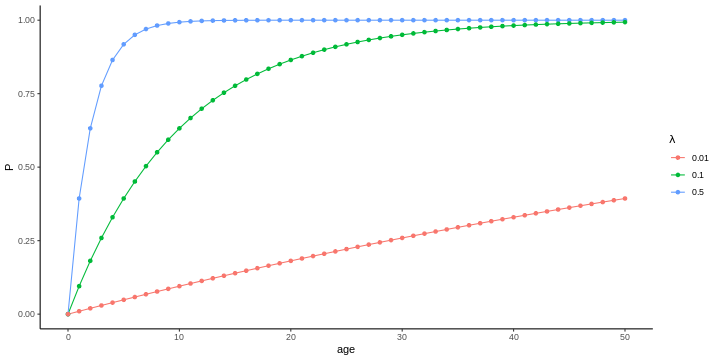
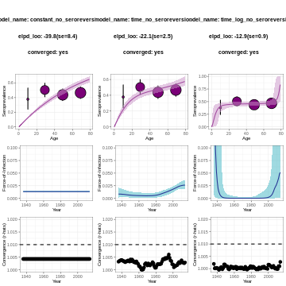

:::::::::::::::::::::::::::::::::::::: questions

- ¿Cómo estimar retrospectivamente la *Fuerza de Infección* de un patógeno a partir de *encuestas serológicas poblacionales de prevalencia desagregadas por edad* mediante la implementación de *modelos Bayesianos* usando **serofoi**?

::::::::::::::::::::::::::::::::::::::::::::::::

::::::::::::::::::::::::::::::::::::: objectives

Al final de este taller usted podrá:

-   Explorar y analizar una encuesta serológica típica.

-   Aprender a estimar la Fuerza de Infección en un caso de uso específico.

-   Visualizar e interpretar los resultados.

::::::::::::::::::::::::::::::::::::::::::::::::


## 1. Introducción

<!-- Aquí se espera que usted comparta información sobre un problema de salud pública. La metodología es de resolución de casos.
(También es posible pedir a los participantes que describan la base de datos)
-->

**serofoi** es un paquete de R para estimar retrospectivamente la *Fuerza de Infección* de un patógeno a partir de *encuestas serológicas poblacionales de prevalencia desagregadas por edad* mediante la implementación de *modelos Bayesianos*. Para ello, **serofoi** utiliza el paquete *Rstan*, que proporciona una interfaz para el lenguaje de programación estadística *Stan*, mediante el cual se implementan métodos de Monte-Carlo basados en cadenas de Markov.

Como un caso particular, estudiaremos un brote de Chikungunya, una enfermedad viral descubierta en Tanzania en el año 1952 que se caracteriza por causar fuertes fiebres, dolor articular,
jaqueca, sarpullidos, entre otros síntomas. Desde el año 2013, casos de esta enfermedad comenzaron a ser reportados en América y desde entonces la enfermedad ha sido endémica en varios países latinoamericanos. Durante este tutorial, vamos a analizar una encuesta serológica realizada entre octubre y diciembre de 2015 en Bahía, Brasil, la cual fue realizada poco tiempo después de una epidemia de esta enfermedad, con el fin de caracterizar los patrones endémicos o epidémicos en la zona.

## 2. Objetivos

<!-- Aquí se espera que usted incluya los objetivos del taller. ¿Qué es lo que usted espera que los estudiantes aprendan del taller? ¿Qué se espera que los estudiantes puedan hacer al terminar el taller? Los objetivos deben empezar con un verbo en infinitivo. -->

-   Explorar y analizar una encuesta serológica típica.

-   Aprender a estimar la Fuerza de Infección en un caso de uso específico.

-   Visualizar e interpretar los resultados.


## 3. Conceptos básicos a desarrollar

<!-- En esta práctica se desarrollarán los siguientes conceptos: -->
<!-- Aquí se espera que usted mencione los conceptos más importantes del taller (deben ser conceptos técnicos que se puedan encontrar en la literatura) -->

En esta práctica se desarrollarán los siguientes conceptos:

- Encuestas serologícas (*sero*)

- Fuerza de infección (*foi*)

- Modelos serocatalíticos

- Estadística Bayesiana

- Visualización e interpretación de resultados de modelos FoI

La Fuerza de Infección (FoI, por sus siglas en inglés), también conocida
cómo la tasa de riesgo o la presión de infección, representa la tasa a
la que los individuos susceptibles se infectan dado que estuvieron
expuestos a un patógeno. En otras palabras, la FoI cuantifica el riesgo
de que un individuo susceptible se infecte en un periodo de tiempo.

Como veremos a continuación, este concepto es clave en el modelamiento
de enfermedades infecciosas. Para ilustrar el concepto, consideremos una
población expuesta a un patógeno y llamemos $P(t)$ a la proporción de
individuos que han sido infectados al tiempo $t$. Suponiendo que no hay
sero-reversión, la cantidad $1 - P(t)$ representa la cantidad de
individuos susceptibles a la enfermedad, de tal forma que la velocidad
de infección está dada por:

$$ \tag{1}
\frac{dP(t)}{d t} = \lambda(t) (1- P(t)),$$

en donde $\lambda(t)$ representa la tasa a la que los individuos
susceptibles se infectan por unidad de tiempo (días, meses, años, ...), es decir la FoI. La
ecuación diferencial (1) se asemeja a la de una reacción química en
donde $P(t)$ representa la proporción de sustrato que no ha entrado en
contacto con un reactivo catalítico, por lo que este tipo de modelos se
conocen como **modelos serocatalíticos** (Muench, 1959).

A pesar de la simpleza del modelo representado por la ecuación (1), en comparación con modelos compartimentales (por ejemplo), la dificultad para conocer una condición inicial para la seropositividad en algún punto del pasado imposibilita su uso práctico. Para sortear esta limitación, es común aplicar el modelo para cohortes de edad en lugar de para el total de la población. Para ello, etiquetemos cada cohorte de edad de acuerdo con su año de nacimiento $\tau$, y supongamos que los individuos son seronegativos al nacer:
$$
\frac{dP^\tau (t)}{dt} = \lambda(t) (1 - P^\tau(t)).
$$
Con condiciones iniciales dadas por $P^\tau(\tau) = 0$. Esta ecuación se puede resolver analíticamente, dando como resultado (Hens et al, 2010):

$$
P^{\tau} (t) = 1 - \exp\left(-\int_{\tau}^{t} \lambda (t') dt' \right).
$$

Suponiendo que la FoI se mantiene constante a lo largo de cada año, la versión discreta de esta ecuación es:

$$
\tag{2}
P^\tau(t) = 1 - \exp\left(-\sum_{i = \tau}^{t} \lambda_i \right),
$$
Como un ejemplo, consideremos la FoI representada en la siguiente figura:


A partir de esta FoI, es posible calcular la seroprevalencia para distintas cohortes por medio de la ecuación (2):


Cuando conocemos los datos de una encuesta serológica, la información a la que tenemos acceso es a una fotografía de la seroprevalencia en el momento su realización $t_{sur}$ como función de la edad de los individuos en ese momento, la cual coincide con la ecuación (2) ya que los individuos envejecen al mismo ritmo al que pasa el tiempo; es decir:

$$
\tag{3}
P^{t_{sur}}(a^\tau) = 1 - \exp\left(-\sum_{i = \tau}^{t_{sur}} \lambda_i \right).
$$
En el caso del ejemplo, esto nos da la siguiente gráfica:

Note que los valores de seroprevalencia de cada edad en esta gráfica corresponden a los valores de seroprevalencia al momento de la encuesta (2020) en la gráfica anterior.

La misión que cumple **serofoi** es estimar la fuerza de infección histórica $\lambda(t)$ a partir de esta fotografía del perfil serológico de la población al momento de la encuesta. para lo cual se requieren encuestas serológicas que cumplan con los siguientes criterios de
inclusión:

-   Basadas en poblacionales (no hospitalaria).
-   Estudio de tipo transversal (un solo tiempo) .
-   Que indique la prueba diagnóstica utilizada.
-   Que identifique la edad del paciente en el momento de la encuesta.

En casos donde la FoI pueda considerarse constante, la ecuación (3)
da como resultado:

$$
\tag{4}
P_{sur}(a^\tau(t_{sur})) = 1 - \exp (-\lambda a^\tau),
$$

en donde se tuvo en cuenta qué, al momento de la introducción del
patógeno ($t = 0$), la proporción de individuos infectados fue
$P(0) = 0$ (condición inicial). Note que el término de la suma en la ecuación (3)
da como resultado la edad de cada cohorte al considerar la fuerza de infección constante.



**Figura 1.** Curvas de prevalencia en función de la edad para distintos
valores de FoI constante.

En este ejemplo hemos escogido, por simplicidad, que la FoI fuese
constante; sin embargo, este no es necesariamente el caso. Identificar
si la FoI sigue una tendencia constante o variante en el tiempo puede
ser de vital importancia para la identificación y caracterización de la
propagación de una enfermedad. Es acá donde el paquete de R **serofoi**
juega un papel importante, ya que este permite estimar
retrospectivamente la FoI de un patógeno, recuperando así su evolución
temporal, por medio de modelos Bayesianos pre-establecidos.

Los modelos actuales del paquete **serofoi** asumen los siguientes
supuestos biológicos:

-   No hay sero-reversión (sin pérdida de inmunidad).
-   La FoI no depende de la edad.
-   Bajos o nulos niveles de migración en las poblaciones.
-   Diferencias pequeñas entre las tasas de mortalidad de susceptibles e
    infectados.

## 3.2. Modelos Bayesianos

A diferencia del enfoque frecuentista, donde la probabilidad se asocia
con la frecuencia relativa de la ocurrencia de los eventos, la
estadística Bayesiana se basa en el uso de la probabilidad condicional
de los eventos respecto al conocimiento (o estado de información) que
podamos tener sobre los datos o sobre los parámetros que queramos
estimar.

Por lo general, cuando proponemos un modelo lo que buscamos es disminuir
la incertidumbre sobre algún parámetro, de tal forma que nos aproximemos
a su valor tan óptimamente como nos lo permita nuestro conocimiento
previo del fenómeno y de las mediciones realizadas (datos).

La inferencia Bayesiana se sustenta en el teorema de Bayes, el cual
establece que: dado un conjunto de datos $\vec{y} = (y_1, …, y_N)$, el
cual representa un único evento, y la variable aleatoria $\theta$, que
representa un parámetro de interés para nosotros (en nuestro caso, la FoI $\lambda$),
la distribución de probabilidad conjunta de las variables aleatorias asociadas está dada
por:

$$ \tag{4}
p(\vec{y}, \theta) = p(\vec{y} | \theta) p(\theta) = p(\theta | \vec{y}) p(\vec{y}),
$$

de donde se desprende la distribución aposteriori de $\theta$, es
decir una versión actualizada de la distribución de probabilidad de la
FoI condicionada a nuestros datos:

$$\tag{5}
p(\theta, \vec{y}) =  \frac{p(\vec{y} | \theta) p(\theta)}{p(\vec{y})},$$

La distribución $p(\vec{y} | \theta)$, que corresponde a la
información interna a los datos condicionada al valor del parámetro
$\theta$, suele estar determinada por la naturaleza del experimento: no
es lo mismo escoger pelotas dentro de una caja reemplazándolas que
dejándolas por fuera de la caja (e.g.). En el caso particular de la FoI,
contamos con datos como el número total de encuestas por edad y el
número de casos positivos, por lo que es razonable asignar una
distribución binomial a la probabilidad, como veremos a continuación.

### 3.3.1. Modelo FoI constante

En nuestro caso particular, el parámetro que queremos estimar es la FoI
($\lambda$). La distribución de probabilidad apriori de $\lambda$
representa nuestras suposiciones informadas o el conocimiento previo que
tengamos sobre el comportamiento de la FoI. En este contexto, el estado
de mínima información sobre $\lambda$ está representado por una
distribución uniforme:

$$\tag{6}
\lambda \sim U(0, 2),$$

lo que significa que partimos de la premisa de que todos los valores
de la fuerza de infección entre $0$ y $2$ son igualmente probables. Por
otro lado, de la teoría de modelos sero-catalíticos sabemos que la
seroprevalencia en un año dado está descrita por un proceso cumulativo
con la edad (Hens et al, 2010):

$$\tag{7}
P(a, t) = 1 - \exp\left(  -\sum_{i=t-a+1}^{t} \lambda_i  \right),
$$ en donde $\lambda_i$ corresponde a la FoI al tiempo $t$. Como en este
caso la FoI es constante, la ec. (7) se reduce a:

$$\tag{8}
P(a, t) = 1 - \exp\left(  -\lambda a \right),$$

Si $n(a, t_{sur})$ es el número de muestras positivas por edad
obtenidas en un estudio serológico desarrollado en el año $t_{sur}$,
entonces podemos estimar la distribución de los casos seropositivos por
edad condicionada al valor de $\lambda$ como una distribución binomial:

$$\tag{9}
p(a, t) \sim Binom(n(a, t), P(a, t)) \\
\lambda \sim U(0, 2)$$

### 3.3.2. Modelo FOI dependientes del tiempo

Actualmente, **serofoi** permite la implementación de dos modelos
dependientes del tiempo: uno de variación lenta de la FoI
(**tv-normal**) y otro de variación rápida (**tv-normal-log**) de la
FoI.

Cada uno de ellos se basa en distintas distribuciones previas para
$\lambda$, las cuales se muestran en la tabla 1.


| Model Type | Logarithmic Scale | Probability of positive case at age $a$ | Prior distribution |
|---|---|---|---|
| `"constant"` | `FALSE` | $\sim binom(n(a,t), P(a,t))$ | $\lambda\sim uniform(0,2)$ |
| `"time"` | `FALSE` | $\sim binom(n(a,t), P(a,t))$ | $\lambda\sim normal(\lambda(t-1),\sigma)\\ \lambda(t=1)\sim normal(0,1)$ |
| `"time"` | `TRUE` | $\sim binom(n(a,t), P(a,t))$ | $\lambda\sim normal(log(\lambda(t-1)),\sigma)\\ \lambda(t=1)\sim normal(-6,4)$ |


**Tabla 1.** Distribuciones a priori de los distintos modelos soportados
por **serofoi**. $\sigma$ representa la desviación estándar.

Como se puede observar, las distribuciones previas de $\lambda$ en ambos
casos están dadas por distribuciones Gaussianas con desviación estándar
$\sigma$ y centradas en $\lambda$ (modelo de variación lenta -
`"time"`) y $\log(\lambda)$ (modelo de variación rápida -
`"time"` con `is_log_foi = TRUE`). De esta manera, la FoI en un tiempo $t$ está
distribuida de acuerdo a una distribución normal alrededor del valor que
esta tenía en el tiempo inmediatamente anterior. El logaritmo en el
modelo $\log(\lambda)$ permite identificar cambios drásticos en la
tendencia temporal de la FoI.

### 4. Contenido del taller

<!-- Aquí debe agregar el contenido del taller. Sea claro. Pruebe los códigos. Recuerde que si bien estará usted para dirigir el taller, el taller debe ser claro para poder ser ejecutado. -->

#### 4.1 Instalación de **serofoi**

Previo a la instalación de **serofoi**, cree un proyecto en R en la carpeta de su escogencia en su máquina local; esto con el fin de organizar el espacio de trabajo en donde se guardarán los códigos que desarrolle durante la sesión.

Antes de realizar la instalación de **serofoi**, es necesario instalar y configurar C++ Toolchain (instrucciones para [windows](https://github.com/stan-dev/rstan/wiki/Configuring-C---Toolchain-for-Windows)/ [mac](https://github.com/stan-dev/rstan/wiki/Configuring-C---Toolchain-for-Mac)/[linux](https://github.com/stan-dev/rstan/wiki/Configuring-C-Toolchain-for-Linux)). Después de haber configurado C++ Toolchain, ejecute las siguientes líneas de código para instalar el paquete:


``` r
if(!require("pak")) install.packages("pak")
pak::pak("epiverse-trace/serofoi")
```
Opcionalmente, es posible modificar la configuración de R para que los modelos a implementar corran en paralelo, aprovechando los núcleos del procesador de su computador. Esto tiene el efecto de disminuir los tiempos de cómputo de las implementaciones en Stan. Para activar esta opción ejecute:


``` r
options(mc.cores=parallel::detectCores())
```

Finalmente, cargue el paquete ejecutando:

``` r
library(serofoi)
```


#### 4.2 Caso de uso: Chikungunya

En esta sección vamos a analizar una encuesta serológica realizada entre
octubre y diciembre de 2015 en Bahía, Brasil, la cual fue realizada poco
tiempo después de una epidemia de esta enfermedad en la zona. Nuestro
objetivo es caracterizar la propagación de la enfermedad por medio de la
implementación de los distintos modelos y determinar cuál de estos
describe mejor la situación. Primero, carguemos y preparemos los datos
que utilizaremos en este análisis. La base `chik2015` contiene los datos
correspondientes a esta encuesta serológica:


``` r
data(chik2015)
chik2015
```

``` output
  survey_year n_sample n_seropositive age_min age_max
1        2015      144             63      40      59
2        2015      148             69      60      79
3        2015       45             17       1      19
4        2015      109             55      20      39
```

Para correr el modelo de FoI constante y visualizar los resultados del
mismo, corra las siguientes líneas de código:


``` r
chik_constant <- fit_seromodel(serosurvey = chik2015,
                               model_type = "constant",
                               iter = 1000)

chik_constant_plot <- plot_seromodel(seromodel = chik_constant,
                                     serosurvey = chik2015,
                                     size_text = 12)
```

Ahora, corra los modelos dependientes del tiempo con `iter =1500`.
Luego visualice conjuntamente las tres gráficas por medio de la función
`plot_grid()` del paquete `cowplot`:


``` r
install.packages("cowplot")

cowplot::plot_grid(chik_constant_plot,
                   chik_normal_plot,
                   chik_normal_log_plot,
                   ncol = 3)
```

**NOTA:** Debido a que el número de trayectorias es relativamente alto,
con el fin de asegurar la convergencia de los modelos, el tiempo de
cómputo de los modelos dependientes del tiempo puede tardar varios
minutos.

*Pista: Debería obtener la siguiente gráfica:*




Explicación de *elpd* (*expected log pointwise predictive density*)


## 5. Reflexión

<!-- Aquí se espera que incluya preguntas/actividades que permita reflexionar al grupo sobre los alcances y limitaciones de lo aprendido en la resolución del problema expuesto en el taller. Así como reflexiones que conlleven a un mejor aprendizaje y aplicación al campo de la salud pública. -->

Según los criterios explicados anteriormente, responda:

¿Cuál de los tres modelos se ajusta mejor a esta encuesta serológica?\
\
\
\
\

¿Cómo interpreta estos resultados?\
\
\

***

[Reto](https://docs.google.com/document/d/11j99fA8SBMUn1FD6oJBOvc-Nmr9aq5hd/edit?usp=sharing&ouid=108718106243006326200&rtpof=true&sd=true)

::::::::::::::::::::::::::::::::::::: keypoints

Revise si al final de esta lección adquirió estas competencias:


-   Explorar y analizar una encuesta serológica típica.

-   Aprender a estimar la Fuerza de Infección en un caso de uso específico.

-   Visualizar e interpretar los resultados.


::::::::::::::::::::::::::::::::::::::::::::::::
### Sobre este documento

Este documento ha sido diseñado por NOMBRE_DE_AUTORES para el Curso Internacional: Análisis de Brotes y Modelamiento en Salud Pública, Bogotá 2023. TRACE-LAC/Javeriana.

#### Contribuciones

-   Nicolás Torres Domínguez
-   Zulma M. Cucunuba

Contribuciones son bienvenidas vía [pull requests](https://github.com/reconhub/learn/pulls).

## Referencias

Muench, H. (1959). Catalytic models in epidemiology. Harvard University Press.

Hens, N., Aerts, M., Faes, C., Shkedy, Z., Lejeune, O., Van Damme, P., & Beutels, P. (2010). Seventy-five years of estimating the force of infection from current status data. Epidemiology & Infection, 138(6), 802–812.

Cucunubá, Z. M., Nouvellet, P., Conteh, L., Vera, M. J., Angulo, V. M., Dib, J. C., … Basáñez, M. G. (2017). Modelling historical changes in the force-of-infection of Chagas disease to inform control and elimination programmes: application in Colombia. BMJ Global Health, 2(3). doi:10.1136/bmjgh-2017-000345
