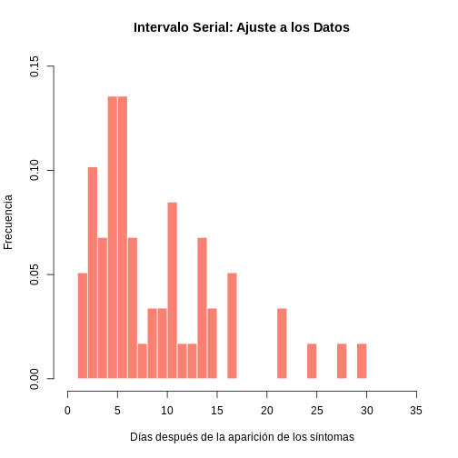

:::::::::::::::::::::::::::::::::::::: questions 

### Pregunta introductoria 

- ¿Cómo modelar y analizar un brote?

::::::::::::::::::::::::::::::::::::::::::::::::

::::::::::::::::::::::::::::::::::::: objectives

# Objetivos 

Al final de este taller usted podrá:

- Identificar los parámetros necesarios en casos de  transmisión de enfermedades infecciosas de persona a persona. 

- Estimar e interpretar la tasa de crecimiento y el tiempo en que se duplica la epidemia. 

- Estimar el intervalo serial a partir de los datos pareados de individuos infectantes/ individuos infectados.

- Estimar e interpretar el número de reproducción instantáneo de la epidemia

- Estimar la tasa de letalidad (CFR) 

- Calcular y graficar la incidencia

::::::::::::::::::::::::::::::::::::::::::::::::


## Tiempos de ejecución

Explicación del taller (5 minutos)

Realizar taller (100 minutos taller + 5 minutos imprevistos)

- [1. Preparación (3 minutos ejecución + 3 minutos solución)](#sección-1)

- [2. CFR (3 minutos explicación + 5 minutos ejecución + 2 minutos solución)](#sección-2)

- [3. Incidencia (4 minutos de explicación + 9 minutos de ejecución + 7 minutos solución y reflexión)](#sección-3)
  
  - [3.1. Curva de incidencia diaria (3min ejecución + 4min reflexión)](#sección-3.1)
  
  - [3.2. Cálculo de la incidencia semanal (6 minutos ejecución + 3 minutos de reflexión)](#sección-3.2)

- [4. Tasa de crecimiento (3 minutos de explicación + 18 minutos lectura y ejecución + 14 minutos reflexión)](#sección-4)

  - [4.1. Modelo log-lineal  (5 minutos lectura + 6 minutos de reflexión)](#sección-4.1)

  - [4.2. Modelo log-lineal con datos truncados (5 minutos lectura + 5 minutos ejecución y reflexión)](#sección-4.2)

  - [4.3. Tasa de crecimiento y tiempo de duplicación: extracción de datos (5 minutos lectura y ejecución + 6 minutos solución y reflexión)](#sección-4.3)
  
- [5. Rastreo de contactos (2 minutos explicación + 4 minutos lectura y ejecución + 3 minutos de reflexión)](#sección-5)

- [6. Intervalo serial y Rt (5 minutos explicación + 7 minutos lectura y ejecución + 8 minutos reflexión)](#sección-6)

  - [6.1. Estimación del intervalo serial (SI)](#sección-6.1)
  
  - [6.2. Estimación de la transmisibilidad variable en el tiempo, R(t)](#sección-6.2)

Discusión 30 minutos

## Introducción

Un nuevo brote de virus del Ébola (EVE) en un país ficticio de África occidental


#### Conceptos básicos a desarrollar

En esta práctica se desarrollarán los siguientes conceptos:


- Transmisión de enfermedades infecciosas de persona a persona 

- Número reproductivo efectivo 

- tasa de letalidad 

- Intervalo serial 

- Tasa de crecimiento 

- Incidencia

## 1. Preparación {#sección-1}


#### Preparación previa

Antes de comenzar, recuerde crear el proyecto en R `RProject`. Este paso no solo le ayudará a cumplir con las buenas prácticas de programación en R, sino también a mantener un directorio organizado, permitiendo un desarrollo exitoso del taller.

Puede descargar la carpeta con los datos y el proyecto desde [Carpetas de datos](https://drive.google.com/drive/folders/1T0uZ2FNhwFAnFcCNxfLX8V6Ir3IsJO6y?usp=sharing) . Ahí mismo encontrará un archivo .R para instalar las dependencias necesarias para este taller.

#### Cargue de librerías: 

Cargue las librerías necesarias para el análisis epidemiológico y para análisis de incidencia y contactos. Los datos serán manipulados con tidyverse que es una colección de paquetes para la ciencia de datos.


```r
library(tidyverse) # contiene ggplot2, dplyr, tidyr, readr, purrr, tibble
library(readxl) # para leer archivos Excel
library(binom) # para intervalos de confianza binomiales
library(knitr) # para crear tablas bonitas con kable()
library(incidence) # para calcular incidencia y ajustar modelos
library(epicontacts) # para análisis de contactos epidemiológicos
library(EpiEstim) # para estimar R(t)
library(epitrix) #para ajustar la distribución del modelo
```


#### Cargue de bases de datos

Se le ha proporcionado la siguiente base de datos de casos (directorio_casos) y datos de contacto:

`directorio_casos`: una base de datos de casos que contiene información de casos hasta el 1 de julio de 2014; y

`contactos_20140701.xlsx`: una lista de contactos reportados por los casos hasta el 1 de julio de 2014. “infectante” indica una fuente potencial de infección y “id_caso” con quién se tuvo el contacto.

Para leer en R, descargue estos archivos y use la función `read_xlsx` del paquete `readxl` para importar los datos y la función `read_rds` de `tidyverse`. Cada grupo de datos importados creará una tabla de datos almacenada como el objeto `tibble.`


```r
directorio_casos <- read_rds("files/directorio_casos.rds")
```


```r
contactos <- read_excel("files/contactos_20140701.xlsx", na = c("", "NA"))
```


#### Estructura de los datos

Explore la estructura de los datos. Para esto puede utilizar `glimpse` de `tidyverse` el cual nos proporciona una visión rápida y legible de la estructura interna de nuestros conjuntos de datos.


```r
glimpse(contactos)
```

```{.output}
Rows: 60
Columns: 3
$ infectante <chr> "d1fafd", "f5c3d8", "0f58c4", "f5c3d8", "20b688", "2ae019",…
$ id_caso    <chr> "53371b", "0f58c4", "881bd4", "d58402", "d8a13d", "a3c8b8",…
$ fuente     <chr> "otro", "otro", "otro", "otro", "funeral", "otro", "funeral…
```


Como puede observar contactos tiene 3 columnas (variables) y 60 filas de datos. En un rápido vistazo puede observar que la columna fuente (fuente del contagio) puede contener entre sus valores otro o funeral. Así como que las tres variables están en formato `caracter`.


```r
glimpse(directorio_casos)
```

```{.output}
Rows: 166
Columns: 11
$ id_caso                  <chr> "d1fafd", "53371b", "f5c3d8", "6c286a", "0f58…
$ generacion               <dbl> 0, 1, 1, 2, 2, 0, 3, 3, 2, 3, 4, 3, 4, 2, 4, …
$ fecha_de_infeccion       <date> NA, 2014-04-09, 2014-04-18, NA, 2014-04-22, …
$ fecha_inicio_sintomas    <date> 2014-04-07, 2014-04-15, 2014-04-21, 2014-04-…
$ fecha_de_hospitalizacion <date> 2014-04-17, 2014-04-20, 2014-04-25, 2014-04-…
$ fecha_desenlace          <date> 2014-04-19, NA, 2014-04-30, 2014-05-07, 2014…
$ desenlace                <chr> NA, NA, "Recuperacion", "Muerte", "Recuperaci…
$ genero                   <fct> f, m, f, f, f, f, f, f, m, m, f, f, f, f, f, …
$ hospital                 <fct> Military Hospital, Connaught Hospital, other,…
$ longitud                 <dbl> -13.21799, -13.21491, -13.22804, -13.23112, -…
$ latitud                  <dbl> 8.473514, 8.464927, 8.483356, 8.464776, 8.452…
```

En el caso del directorio de casos encuentra: 

- El identificador id_caso al igual que en contactos 

- La generación de infectados (cuantas infecciones secundarias desde la fuente hasta el sujeto han ocurrido) 

- La fecha de infección 

- La fecha de inicio de sintomas 

- La fecha de hospitalización 

- La fecha del desenlace que como se puede observar en la siguiente variable puede tener entre sus opciones NA (no hay información hasta ese momento o no hay registro), recuperación y muerte 

- La variable género que puede ser f de femenino o m de masculino 

- El lugar de hospitalización, en la variable hospital
- Y las variables longitud y latitud

Note que las fechas ya están en formato fecha (`Date`).

## 2. CFR {#sección-2}


### Probabilidad de muerte en los casos reportados (`CFR`)


```r
table(directorio_casos$desenlace, useNA = "ifany")
```

```{.output}

      Muerte Recuperacion         <NA> 
          60           43           63 
```

::::::::::::::::::::::::::::::::::::: challenge  

## Desafío 1  

Calcule la tasa de letalidad (`CFR`) tomando el número de muertes y el número de casos con resultado conocido del directorio_casos. 


```r
numero_muertes <-  #COMPLETE

numero_con_resultado_conocido <- sum(directorio_casos$desenlace %in% c("Muerte", "Recuperacion")) 

tasa_letalidad <- #COMPLETE / COMPLETE
```


```{.output}
[1] 0.5825243
```
:::::::::::::::::::::::::::::::::

:::::::::::::::::::::::::::::::::::::::::::::::::::::::::::::::::::: instructor

## Solución 1  


```r
numero_muertes <- sum(directorio_casos$desenlace %in% "Muerte") 

numero_con_resultado_conocido <- sum(directorio_casos$desenlace %in% c("Muerte", "Recuperacion")) 

tasa_letalidad <- numero_muertes / numero_con_resultado_conocido

print(tasa_letalidad)
```

```{.output}
[1] 0.5825243
```

```r
#Otra posible solución.

# numero_muertes <- directorio_casos %>%
#   filter(desenlace == "Muerte") %>%
#   tally()
# 
# numero_con_resultado_conocido <- directorio_casos %>%
#   filter(desenlace %in% c("Muerte", "Recuperacion")) %>%
#   tally()
# 
# tasa_letalidad <- numero_muertes$n / numero_con_resultado_conocido$n
```
 
::::::::::::::::::::::::::::::::::::::::::::::::::::::::::::::::::::::::::::::::

Luego, determine la tasa de letalidad con sus intervalos de confianza utilizando la función `binom.confint` y presentamos los resultados en una tabla con `kable`, agregando una descripción en negritas para destacar la información. 

La función `binom.confint` se utiliza para calcular intervalos de confianza para una proporción en una población binomial, que es el caso cuando los datos pueden caer en una de dos categorías, como por ejemplo recuperado/muerto. Esta función pide tres argumentos el primero es el número de muertes, el segundo el número total de casos con resultado conocido, sin importar que hayan muerto o se hayan recuperado, pero no cuenta los datos con `NA`. Finalmente el último argumento es el método que se utilizará para calcular los intervalos de confianza, en este caso "`exact`" (método Clopper-Pearson).
::::::::::::::::::::::::::::::::::::: challenge  

## Desafío 2  

```r
tasa_letalidad_con_CI <- binom.confint(COMPLETE, COMPLETE, method = "COMPLETE") %>%
  kable(caption = "**¿QUE TITULO LE PONDRÍA?**")

tasa_letalidad_con_CI
```


Table: **tasa de letalidad con intervalos de confianza**

|method |  x|   n|      mean|     lower|     upper|
|:------|--:|---:|---------:|---------:|---------:|
|exact  | 60| 103| 0.5825243| 0.4812264| 0.6789504|
:::::::::::::::::::::::::::::::::

:::::::::::::::::::::::::::::::::::::::::::::::::::::::::::::::::::: instructor

## Solución 2  


```r
tasa_letalidad_con_CI <- binom.confint(numero_muertes, 
                                       numero_con_resultado_conocido, method = "exact") %>%
  kable(caption = "**tasa de letalidad con intervalos de confianza**")

tasa_letalidad_con_CI
```


Table: **tasa de letalidad con intervalos de confianza**

|method |  x|   n|      mean|     lower|     upper|
|:------|--:|---:|---------:|---------:|---------:|
|exact  | 60| 103| 0.5825243| 0.4812264| 0.6789504|
::::::::::::::::::::::::::::::::::::::::::::::::::::::::::::::::::::::::::::::::

## 3. Incidencia {#sección-3}

### 3.1. Curva de incidencia diaria {#sección-3.1}

El paquete `incidence` es de gran utilidad para el análisis epidemiológico de datos de incidencia de enfermedades infecciosas, dado que permite calcular la incidencia a partir del intervalo temporal suministrado (por ejemplo, diario, semanal). Dentro de este paquete esta la función `incidence` la cual puede usar varios argumentos: 

1. `dates` contiene una variable con fechas que representan cuándo ocurrieron eventos individuales, como por ejemplo la fecha de inicio de los síntomas de una enfermedad en un conjunto de pacientes. 

2. `interval` es un intervalo de tiempo fijo por el que se quiere calcula la incidencia. Por ejemplo, `interval = 365` para un año. Si no se especifica, por defecto es diario. 

3. `last_date` fecha donde se establecerá un limite temporal para los datos. Por ejemplo, última fecha de hospitalización. Para este tercer argumento, podemos incluir la opción `max` y la opción  `na.rm`. La primera para obtener la última fecha de una variable y la segunda para ignorar los `NA` en caso de que existan. 


Por ejemplo, se podría escribir `last_date = max(base_de_datos$vector_ultima_fecha, na.rm = TRUE)`

Con esta información la función agrupa los casos según el intervalo de tiempo especificado y cuenta el número de eventos (como casos de enfermedad) que ocurrieron dentro de cada intervalo.
::::::::::::::::::::::::::::::::::::: challenge  

## Desafío 3  

Calcule la incidencia diaria usando únicamente el primer argumento ¿Qué fecha sería la más adecuada? Tenga en cuenta que se esperaría sea la que pueda dar mejor información, menor cantidad de `NA`.


```r
incidencia_diaria <- incidence(COMPLETE)
incidencia_diaria
```
:::::::::::::::::::::::::::::::::

 El resultado es un objeto de incidencia que contiene el recuento de casos para cada intervalo de tiempo, lo que facilita su visualización y análisis posterior. Como puede observar la función produjo los siguientes datos: 


```{.output}
<incidence object>
[166 cases from days 2014-04-07 to 2014-06-29]

$counts: matrix with 84 rows and 1 columns
$n: 166 cases in total
$dates: 84 dates marking the left-side of bins
$interval: 1 day
$timespan: 84 days
$cumulative: FALSE
```

:::::::::::::::::::::::::::::::::::::::::::::::::::::::::::::::::::: instructor

## Solución 3  


```r
incidencia_diaria <- incidence(directorio_casos$fecha_inicio_sintomas)
incidencia_diaria
```

```{.output}
<incidence object>
[166 cases from days 2014-04-07 to 2014-06-29]

$counts: matrix with 84 rows and 1 columns
$n: 166 cases in total
$dates: 84 dates marking the left-side of bins
$interval: 1 day
$timespan: 84 days
$cumulative: FALSE
```
::::::::::::::::::::::::::::::::::::::::::::::::::::::::::::::::::::::::::::::::

Como resultado de la función se produjo un objeto tipo lista. El cual le pudo arrojar estos datos: tiene `166 casos` contemplados entre los días `2014-04-07` al `2014-06-29` para un total de `84 días`, se menciona que el intervalo es de `1 día`, dado que no se utilizo este parámetro quedo por defecto. Finalmente se menciona "`cumulative`: `FALSE`" lo que quiere decir que no se esta haciendo el acumulado de la incidencia. Son únicamente los casos de ese intervalo, es decir, de ese día en especifico.


Ahora haga una gráfica de la incidencia diaria. 


```r
plot(incidencia_diaria, border = "black")
```


En el `Eje X (Fechas)`: Se puede observar fechas van desde el `7 de abril de 2014` hasta una fecha posterior al `21 de junio de 2014`. Estas fechas representan el período de observación del brote.

En el `Eje Y (Incidencia Diaria)`: La altura de las barras indica el número de nuevos casos reportados cada día.

Dado que no se agrego el parámetro `interval` la incidencia quedo por defecto diaria, produciéndose un histograma de barras, en el que cada barra representa la incidencia de un día, es decir, los nuevos casos. Los días sin barras sugieren que no hubo casos nuevos reportados o que los datos podrían no estar disponibles para esos días.

Hay periodos con pocos o ningún caso, seguidos por picos que sugieren brotes repentinos de la enfermedad. ¿Porque cree que podrían darse estos periodos de pocos o muchos casos?


:::::::::::::::::::::::::::::::::::::::::::::::::::::::::::::::::::: instructor

## Ideas discusión: 

Después del pico más alto, la incidencia parece disminuir ligeramente pero sigue siendo errática, con varios días mostrando aumentos significativos en la cantidad de casos nuevos.
La naturaleza errática de las barras, con picos altos seguidos por periodos de menor incidencia, podría indicar brotes localizados o la introducción de medidas de control que temporalmente redujeron la transmisión. También podría reflejar la variabilidad en la notificación de casos o retrasos en la confirmación y reporte de los mismos.

::::::::::::::::::::::::::::::::::::::::::::::::::::::::::::::::::::::::::::::::

### 3.2. Cálculo de la incidencia semanal {#sección-3.2}

Teniendo en cuenta lo aprendido durante la incidencia diaria cree una variable para incidencia semanal, interprete el resultado y haga una gráfica. Para escoger la fecha que utilizará como última fecha en el tercer argumento ¿Qué fecha sería la más adecuada? Tenga en cuenta que la fecha debe ser posterior al evento.

::::::::::::::::::::::::::::::::::::: challenge  

## Desafío 4  


```r
incidencia_semanal <- incidence(PRIMER ARGUMENTO,  #COMPLETE
                                SEGUNDO ARGUMENTO, #COMPLETE 
                                TERCER ARGUMENTO)  #COMPLETE
```


```{.output}
<incidence object>
[166 cases from days 2014-04-07 to 2014-06-30]
[166 cases from ISO weeks 2014-W15 to 2014-W27]

$counts: matrix with 13 rows and 1 columns
$n: 166 cases in total
$dates: 13 dates marking the left-side of bins
$interval: 7 days
$timespan: 85 days
$cumulative: FALSE
```


:::::::::::::::::::::::::::::::::

:::::::::::::::::::::::::::::::::::::::::::::::::::::::::::::::::::: instructor

## Solución 4  


```r
incidencia_semanal <- incidence(directorio_casos$fecha_inicio_sintomas, 
                                interval = 7, 
                                last_date = max(directorio_casos$fecha_de_hospitalizacion,
                                              na.rm = TRUE))
incidencia_semanal
```

```{.output}
<incidence object>
[166 cases from days 2014-04-07 to 2014-06-30]
[166 cases from ISO weeks 2014-W15 to 2014-W27]

$counts: matrix with 13 rows and 1 columns
$n: 166 cases in total
$dates: 13 dates marking the left-side of bins
$interval: 7 days
$timespan: 85 days
$cumulative: FALSE
```

```r
plot(incidencia_semanal, border = "black")
```


::::::::::::::::::::::::::::::::::::::::::::::::::::::::::::::::::::::::::::::::

De acuerdo a lo aprendido interprete la gráfica. ¿Qué observa? ¿Los datos se comportan diferente? ¿Es lo que esperaba? ¿Logra observar tendencias?

## 4. Tasa de crecimiento {#sección-4}

### 4.1. Modelo log-lineal {#sección-4.1}

#### Estimación de la tasa de crecimiento mediante un modelo log-lineal


Para observar mejor las tendencias de crecimiento en el número de casos se puede visualizar la incidencia semanal en una escala logarítmica . Esto es particularmente útil para identificar patrones exponenciales en los datos.


Grafique la incidencia transformada logarítmicamente:


```r
incidencia_semanal_df <- as.data.frame(incidencia_semanal)

  ggplot(incidencia_semanal_df) + 
  geom_point(aes(x = dates, y = log(counts))) + 
  scale_x_date(date_breaks = "1 week", date_labels = "%d-%b") +
  xlab("Fecha") +
  ylab("Incidencia semanal logarítmica") + 
  theme_minimal()
```


 
  
#### Ajuste un modelo log-lineal a los datos de incidencia semanal {#interpretación-del-modelo}


```r
ajuste_modelo <- incidence::fit(incidencia_semanal)
ajuste_modelo
```

```{.output}
<incidence_fit object>

$model: regression of log-incidence over time

$info: list containing the following items:
  $r (daily growth rate):
[1] 0.04145251

  $r.conf (confidence interval):
          2.5 %     97.5 %
[1,] 0.02582225 0.05708276

  $doubling (doubling time in days):
[1] 16.72148

  $doubling.conf (confidence interval):
        2.5 %   97.5 %
[1,] 12.14285 26.84302

  $pred: data.frame of incidence predictions (12 rows, 5 columns)
```

::::::::::::::::::::::::::::::::::::: challenge  

## Desafío 5  

¿Qué observa en este resultado?

:::::::::::::::::::::::: solution 

## Solución 

`$model`: Indica que se ha realizado una regresión del logaritmo de la incidencia en función del tiempo. Esto implica que la relación entre el tiempo y la incidencia de la enfermedad ha sido modelada como una función logarítmica para entender mejor las tendencias de crecimiento.


`$info`: Contiene varios componentes importantes del análisis:

1. `$r (daily growth rate)` Tasa de crecimiento diaria: `0.04145251` 

La tasa de crecimiento diaria estimada del brote es de aproximadamente `0.0415`. Esto significa que cada día, la cantidad de casos está creciendo en un `4.15%` con respecto al día anterior, bajo la suposición de un crecimiento exponencial constante durante el periodo modelado.


Si quisiera acceder a esta información sin ingresar al modelo podría hacerlo con el siguiente código


```r
tasa_crecimiento_diaria <- ajuste_modelo$info$r
cat("La tasa de crecimiento diaria es:", tasa_crecimiento_diaria, "\n")
```

```{.output}
La tasa de crecimiento diaria es: 0.04145251 
```

2. `$r.conf` (confidence interval):  2.5 %  0.02582225   97.5 %  0.05708276

El intervalo de confianza del `95%` para la tasa de crecimiento diaria está entre aproximadamente `0.0258 (2.58%)` y `0.0571 (5.71%)`. Esto indica que estamos razonablemente seguros de que la verdadera tasa de crecimiento diaria está en este rango.

`$doubling` (doubling time in days): 16.72148

3. El tiempo de duplicación estimado de la enfermedad es de aproximadamente `16.72 días`. Esto significa que, bajo el modelo actual y con la tasa de crecimiento estimada, se espera que el número de casos se duplique cada `16.72 días`.

`$doubling.conf` (confidence interval):  2.5 %  12.14285 97.5 % 26.84302

4. El intervalo de confianza del `95%` para el tiempo de duplicación está entre aproximadamente `12.14` y `26.84 días`. Este amplio rango refleja la incertidumbre en la estimación y puede ser consecuencia de la variabilidad en los datos o de un tamaño de muestra pequeño.

`$pred`: Contiene las predicciones de incidencia. Incluye las fechas, la escala de tiempo en días desde el inicio del brote, los valores ajustados (predicciones), los límites inferior y superior del intervalo de confianza para las predicciones.

Si quiere conocer un poco más de este componente puede explorarlo con esta función.


```r
glimpse(ajuste_modelo$info$pred)
```

:::::::::::::::::::::::::::::::::
::::::::::::::::::::::::::::::::::::::::::::::::
 
Antes de continuar ¿Porqué considera más adecuado usar una gráfica semana para buscar un ajuste de los datos?

¿Porqué calcular la tasa de crecimiento diaria con el ajuste semanal y no el ajuste diario?

:::::::::::::::::::::::::::::::::::::::::::::::::::::::::::::::::::: instructor

## Ideas para responder:

La tasa de crecimiento diaria se calcula utilizando el ajuste de la incidencia semanal en lugar de la incidencia diaria debido a que los datos diarios pueden ser muy volátiles debido a:

- Las fluctuaciones naturales, ciclos de informes, retrasos en el reporte y los errores de medición, que pueden no reflejar cambios reales en la transmisión de la enfermedad. 

- Los datos diarios pueden tener más lagunas o inexactitudes. 

- Eventos de superdispersión o las intervenciones de control.

El uso de datos semanales puede suavizar estas fluctuaciones, dando una mejor idea de la tendencia subyacente.. Al utilizar una media móvil semanal, se suavizan estas fluctuaciones, lo que proporciona una imagen más clara de la tendencia subyacente. Esto permite mejorar la precisión de la estimación y evitar el sesgo de los días de la semana, así como mejorar el modelo al reducir el número total de puntos, dado que puede ayudar a evitar el sobreajuste y mejorar la generalización del modelo.

Ejemplo: Algunos fenómenos pueden variar sistemáticamente según el día de la semana. Por ejemplo, el número de pruebas de COVID-19 realizadas podría ser menor los fines de semana, lo que podría afectar a la incidencia reportada. Al utilizar una media móvil semanal, se evita este tipo de sesgo.
::::::::::::::::::::::::::::::::::::::::::::::::::::::::::::::::::::::::::::::::


Grafique la incidencia con la linea de modelo

Dos formas de hacerlo

1. Con `plot`

```r
plot(incidencia_semanal, fit = ajuste_modelo)
```


2. Con `ggplot` 


```r
ajuste_modelo_df <- as.data.frame(ajuste_modelo$info$pred) #Predicciones del modelo

ggplot() +
  geom_bar(data = incidencia_semanal_df, aes(x = dates, y = counts),  #Histograma
           stat = "identity", fill = "grey", color = "black") +
  geom_ribbon(data = ajuste_modelo_df, aes(x = dates, ymin = lwr, ymax = upr), alpha = 0.2) + #Intervalo de confianza del ajuste
  geom_line(data = ajuste_modelo_df, aes(x = dates, y = fit), #Línea del ajuste
            color = "blue", size = 1) +
  scale_x_date(date_breaks = "1 week", date_labels = "%d-%b") + #Formato para los ejes
  xlab("Fecha") +
  ylab("Incidencia semanal") +
  theme_minimal()
```


Tras ajustar el modelo log-lineal a la incidencia semanal para estimar la tasa de crecimiento de la epidemia. El gráfico muestra la curva de ajuste superpuesta a la incidencia semanal observada. 

Al final del gráfico se puede observar que la incidencia semanal disminuye. 

¿Porqué cree que podría estar pasando esto? ¿Cómo lo solucionaría?

### 4.2. Modelo log-lineal con datos truncados {#sección-4.2}


#### Encontrando una fecha límite adecuada para el modelo log-lineal, en función de los retrasos observados

Una de las posibles causas podrían ser los retrasos en la notificación. Para esto es posible que desee examinar cuánto tiempo después de la aparición de los síntomas los casos son hospitalizados.


```r
summary(as.numeric(directorio_casos$fecha_de_hospitalizacion - directorio_casos$fecha_desenlace))
```

```{.output}
   Min. 1st Qu.  Median    Mean 3rd Qu.    Max.    NA's 
-30.000  -9.000  -4.000  -5.164  -2.000  21.000      56 
```

Existen valores negativos. ¿Cual cree es su significado?


Para evitar el sesgo debido a retrasos en la notificación, se pueden truncar los datos de incidencia, pruebe descartar las últimas dos semanas. Esta selección permite concentrarse en el periodo donde los datos son más completos para un análisis más fiable.

Semanas a descartar al final de la epicurva


```r
semanas_a_descartar <- 2
fecha_minima <- min(incidencia_diaria$dates)
fecha_maxima <- max(incidencia_diaria$dates) - semanas_a_descartar * 7
# Para truncar la incidencia semanal
incidencia_semanal_truncada <- subset(incidencia_semanal, 
                         from = fecha_minima, 
                         to = fecha_maxima) # descarte las últimas semanas de datos

# Incidencia diaria truncada. No la usamos para la regresión lineal pero se puede usar más adelante
incidencia_diaria_truncada <- subset(incidencia_diaria, 
                        from = fecha_minima, 
                        to = fecha_maxima) # eliminamos las últimas dos semanas de datos
```

Ahora utilizando los datos truncados `incidencia_semanal_truncada`. Vuelva a montar y a graficar el modelo logarítmico lineal. Puede emplear el método que más le haya gustado.

::::::::::::::::::::::::::::::::::::: challenge  

## Desafío 6  

Primero monte el modelo

```{.output}
<incidence_fit object>

$model: regression of log-incidence over time

$info: list containing the following items:
  $r (daily growth rate):
[1] 0.05224047

  $r.conf (confidence interval):
          2.5 %    97.5 %
[1,] 0.03323024 0.0712507

  $doubling (doubling time in days):
[1] 13.2684

  $doubling.conf (confidence interval):
        2.5 %   97.5 %
[1,] 9.728286 20.85893

  $pred: data.frame of incidence predictions (10 rows, 5 columns)
```
:::::::::::::::::::::::::::::::::

:::::::::::::::::::::::::::::::::::::::::::::::::::::::::::::::::::: instructor

## Solución 6  


```r
ajuste_modelo_semanal <- incidence::fit(incidencia_semanal_truncada)
ajuste_modelo_semanal
```

```{.output}
<incidence_fit object>

$model: regression of log-incidence over time

$info: list containing the following items:
  $r (daily growth rate):
[1] 0.05224047

  $r.conf (confidence interval):
          2.5 %    97.5 %
[1,] 0.03323024 0.0712507

  $doubling (doubling time in days):
[1] 13.2684

  $doubling.conf (confidence interval):
        2.5 %   97.5 %
[1,] 9.728286 20.85893

  $pred: data.frame of incidence predictions (10 rows, 5 columns)
```
::::::::::::::::::::::::::::::::::::::::::::::::::::::::::::::::::::::::::::::::

¿Como interpreta estos resultados?

::::::::::::::::::::::::::::::::::::: challenge  

## Desafío 7  

Ahora grafique el modelo.

:::::::::::::::::::::::::::::::::

:::::::::::::::::::::::::::::::::::::::::::::::::::::::::::::::::::: instructor

## Solución 7  


```r
ajuste_modelo_semanal_df <- as.data.frame(ajuste_modelo_semanal$info$pred) #Predicciones del modelo

incidencia_semanal_truncada_df <- as.data.frame(incidencia_semanal_truncada)


ggplot() +
  geom_bar(data = incidencia_semanal_truncada_df, aes(x = dates, y = counts),  #Histograma
           stat = "identity", fill = "grey", color = "black") +
  geom_ribbon(data = ajuste_modelo_semanal_df, aes(x = dates, ymin = lwr, ymax = upr), alpha = 0.2) + #Intervalo de confianza del ajuste
  geom_line(data = ajuste_modelo_semanal_df, aes(x = dates, y = fit), #Línea del ajuste
            color = "blue", size = 1) +
  scale_x_date(date_breaks = "1 week", date_labels = "%d-%b") + #Formato para los ejes
  xlab("Fecha") +
  ylab("Incidencia semanal") +
  theme_minimal()
```


::::::::::::::::::::::::::::::::::::::::::::::::::::::::::::::::::::::::::::::::


¿Qué cambios observa?


Observe las estadísticas resumidas de su ajuste:


```r
summary(ajuste_modelo_semanal$model)
```

```{.output}

Call:
stats::lm(formula = log(counts) ~ dates.x, data = df)

Residuals:
     Min       1Q   Median       3Q      Max 
-0.73474 -0.31655 -0.03211  0.41798  0.65311 

Coefficients:
            Estimate Std. Error t value Pr(>|t|)    
(Intercept) 0.186219   0.332752   0.560 0.591049    
dates.x     0.052240   0.008244   6.337 0.000224 ***
---
Signif. codes:  0 '***' 0.001 '**' 0.01 '*' 0.05 '.' 0.1 ' ' 1

Residual standard error: 0.5241 on 8 degrees of freedom
Multiple R-squared:  0.8339,	Adjusted R-squared:  0.8131 
F-statistic: 40.16 on 1 and 8 DF,  p-value: 0.0002237
```


El modelo muestra que hay una relación significativa entre el tiempo (`dates.x`) y la incidencia de la enfermedad, con la enfermedad mostrando un crecimiento exponencial a lo largo del tiempo. 

### 4.3. Tasa de crecimiento y tasa de duplicación: extracción de datos {#sección-4.3}

#### Estimacion de la tasa de crecimiento 


Para estimar la tasa de crecimiento de una epidemia utilizando un modelo log-lineal, se necesita realizar un ajuste de regresión a los datos de incidencia. Dado que ya tiene un objeto de incidencia truncado y ajustado un modelo log-lineal, puede proceder a calcular la tasa de crecimiento diaria y el tiempo de duplicación de la epidemia.

El modelo log-lineal ajustado proporcionará los coeficientes necesarios para estos cálculos. El coeficiente asociado con el tiempo (la pendiente de la regresión) se puede interpretar como la tasa de crecimiento diaria cuando el tiempo está en días.

Con el modelo ajustado truncado. Es hora de realizar la estimación de la tasa de crecimiento. Estos datos los puede encontrar en el objeto ajuste modelo semana, que tiene los datos ajustados de incidencia semanal truncada. 

::::::::::::::::::::::::::::::::::::: challenge  

## Desafío 8  

Por favor escriba el código para obtener los siguientes valores:


```{.output}
La tasa de crecimiento diaria es: 0.05224047 
```

```{.output}
Intervalo de confianza de la tasa de crecimiento diaria (95%): 0.03323024 0.0712507 
```
:::::::::::::::::::::::::::::::::

:::::::::::::::::::::::::::::::::::::::::::::::::::::::::::::::::::: instructor

## Solución  8 


```r
# Estimación de la tasa de crecimiento diaria
tasa_crecimiento_diaria <- ajuste_modelo_semanal$info$r

cat("La tasa de crecimiento diaria es:", tasa_crecimiento_diaria, "\n")
```

```{.output}
La tasa de crecimiento diaria es: 0.05224047 
```

```r
# Intervalo de confianza de la tasa de crecimiento diaria
tasa_crecimiento_IC <- ajuste_modelo_semanal$info$r.conf

cat("Intervalo de confianza de la tasa de crecimiento diaria (95%):", tasa_crecimiento_IC, "\n")
```

```{.output}
Intervalo de confianza de la tasa de crecimiento diaria (95%): 0.03323024 0.0712507 
```

::::::::::::::::::::::::::::::::::::::::::::::::::::::::::::::::::::::::::::::::

Si no lo recuerda vuelva por pistas a la sección [Ajuste un modelo log-lineal a los datos de incidencia semanal](#interpretación-del-modelo)


Ahora que ya ha obtenido la tasa de crecimiento diaria y sus intervalos de confianza. Puede pasar a estimar el tiempo de duplicación.


#### Estimacion del tiempo de duplicación


Esta información también la encontrará calculada y lista para utilizar el objeto ajuste modelo semana, que tiene los datos ajustados de incidencia semanal truncada. 

::::::::::::::::::::::::::::::::::::: challenge  

## Desafío 9  

Por favor escriba el código para obtener los siguientes valores:


```{.output}
El tiempo de duplicación de la epidemia en días es: 13.2684 
```

```{.output}
Intervalo de confianza del tiempo de duplicación (95%): 9.728286 20.85893 
```
:::::::::::::::::::::::::::::::::

:::::::::::::::::::::::::::::::::::::::::::::::::::::::::::::::::::: instructor

## Solución 9  


```r
# Estimación del tiempo de duplicación en días
tiempo_duplicacion_dias <- ajuste_modelo_semanal$info$doubling
cat("El tiempo de duplicación de la epidemia en días es:", tiempo_duplicacion_dias, "\n")
```

```{.output}
El tiempo de duplicación de la epidemia en días es: 13.2684 
```

```r
# Intervalo de confianza del tiempo de duplicación
tiempo_duplicacion_IC <- ajuste_modelo_semanal$info$doubling.conf
cat("Intervalo de confianza del tiempo de duplicación (95%):", tiempo_duplicacion_IC, "\n")
```

```{.output}
Intervalo de confianza del tiempo de duplicación (95%): 9.728286 20.85893 
```
::::::::::::::::::::::::::::::::::::::::::::::::::::::::::::::::::::::::::::::::

Si no lo recuerda vuelva por pistas a la sección [Ajuste un modelo log-lineal a los datos de incidencia semanal](#interpretación-del-modelo)

## 5. Rastreo de contactos {#sección-5}

Una de las grandes utilidades de tener datos como un directorio de casos y una lista de contactos, es la posibilidad de generar una red de rastreo de contactos.

#### Generacion de la red de rastreo de contactos: 

Para generar una red de rastreo de contactos, puede emplear la función `make_epicontacts` en el paquete `epicontacts`. Cree un nuevo objeto llamado `red_rastreo_contactos` . Asegúrese de comprobar los nombres de las columnas de los argumentos relevantes **“to”** y **“from”**.


```r
red_rastreo_contactos <- make_epicontacts(directorio_casos, 
                                          contactos, 
                                          id = "id_caso",
                                          from = "infectante",
                                          to = "id_caso")
red_rastreo_contactos
```

```{.output}

/// Epidemiological Contacts //

  // class: epicontacts
  // 166 cases in linelist; 60 contacts;  non directed 

  // linelist

# A tibble: 166 × 11
   id     generacion fecha_de_infeccion fecha_inicio_sintomas
   <chr>       <dbl> <date>             <date>               
 1 d1fafd          0 NA                 2014-04-07           
 2 53371b          1 2014-04-09         2014-04-15           
 3 f5c3d8          1 2014-04-18         2014-04-21           
 4 6c286a          2 NA                 2014-04-27           
 5 0f58c4          2 2014-04-22         2014-04-26           
 6 49731d          0 2014-03-19         2014-04-25           
 7 f9149b          3 NA                 2014-05-03           
 8 881bd4          3 2014-04-26         2014-05-01           
 9 e66fa4          2 NA                 2014-04-21           
10 20b688          3 NA                 2014-05-05           
# ℹ 156 more rows
# ℹ 7 more variables: fecha_de_hospitalizacion <date>, fecha_desenlace <date>,
#   desenlace <chr>, genero <fct>, hospital <fct>, longitud <dbl>,
#   latitud <dbl>

  // contacts

# A tibble: 60 × 3
   from   to     fuente 
   <chr>  <chr>  <chr>  
 1 d1fafd 53371b otro   
 2 f5c3d8 0f58c4 otro   
 3 0f58c4 881bd4 otro   
 4 f5c3d8 d58402 otro   
 5 20b688 d8a13d funeral
 6 2ae019 a3c8b8 otro   
 7 20b688 974bc1 funeral
 8 2ae019 72b905 funeral
 9 40ae5f b8f2fd funeral
10 f1f60f 09e386 otro   
# ℹ 50 more rows
```


El resultado de esta función es un objeto `epicontacts` que puede ser utilizado para analizar la red de transmisión. Por ejemplo, se puede visualizar la red para comprender cómo los casos están conectados entre sí a través de sus contactos, o se pueden calcular métricas de red.

Apartir del objeto creado mediante la función `make_epicontacs` se puede extraer información como la fuente del contagio


```r
# observe la fuente de infección reportada de los contactos.
table(red_rastreo_contactos$contacts$fuente, useNA = "ifany")
```

```{.output}

funeral    otro 
     20      40 
```

Así como visualizar la red de rastreo de contactos donde los nodos representan a los individuos y las aristas las conexiones entre ellos según el rastreo. Produzca el gráfico y de click a uno de los sujetos. ¿Qué información le aporta?


```r
p <- plot(red_rastreo_contactos, node_shape = "genero", shapes = c(m = "male", f = "female"), node_color = "genero", edge_color = "fuente", selector = FALSE)
p
```


#### Observe la gráfica ¿Cuáles de los contactos visualizados son realmente casos? (Pista ver abajo)

Usando la función `match` (ver` ? Match`) verifique que los contactos visualizados sean realmente casos, es decir, que los contactos estén también registrados como casos en el directorio de casos. 


```r
match(contactos$id_caso, directorio_casos$id_caso)
```

```{.output}
 [1]   2   5   8  14  15  16  18  20  21  22  24  25  26  27  30  33  37  38  40
[20]  NA  47  50  57  58  61  62  66  67  68  69  71  73  77  82  84  86  88  92
[39]  93  94  96 101 106 112 113 119 123 128 130 139 142 143 144 145 150 152 154
[58] 157 159 163
```

Si un contacto específico no está listado como un caso confirmado en directorio_casos, la función `match` devolverá NA para ese contacto. Cada número que se observa partiendo desde el 2 representa la posición que ocupa en el `directorio de casos` a quién infecto a esa persona. Por ejemplo, el primer 2 significa que el primer sujeto infectante de la lista de 'contactos' infectó al que ocupa la posición 2 en el 'directorio de casos'. 

¿Observa algún `NA`?

Un `NA` podría significar que hay un contacto registrado que no está listado como un caso confirmado en el directorio de casos, lo cual puede ser relevante para la investigación epidemiológica y el rastreo de contactos. Por ejemplo, en la posición 20 hay un `NA`, este corresponde al infectante `bd8c0e`, que genero el caso `3f1aaf.` 


```r
contactos[20,]
```

```{.output}
# A tibble: 1 × 3
  infectante id_caso fuente 
  <chr>      <chr>   <chr>  
1 bd8c0e     3f1aaf  funeral
```

Sin embargo, si se busca este `id_caso` en el `directorio de casos`, no se encuentra este resultado.


```r
directorio_casos %>% filter(id_caso == "3f1aaf")
```

```{.output}
# A tibble: 0 × 11
# ℹ 11 variables: id_caso <chr>, generacion <dbl>, fecha_de_infeccion <date>,
#   fecha_inicio_sintomas <date>, fecha_de_hospitalizacion <date>,
#   fecha_desenlace <date>, desenlace <chr>, genero <fct>, hospital <fct>,
#   longitud <dbl>, latitud <dbl>
```


La función `Match` evita esta busqueda manual.
 
## 6. Intervalo serial y Rt {#sección-6}

### 6.1. Estimación del intervalo serial (SI) {#sección-6.1}

¿Qué es el intervalo serial?

El intervalo serial en epidemiología se refiere al tiempo que transcurre entre el momento en que una persona infectada (el caso primario) comienza a mostrar síntomas y el momento en que la persona que fue infectada por ella (el caso secundario) comienza a mostrar síntomas.

Este intervalo es importante porque ayuda a entender qué tan rápido se está propagando una enfermedad y a diseñar estrategias de control como el rastreo de contactos y la cuarentena. Si el intervalo serial es corto, puede significar que la enfermedad se propaga rápidamente y que es necesario actuar con urgencia para contenerla. Si es largo, puede haber más tiempo para intervenir antes de que la enfermedad se disemine ampliamente.

Para analizar el intervalo serial se puede emplear la función `get_pairwise`, la cual es parte del paquete epicontacts en R y se utiliza para calcular el intervalo entre eventos relacionados en una red de contactos de enfermedades infecciosas. Específicamente, esta función extrae y calcula los intervalos seriales, que son los tiempos entre el inicio de los síntomas en los casos primarios (los que infectan) y los casos secundarios (los que se infectan). Utilizando esta función calcule y visualice la distribución empírica del intervalo serial:


```r
intervalo_serial_observado <- get_pairwise(red_rastreo_contactos, "fecha_inicio_sintomas")
summary(intervalo_serial_observado)
```

```{.output}
   Min. 1st Qu.  Median    Mean 3rd Qu.    Max.    NA's 
  2.000   5.000   7.000   9.254  12.500  30.000       1 
```

El resultado de `summary` muestra como se distribuyen el intercalo serial. Por ejemplo, `Min.`: muestra que el intervalo serial mínimo observado es de 2 días, lo que significa que el caso secundario más rápido reportado comenzó a mostrar síntomas solo dos días después del caso índice.

Interprete los otros resultados de acuerdo al ejemplo anterior.


```r
hist(intervalo_serial_observado, breaks = 0:30,
     xlab = "Días después de la aparición de los síntomas", ylab = "Frecuencia",
     main = "Intervalo Serial (Distribución Empírica)",
     col = "grey", border = "white")
```


¿Qué puede observar en la gráfica? 


#### Ajuste a una distribucion de probabilidad gamma

La distribución gamma se utiliza comúnmente en epidemiología por varias razones, especialmente cuando se trata de modelar el tiempo entre eventos que son inherentemente positivos y continuos, como los intervalos de tiempo entre la infección y la aparición de síntomas (intervalo de incubación) o entre la aparición de síntomas en casos primarios y secundarios (intervalo serial). La distribución gamma es elegida por su capacidad para ajustarse a la naturaleza de los datos y por su flexibilidad matemática, lo que la hace una herramienta poderosa en el análisis y modelado de datos epidemiológicos. Sin embargo, pueden usarse otras opciones como: Exponencial, Weibull, Log-normal, Poisson, Binomial negativa, Beta, entre otras.

Esto puede realizarse empleando la función `fit_disc_gamma` del paquete `epitrix`.

Realice un ajuste de la distribución gamma a los datos del intervalo serial observado y compare la distribución ajustada con los datos.


```r
ajuste_distribucion_gamma <- fit_disc_gamma(intervalo_serial_observado, w = 1)
```

```{.error}
Error in fit_disc_gamma(intervalo_serial_observado, w = 1): could not find function "fit_disc_gamma"
```

```r
ajuste_distribucion_gamma
```

```{.error}
Error in eval(expr, envir, enclos): object 'ajuste_distribucion_gamma' not found
```


En los resultados se encuentra el valor de la media (mu), el coeficiente de variación (CV), la desviación estándar (sd), el logaritmo de la verosimilitud (ll), la convergencia del modelo (converged), distribución gamma ajustada (distribution) compuesta por los parámetros shape (forma) y scale (escala). 

Un CV cercano a 1 indica que la desviación estándar es casi igual a la media, lo que sugiere una variabilidad considerable en los intervalos seriales.

El ll es un indicador de qué tan bien el modelo se ajusta a los datos, cuanto más alto es el valor (más cerca de cero), mejor es el ajuste.

Ahora observe más a profundidad los parámetros de la distribución.


```r
distribucion_gamma <- ajuste_distribucion_gamma$distribution
```

```{.error}
Error in eval(expr, envir, enclos): object 'ajuste_distribucion_gamma' not found
```

```r
distribucion_gamma
```

```{.error}
Error in eval(expr, envir, enclos): object 'distribucion_gamma' not found
```

Forma (shape): Este parámetro controla la forma de la distribución de probabilidad. Cuando el parámetro de forma es menor que 1, la distribución tiene una cola larga hacia la derecha, indicando la posibilidad de intervalos seriales muy largos. Cuando es mayor que 1, como en este caso, la distribución está más sesgada hacia la izquierda, pero todavía puede tener una cola larga si el parámetro de escala es grande.

Escala (scale): Este parámetro estira o comprime la distribución a lo largo del eje horizontal. Un parámetro de escala mayor significa que los intervalos seriales pueden ser más largos en promedio, lo que indica que puede haber más tiempo entre el caso índice y el caso secundario.


```r
## compare fitted distribution
hist(intervalo_serial_observado, xlab = "Días después de la aparición de los síntomas", 
     ylab = "Frecuencia", main = "Intervalo Serial: Ajuste a los Datos", 
     col = "salmon", border = "white", 50, ylim = c(0, 0.15), freq = FALSE, breaks = 0:35)
```



```r
points(0:60, distribucion_gamma$d(0:60), col = "#9933ff", pch = 20)
```

```{.error}
Error in eval(expr, envir, enclos): object 'distribucion_gamma' not found
```

```r
points(0:60, distribucion_gamma$d(0:60), col = "#9933ff", type = "l", lty = 2)
```

```{.error}
Error in eval(expr, envir, enclos): object 'distribucion_gamma' not found
```


### 6.2. Estimación de la transmisibilidad variable en el tiempo, R(t) {#sección-6.2}

Cuando la suposición de que ($R$) es constante en el tiempo se vuelve insostenible, una alternativa es estimar la transmisibilidad variable en el tiempo utilizando el número de reproducción instantánea ($R_t$). Este enfoque, introducido por Cori et al. (2013),  se implementa en el paquete `EpiEstim.` Estima ($R_t$) para ventanas de tiempo personalizadas (el valor predeterminado es una sucesión de ventanas de tiempo deslizantes), utilizando la probabilidad de Poisson.  A continuación, estimamos la transmisibilidad para ventanas de tiempo deslizantes de 1 semana (el valor predeterminado de `estimate_R`):

***


```r
configuracion_rt <- make_config(mean_si = ajuste_distribucion_gamma$mu, # Media de la distribución SI estimada anteriormente
                                std_si = ajuste_distribucion_gamma$sd,  # Desviación estándar de la distribución SI estimada anteriormente
                                t_start = 2,                            # Día de inicio de la ventana de tiempo
                                t_end = length(incidencia_diaria_truncada$counts)) # Último día de la ventana de tiempo
```

```{.error}
Error in eval(expr, envir, enclos): object 'ajuste_distribucion_gamma' not found
```


```r
config <- make_config(list(mean_si = ajuste_distribucion_gamma$mu, std_si = ajuste_distribucion_gamma$sd))  
```

```{.error}
Error in eval(expr, envir, enclos): object 'ajuste_distribucion_gamma' not found
```

```r
# t_start y t_end se configuran automáticamente para estimar R en ventanas deslizantes para 1 semana de forma predeterminada.
```


```r
# use estimate_R using method = "parametric_si"
estimacion_rt <- estimate_R(incidencia_diaria_truncada, method = "parametric_si", 
                            si_data = si_data,
                            config = configuracion_rt)
```

```{.error}
Error in eval(expr, envir, enclos): object 'configuracion_rt' not found
```

```r
# Observamos las estimaciones más recientes de R(t)
tail(estimacion_rt$R[, c("t_start", "t_end", "Median(R)", 
                         "Quantile.0.025(R)", "Quantile.0.975(R)")])
```

```{.error}
Error in eval(expr, envir, enclos): object 'estimacion_rt' not found
```


Grafique la estimación de $R$ sobre el tiempo:


```r
plot(estimacion_rt, legend = FALSE)
```

```{.error}
Error in eval(expr, envir, enclos): object 'estimacion_rt' not found
```


***

#### Sobre este documento

Este documento ha sido una adaptación de los materiales originales disponibles en [RECON Learn](https://www.reconlearn.org/)

#### Contribuciones
Autores originales:

- Anne Cori

- Natsuko Imai

- Finlay Campbell

- Zhian N. Kamvar

- Thibaut Jombart


Cambios menores y adaptación a español:

- José M. Velasco-España

- Cándida Díaz-Brochero

- Nicolas Torres

- Zulma M. Cucunubá


::::::::::::::::::::::::::::::::::::: keypoints 

## Puntos clave 

Revise si al final de esta lección adquirió estas competencias:

- Identificar los parámetros necesarios en casos de  transmisión de enfermedades infecciosas de persona a persona. 

- Estimar e interpretar la tasa de crecimiento y el tiempo en que se duplica la epidemia. 

- Estimar el intervalo serial a partir de los datos pareados de individuos infectantes/ individuos infectados.

- Estimar e interpretar el número de reproducción instantáneo de la epidemia

- Estimar la tasa de letalidad (CFR) 

- Calcular y graficar la incidencia

::::::::::::::::::::::::::::::::::::::::::::::::
