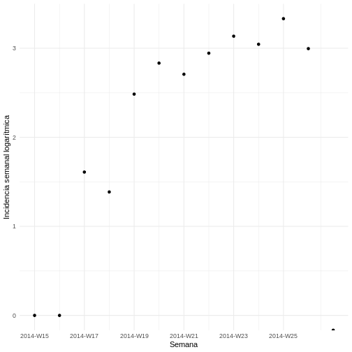
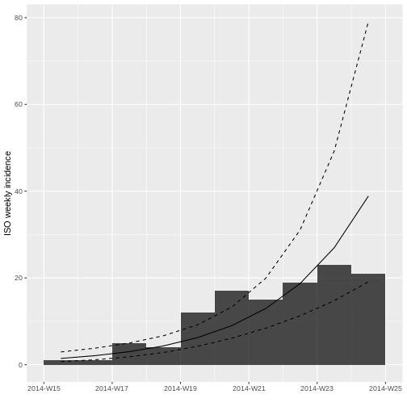

:::::::::::::::::::::::::::::::::::::: questions 

### Pregunta introductoria 

- ¿Cómo modelar y analizar un brote?

::::::::::::::::::::::::::::::::::::::::::::::::

::::::::::::::::::::::::::::::::::::: objectives

# Objetivos 

Al final de este taller usted podrá:

- Identificar los parámetros necesarios en casos de  transmisión de enfermedades infecciosas de persona a persona. 

- Estimar la probabilidad de muerte (CFR). 

- Calcular y graficar la incidencia.

- Estimar e interpretar la tasa de crecimiento y el tiempo en que se duplica la epidemia. 

- Estimar e interpretar el número de reproducción instantáneo  de la epidemia.


::::::::::::::::::::::::::::::::::::::::::::::::


## Tiempos de ejecución

Explicación del taller (10 minutos)

Realización del taller (100 minutos taller)

- Parte 1: Estructura de datos y CFR (15 min)

- Parte 2: Incidencia y tasa de crecimiento (45 min)

- Parte 3: Rt (40 min)

Discusión 30 minutos

## Introducción

Un nuevo brote de virus del Ébola (EVE) en un país ficticio de África occidental


#### Conceptos básicos a desarrollar

En esta práctica se desarrollarán los siguientes conceptos:


- Transmisión de enfermedades infecciosas de persona a persona 

- Número de reproducción básico 

- Número de reproducción instantáneo

- Probabilidad de muerte (IFR, CFR) 

- Intervalo serial 

- Tasa de crecimiento 

- Incidencia

::::::::::::::::::::: prereq

#### Preparación previa

Antes de comenzar, 

1. descargue la carpeta con los datos y el proyecto desde [Carpetas de datos](https://drive.google.com/drive/folders/1T0uZ2FNhwFAnFcCNxfLX8V6Ir3IsJO6y?usp=sharing) . 

2. Ahí mismo encontrará un archivo `.R` para instalar las dependencias necesarias para este taller.

3. Recuerde abrir el archivo `RProject` denominado `Taller-Brotes-Ebola.Rproj` antes de empezar a trabajar. 

Este paso no solo le ayudará a cumplir con las buenas prácticas de programación en R, sino también a mantener un directorio organizado, permitiendo un desarrollo exitoso del taller.

:::::::::::::::::::::


## 1. Estructura de datos

#### Cargue de librerías: 

Cargue las librerías necesarias para el análisis epidemiológico. Los datos serán manipulados con tidyverse que es una colección de paquetes para la ciencia de datos.


``` r
library(tidyverse) # contiene ggplot2, dplyr, tidyr, readr, purrr, tibble
library(readxl) # para leer archivos Excel
library(binom) # para intervalos de confianza binomiales
library(knitr) # para crear tablas bonitas con kable()
library(incidence) # para calcular incidencia y ajustar modelos
library(EpiEstim) # para estimar R(t)
```


#### Cargue de bases de datos

Se le ha proporcionado la siguiente base de datos:

- `casos`: una base de datos de casos que contiene información de casos hasta el 1 de julio de 2014.

Para leer en R este archivo, utilice la función `read_rds` de `tidyverse`. Se creará una tabla de datos almacenada como objeto de clase `tibble.`


``` r
casos <- read_rds("data/casos.rds")
```


#### Estructura de los datos

Explore la estructura de los datos. Para esto puede utilizar la función `glimpse` de `tidyverse`, la cual nos proporciona una visión rápida y legible de la estructura interna de nuestro conjunto de datos.


``` r
glimpse(casos)
```

``` output
Rows: 166
Columns: 11
$ id_caso                  <chr> "d1fafd", "53371b", "f5c3d8", "6c286a", "0f58…
$ generacion               <dbl> 0, 1, 1, 2, 2, 0, 3, 3, 2, 3, 4, 3, 4, 2, 4, …
$ fecha_de_infeccion       <date> NA, 2014-04-09, 2014-04-18, NA, 2014-04-22, …
$ fecha_inicio_sintomas    <date> 2014-04-07, 2014-04-15, 2014-04-21, 2014-04-…
$ fecha_de_hospitalizacion <date> 2014-04-17, 2014-04-20, 2014-04-25, 2014-04-…
$ fecha_desenlace          <date> 2014-04-19, NA, 2014-04-30, 2014-05-07, 2014…
$ desenlace                <chr> NA, NA, "Recuperacion", "Muerte", "Recuperaci…
$ genero                   <fct> f, m, f, f, f, f, f, f, m, m, f, f, f, f, f, …
$ hospital                 <fct> Military Hospital, Connaught Hospital, other,…
$ longitud                 <dbl> -13.21799, -13.21491, -13.22804, -13.23112, -…
$ latitud                  <dbl> 8.473514, 8.464927, 8.483356, 8.464776, 8.452…
```

Como puede observar contactos tiene 11 columnas (variables) y 166 filas de datos. En un rápido vistazo puede observar el tipo de las variables por ejemplo, la columna `desenlace` tiene formato carácter (`chr`) y contiene entre sus valores `"Recuperación"` o `"Muerte"`. 

Además, puede encontrar estas variables: 

- El identificador `id_caso`

- La generación de infectados (cuantas infecciones secundarias desde la fuente hasta el sujeto han ocurrido) 

- La fecha de infección 

- La fecha de inicio de síntomas 

- La fecha de hospitalización 

- La fecha del desenlace que, como se puede observar, en la siguiente variable puede tener entre sus opciones `NA` (no hay información hasta ese momento o no hay registro), recuperación y muerte 

- La variable género que puede ser `f` de femenino o `m` de masculino 

- El lugar de hospitalización, en la variable hospital 

- Y las variables longitud y latitud

Note que las fechas ya están en formato fecha (`date`).

## 2. CFR 

### Probabilidad de muerte en los casos reportados (`CFR`, por *Case Fatality Risk*)


``` r
table(casos$desenlace, useNA = "ifany")
```

``` output

      Muerte Recuperacion         <NA> 
          60           43           63 
```

::::::::::::::::::::::::::::::::::::: challenge  

## Desafío 1  

Calcule la probabilidad de muerte en los casos reportados (`CFR`) tomando el número de muertes y el número de casos con desenlace final conocido del objeto `casos`. Esta vez se calculará el `CFR` con el método *Naive*. Los cálculos *Naive* (*inocentes*) tienen el problema de que pueden presentar sesgos, por lo que no deberían ser utilizados para informar decisiones de salud pública. Hablaremos de estos sesgos en profundidad en el día 4. 

Durante este taller se le presentarán algunos retos, para los cuales obtendrá algunas pistas, por ejemplo en el presente reto se le presenta una pista, la cual es un fragmento del código que usted debe completar para alcanzar la solución. En los espacios donde dice `COMPLETE` por favor diligencie el código faltante.


``` r
muertes <-  COMPLETE

casos_desenlace_final_conocido <- sum(casos$desenlace %in% c("Muerte", "Recuperacion")) 

CFR <- COMPLETE / COMPLETE
```

Ejemplo, 


``` r
# Reto
muertes <-  COMPLETE
#Solución
muertes <- sum(casos$desenlace %in% "Muerte") 
```


``` output
[1] 0.5825243
```
:::::::::::::::::::::::::::::::::

:::::::::::::::::::::::::::::::::::::::::::::::::::::::::::::::::::: instructor

## Solución 1  


``` r
muertes <- sum(casos$desenlace %in% "Muerte") 

casos_desenlace_final_conocido <- sum(casos$desenlace %in% c("Muerte", "Recuperacion")) 

CFR <- muertes / casos_desenlace_final_conocido

print(CFR)
```

``` output
[1] 0.5825243
```
 
::::::::::::::::::::::::::::::::::::::::::::::::::::::::::::::::::::::::::::::::

Para complementar el calculo del CFR se pueden calcular sus intervalos de confianza por medio de la función `binom.confint`. La función `binom.confint` se utiliza para calcular intervalos de confianza para una proporción en una distribución binomial, que corresponde, por ejemplo, a cuando tenemos el total de infecciones con desenlace final conocido (recuperado o muerte). Esta función pide tres argumentos: 1) el número de muertes y 2) el número total de casos con desenlace final conocido, es decir sin importar que hayan muerto o se hayan recuperado, pero sin cuenta los datos con `NA`; 3) el método que se utilizará para calcular los intervalos de confianza, en este caso "`exact`" (método Clopper-Pearson). 

::::::::::::::::::::::::::::::::::::: challenge  

## Desafío 2  

Determine el CFR con sus intervalos de confianza utilizando la función `binom.confint`. Y obtenga este resultado: 


Table: **CFR con intervalos de confianza**

|method |  x|   n|      mean|     lower|     upper|
|:------|--:|---:|---------:|---------:|---------:|
|exact  | 60| 103| 0.5825243| 0.4812264| 0.6789504|
:::::::::::::::::::::::: solution 

## Pista 

Recuerde diligenciar los espacios donde dice `COMPLETE`. Y obtenga este resultado


``` r
CFR_con_CI <- binom.confint(COMPLETE, COMPLETE, method = "COMPLETE") %>%
  kable(caption = "**COMPLETE ¿QUE TITULO LE PONDRÍA?**")

CFR_con_CI
```
:::::::::::::::::::::::::::::::::
::::::::::::::::::::::::::::::::::::::::::::::::

:::::::::::::::::::::::::::::::::::::::::::::::::::::::::::::::::::: instructor

## Solución 2  


``` r
CFR_con_CI <- binom.confint(muertes, 
                                       casos_desenlace_final_conocido, method = "exact") %>%
  kable(caption = "**CFR con intervalos de confianza**")

CFR_con_CI
```


Table: **CFR con intervalos de confianza**

|method |  x|   n|      mean|     lower|     upper|
|:------|--:|---:|---------:|---------:|---------:|
|exact  | 60| 103| 0.5825243| 0.4812264| 0.6789504|
::::::::::::::::::::::::::::::::::::::::::::::::::::::::::::::::::::::::::::::::

## 3. Incidencia 

### 3.1. Curva de incidencia diaria 

El paquete `incidence` es de gran utilidad para el análisis epidemiológico de datos de incidencia de enfermedades infecciosas, dado que permite calcular la incidencia a partir del intervalo temporal suministrado (e.g. diario o semanal). Dentro de este paquete esta la función `incidence` la cual cuenta con los siguientes argumentos: 

1. `dates` contiene una variable con fechas que representan cuándo ocurrieron eventos individuales, como por ejemplo la fecha de inicio de los síntomas de una enfermedad en un conjunto de pacientes. 

2. `interval` es un intervalo de tiempo fijo por el que se quiere calcular la incidencia. Por ejemplo, `interval = 365` para un año. Si no se especifica, el valor por defecto es diario. 

3. `last_date` fecha donde se establecerá un limite temporal para los datos. Por ejemplo, la última fecha de hospitalización. Para este tercer argumento, podemos incluir la opción `max` y la opción  `na.rm`. La primera para obtener la última fecha de una variable y la segunda para ignorar los `NA` en caso de que existan. 


Por ejemplo, se podría escribir `last_date = max(base_de_datos$vector_ultima_fecha, na.rm = TRUE)`

Con esta información la función agrupa los casos según el intervalo de tiempo especificado y cuenta el número de eventos (como casos de enfermedad) que ocurrieron dentro de cada intervalo.

::::::::::::::::::::::::::::::::::::: challenge  

## Desafío 3  

Calcule la incidencia diaria usando únicamente el primer argumento de la función `incidence` ¿Qué fecha sería la más adecuada? Tenga en cuenta que se espera que esta sea la que pueda dar mejor información, es decir la menor cantidad de `NA`s.


``` r
incidencia_diaria <- incidence(COMPLETE)
incidencia_diaria
```
:::::::::::::::::::::::::::::::::

El resultado es un objeto de clase incidencia (`incidence`) que contiene el recuento de casos para cada intervalo de tiempo, lo que facilita su visualización y análisis posterior. Como puede observar la función produjo los siguientes datos: 


``` output
<incidence object>
[166 cases from days 2014-04-07 to 2014-06-29]

$counts: matrix with 84 rows and 1 columns
$n: 166 cases in total
$dates: 84 dates marking the left-side of bins
$interval: 1 day
$timespan: 84 days
$cumulative: FALSE
```

:::::::::::::::::::::::::::::::::::::::::::::::::::::::::::::::::::: instructor

## Solución 3  


``` r
incidencia_diaria <- incidence(casos$fecha_inicio_sintomas)
incidencia_diaria
```

``` output
<incidence object>
[166 cases from days 2014-04-07 to 2014-06-29]

$counts: matrix with 84 rows and 1 columns
$n: 166 cases in total
$dates: 84 dates marking the left-side of bins
$interval: 1 day
$timespan: 84 days
$cumulative: FALSE
```
::::::::::::::::::::::::::::::::::::::::::::::::::::::::::::::::::::::::::::::::

Como resultado de la función se produjo un objeto tipo lista. Este objeto arroja estos datos: `166 casos` contemplados entre los días `2014-04-07` al `2014-06-29` para un total de `84 días`; se menciona que el intervalo es de `1 día`, dado que no se utilizo específico explicitamente el parámetro por lo cual quedó su valor por defecto. Finalmente se menciona "`cumulative : FALSE`" lo que quiere decir que no se esta haciendo el acumulado de la incidencia, es decir que los casos corresponden a los del intervalo `interval: 1 day`, es decir a los casos nuevos cada día en específico.


Ahora haga una gráfica de la incidencia diaria. 


``` r
plot(incidencia_diaria, border = "black")
```


En el `Eje X (Fechas)`: Se puede observar fechas van desde el `7 de abril de 2014` hasta una fecha posterior al `21 de junio de 2014`. Estas fechas representan el período de observación del brote.

En el `Eje Y (Incidencia Diaria)`: La altura de las barras indica el número de nuevos casos reportados cada fecha según el tipo de fecha escogido.

Dado que no se agregó el parámetro `interval` la incidencia quedó por defecto diaria, produciéndose un histograma en el que cada barra representa la incidencia de un día, es decir, los casos nuevos. Los días sin barras sugieren que no hubo casos nuevos para esa fecha o que los datos podrían no estar disponibles para esos días.

A pesar de que hay una curva creciente, hay periodos con pocos o ningún caso. ¿Porque cree que podrían darse estos periodos de pocos a pesar de la curva creciente?


:::::::::::::::::::::::::::::::::::::::::::::::::::::::::::::::::::: instructor

## Ideas discusión: 

Usualmente al inicio de la transmisión en la fase exponencial, y dependiendo el periodo de incubación y el intervalo serial, se van a ver días sin casos. Eso no significa que la curva no sea creciente. Usualmente, al agrupar por semana ya no se verá la ausencia de casos.

::::::::::::::::::::::::::::::::::::::::::::::::::::::::::::::::::::::::::::::::

### 3.2. Cálculo de la incidencia semanal 

Teniendo en cuenta lo aprendido con respecto a la incidencia diaria, cree una variable para incidencia semanal. Luego, interprete el resultado y haga una gráfica. Para escoger la fecha que utilizará como última fecha debe asignarle un valor al argumento `last_date` de la función `incidence` ¿Qué fecha sería la más adecuada? Tenga en cuenta que la fecha debe ser posterior a la fecha que se haya escogido como el primer argumento.

::::::::::::::::::::::::::::::::::::: challenge  

## Desafío 4  


``` r
incidencia_semanal <- incidence(PRIMER ARGUMENTO,  #COMPLETE
                                SEGUNDO ARGUMENTO, #COMPLETE 
                                TERCER ARGUMENTO)  #COMPLETE
```


``` output
<incidence object>
[166 cases from days 2014-04-07 to 2014-06-30]
[166 cases from ISO weeks 2014-W15 to 2014-W27]

$counts: matrix with 13 rows and 1 columns
$n: 166 cases in total
$dates: 13 dates marking the left-side of bins
$interval: 7 days
$timespan: 85 days
$cumulative: FALSE
```


:::::::::::::::::::::::::::::::::

:::::::::::::::::::::::::::::::::::::::::::::::::::::::::::::::::::: instructor

## Solución 4  


``` r
incidencia_semanal <- incidence(casos$fecha_inicio_sintomas, 
                                interval = 7, 
                                last_date = max(casos$fecha_de_hospitalizacion,
                                              na.rm = TRUE))
incidencia_semanal
```

``` output
<incidence object>
[166 cases from days 2014-04-07 to 2014-06-30]
[166 cases from ISO weeks 2014-W15 to 2014-W27]

$counts: matrix with 13 rows and 1 columns
$n: 166 cases in total
$dates: 13 dates marking the left-side of bins
$interval: 7 days
$timespan: 85 days
$cumulative: FALSE
```

``` r
plot(incidencia_semanal, border = "black")
```


::::::::::::::::::::::::::::::::::::::::::::::::::::::::::::::::::::::::::::::::

Compare la gráfica de incidencia diaria con la de incidencia semanal. ¿Qué observa? ¿Los datos se comportan diferente? ¿Es lo que esperaba? ¿Logra observar alguna tendencia?

## 4. Tasa de crecimiento 

### 4.1. Modelo log-lineal 

#### Estimación de la tasa de crecimiento mediante un modelo log-lineal


Para observar mejor las tendencias de crecimiento en el número de casos se puede visualizar la incidencia semanal en una escala logarítmica. Esto es particularmente útil para identificar patrones exponenciales en los datos.


Grafique la incidencia transformada logarítmicamente:


``` r
ggplot(as.data.frame(incidencia_semanal)) + 
  geom_point(aes(x = dates, y = log(counts))) + 
  scale_x_incidence(incidencia_semanal) +
  xlab("Semana") +
  ylab("Incidencia semanal logarítmica") + 
  theme_minimal()
```


 
  
#### Ajuste un modelo log-lineal a los datos de incidencia semanal {#interpretación-del-modelo}


``` r
ajuste_modelo <- incidence::fit(incidencia_semanal)
ajuste_modelo
```

``` output
<incidence_fit object>

$model: regression of log-incidence over time

$info: list containing the following items:
  $r (daily growth rate):
[1] 0.04145251

  $r.conf (confidence interval):
          2.5 %     97.5 %
[1,] 0.02582225 0.05708276

  $doubling (doubling time in days):
[1] 16.72148

  $doubling.conf (confidence interval):
        2.5 %   97.5 %
[1,] 12.14285 26.84302

  $pred: data.frame of incidence predictions (12 rows, 5 columns)
```

::::::::::::::::::::::::::::::::::::: challenge  

## Desafío 5  

¿Qué observa en este resultado?

:::::::::::::::::::::::: solution 

## Solución 

`$model`: Indica que se ha realizado una regresión logarítmica de la incidencia en función del tiempo. Esto implica que la relación entre el tiempo y la incidencia de la enfermedad ha sido modelada como una función lineal en escala logarítmica en la incidencia con el fin de entender mejor las tendencias de crecimiento.


`$info`: Contiene varios componentes importantes del análisis:

1. `$r (daily growth rate)` Tasa de crecimiento diaria: `0.04145251` 

La tasa de crecimiento diaria estimada del brote es de `0.0415`. Esto significa que cada día la cantidad de casos está creciendo en un `4.15%` con respecto al día anterior, bajo la suposición de un crecimiento exponencial constante durante el periodo modelado.


Si quisiera acceder a esta información sin ingresar al modelo podría hacerlo con el siguiente código:


``` r
tasa_crecimiento_diaria <- ajuste_modelo$info$r
cat("La tasa de crecimiento diaria es:", tasa_crecimiento_diaria, "\n")
```

``` output
La tasa de crecimiento diaria es: 0.04145251 
```

2. `$r.conf` (confidence interval):  2.5 %  0.02582225   97.5 %  0.05708276

El intervalo de confianza del `95%` para la tasa de crecimiento diaria está entre `0.0258 (2.58%)` y `0.0571 (5.71%)`.

`$doubling` (doubling time in days): 16.72148

3. El tiempo de duplicación estimado del número de casos nuevos es de aproximadamente `16.72 días`. Esto significa que, bajo el modelo actual y con la tasa de crecimiento estimada, se espera que el número de casos de la curva epidémica actual se duplique cada `16.72 días`.

`$doubling.conf` (confidence interval):  2.5 %  12.14285 97.5 % 26.84302

4. El intervalo de confianza del `95%` para el tiempo de duplicación está entre aproximadamente `12.14` y `26.84 días`. Este amplio rango refleja la incertidumbre en la estimación y puede ser consecuencia de la variabilidad en los datos o de un tamaño de muestra pequeño.

`$pred`: Contiene las predicciones de incidencia observada. Incluye las fechas, la escala de tiempo en días desde el inicio del brote, los valores ajustados (predicciones) y los límites inferior y superior del intervalo de confianza para las predicciones.

Si quiere conocer un poco más de este componente puede explorarlo con la función `glimpse`.


``` r
glimpse(ajuste_modelo$info$pred)
```

¿El modelo se ajusta bien a los datos? Verifique el $R^2$


``` r
AjusteR2modelo <- summary(ajuste_modelo$model)$adj.r.squared
cat("El R cuadrado ajustado es:", AjusteR2modelo, "\n")
```

``` output
El R cuadrado ajustado es: 0.7551113 
```


:::::::::::::::::::::::::::::::::
::::::::::::::::::::::::::::::::::::::::::::::::
 
Antes de continuar ¿Considera más adecuado usar una gráfica semanal para buscar un ajuste de los datos? ¿Por qué?

¿Es preferible calcular la tasa de crecimiento diaria con el ajuste semanal y no con el ajuste diario?

:::::::::::::::::::::::::::::::::::::::::::::::::::::::::::::::::::: instructor

## Ideas para responder:

Es preferible estimar la tasa de crecimiento diaria utilizando el ajuste de la incidencia semanal en lugar de la incidencia diaria debido a que los datos diarios pueden ser muy volátiles en los primeros días de la curva exponencial. Esto puede suceder por varias razones:

- Las fluctuaciones naturales, ciclos de informes, retrasos en el reporte y los errores de medición, que pueden no reflejar cambios reales en la transmisión de la enfermedad. 

- Los datos diarios pueden tener más lagunas o inexactitudes. 

- Eventos de superdispersión o las intervenciones de control.

El uso de datos semanales puede suavizar estas fluctuaciones, dando una mejor idea de la tendencia subyacente. Al utilizar una media móvil semanal, se suavizan estas fluctuaciones, lo que proporciona una imagen más clara de la tendencia subyacente. Esto permite mejorar la precisión de la estimación y evitar el sesgo de los días de la semana, así como mejorar el modelo al reducir el número total de puntos, dado que puede ayudar a evitar el sobreajuste y mejorar la generalización del modelo.

Ejemplo: Algunos fenómenos pueden variar sistemáticamente según el día de la semana. Por ejemplo, el número de pruebas de COVID-19 realizadas podría ser menor los fines de semana, lo que podría afectar a la incidencia reportada. Al utilizar una media móvil semanal, se evita este tipo de sesgo.
::::::::::::::::::::::::::::::::::::::::::::::::::::::::::::::::::::::::::::::::


Grafique la incidencia incluyendo una línea que represente el modelo.


Con `plot`

``` r
plot(incidencia_semanal, fit = ajuste_modelo)
```


Tras ajustar el modelo log-lineal a la incidencia semanal para estimar la tasa de crecimiento de la epidemia, el gráfico muestra la curva de ajuste superpuesta a la incidencia semanal observada. 

Al final del gráfico se puede observar que la incidencia semanal disminuye. 

¿Porqué cree que podría estar pasando esto? ¿Cómo lo solucionaría?

:::::::::::::::::::::::::::::::::::::::::::::::::::::::::::::::::::: instructor

Si se grafica por fecha de inicio de síntomas mientras el brote está creciendo, siempre se va a ver un descenso artificial en la curva de la incidencia en fechas recientes. Este descenso sólo corresponde al rezago administrativo (del diagnóstico y reporte de casos), pero no indica necesariamente una reducción de la incidencia real.

::::::::::::::::::::::::::::::::::::::::::::::::::::::::::::::::::::::::::::::::

### 4.2. Modelo log-lineal con datos truncados 


#### Encuentre una fecha límite adecuada para el modelo log-lineal, en función de los rezagos (biológicos y administrativos).

Dado que esta epidemia es de Ébola y la mayoría de los casos van a ser hospitalizados, es muy probable que la mayoría de las notificaciones ocurran en el momento de la hospitalización. De tal manera que podríamos examinar cuánto tiempo transcurre entre la fecha de inicio de síntomas y la fecha de hospitalización para hacernos una idea del rezago para esta epidemia.


``` r
summary(as.numeric(casos$fecha_de_hospitalizacion - casos$fecha_inicio_sintomas))
```

``` output
   Min. 1st Qu.  Median    Mean 3rd Qu.    Max. 
   0.00    1.00    2.00    3.53    5.00   22.00 
```

Al restar la fecha de hospitalización a la fecha de inicio de síntomas podría haber valores negativos. ¿Cuál cree que sea su significado? ¿Ocurre en este caso?


Para evitar el sesgo debido a rezagos en la notificación, se pueden truncar los datos de incidencia. Pruebe descartar las últimas dos semanas. Este procedimiento permite concentrarse en el periodo en que los datos son más completos para un análisis más fiable.

Semanas a descartar al final de la epicurva


``` r
semanas_a_descartar <- 2
fecha_minima <- min(incidencia_diaria$dates)
fecha_maxima <- max(incidencia_diaria$dates) - semanas_a_descartar * 7

# Para truncar la incidencia semanal
incidencia_semanal_truncada <- subset(incidencia_semanal, 
                         from = fecha_minima, 
                         to = fecha_maxima) # descarte las últimas semanas de datos

# Incidencia diaria truncada. No la usamos para la regresión lineal pero se puede usar más adelante
incidencia_diaria_truncada <- subset(incidencia_diaria, 
                        from = fecha_minima, 
                        to = fecha_maxima) # eliminamos las últimas dos semanas de datos
```


::::::::::::::::::::::::::::::::::::: challenge  

## Desafío 6  

Ahora utilizando los datos truncados `incidencia_semanal_truncada` vuelva a ajustar el modelo logarítmico lineal.


``` output
<incidence_fit object>

$model: regression of log-incidence over time

$info: list containing the following items:
  $r (daily growth rate):
[1] 0.05224047

  $r.conf (confidence interval):
          2.5 %    97.5 %
[1,] 0.03323024 0.0712507

  $doubling (doubling time in days):
[1] 13.2684

  $doubling.conf (confidence interval):
        2.5 %   97.5 %
[1,] 9.728286 20.85893

  $pred: data.frame of incidence predictions (10 rows, 5 columns)
```
:::::::::::::::::::::::::::::::::

:::::::::::::::::::::::::::::::::::::::::::::::::::::::::::::::::::: instructor

## Solución 6  


``` r
ajuste_modelo_truncado <- incidence::fit(incidencia_semanal_truncada)
ajuste_modelo_truncado
```

``` output
<incidence_fit object>

$model: regression of log-incidence over time

$info: list containing the following items:
  $r (daily growth rate):
[1] 0.05224047

  $r.conf (confidence interval):
          2.5 %    97.5 %
[1,] 0.03323024 0.0712507

  $doubling (doubling time in days):
[1] 13.2684

  $doubling.conf (confidence interval):
        2.5 %   97.5 %
[1,] 9.728286 20.85893

  $pred: data.frame of incidence predictions (10 rows, 5 columns)
```

``` r
AjusteR2modelo <- summary(ajuste_modelo_truncado$model)$adj.r.squared 

cat("El R cuadrado ajustado es:", AjusteR2modelo, "\n")
```

``` output
El R cuadrado ajustado es: 0.8131106 
```
::::::::::::::::::::::::::::::::::::::::::::::::::::::::::::::::::::::::::::::::

¿Cámo interpreta estos resultados? ¿Compare los $R^2$?

::::::::::::::::::::::::::::::::::::: challenge  

## Desafío 7  

Ahora utilizando los datos truncados `incidencia_semanal_truncada` vuelva a graficar el modelo logarítmico lineal. 


:::::::::::::::::::::::::::::::::

:::::::::::::::::::::::::::::::::::::::::::::::::::::::::::::::::::: instructor

## Solución 7  


``` r
plot(incidencia_semanal_truncada, fit = ajuste_modelo_truncado)
```


::::::::::::::::::::::::::::::::::::::::::::::::::::::::::::::::::::::::::::::::


¿Qué cambios observa?


Observe las estadísticas resumidas del ajuste:


``` r
summary(ajuste_modelo_truncado$model)
```

``` output

Call:
stats::lm(formula = log(counts) ~ dates.x, data = df)

Residuals:
     Min       1Q   Median       3Q      Max 
-0.73474 -0.31655 -0.03211  0.41798  0.65311 

Coefficients:
            Estimate Std. Error t value Pr(>|t|)    
(Intercept) 0.186219   0.332752   0.560 0.591049    
dates.x     0.052240   0.008244   6.337 0.000224 ***
---
Signif. codes:  0 '***' 0.001 '**' 0.01 '*' 0.05 '.' 0.1 ' ' 1

Residual standard error: 0.5241 on 8 degrees of freedom
Multiple R-squared:  0.8339,	Adjusted R-squared:  0.8131 
F-statistic: 40.16 on 1 and 8 DF,  p-value: 0.0002237
```

El modelo muestra que hay una relación significativa (`R-squared: 0.8131`) entre el tiempo (`dates.x`) y la incidencia de la enfermedad, por lo que concluimos que la enfermedad muestra un crecimiento exponencial a lo largo del tiempo. 

### 4.3. Tasa de crecimiento y tasa de duplicación: extracción de datos 

#### Estimacion de la tasa de crecimiento 


Para estimar la tasa de crecimiento de una epidemia utilizando un modelo log-lineal es necesario realizar un ajuste de regresión a los datos de incidencia. Dado que ya tiene un objeto de incidencia truncado y un modelo log-lineal ajustado, puede proceder a calcular la tasa de crecimiento diaria y el tiempo de duplicación de la epidemia.

El modelo log-lineal proporcionará los coeficientes necesarios para estos cálculos. Note que el coeficiente asociado con el tiempo (la pendiente de la regresión) se puede interpretar como la tasa de crecimiento diaria cuando el tiempo se expresa en días.

Con el modelo ajustado truncado, es hora de realizar la estimación de la tasa de crecimiento. Estos datos los puede encontrar en el objeto `ajuste modelo semana`, que tiene los datos ajustados de incidencia semanal truncada. 

::::::::::::::::::::::::::::::::::::: challenge  

## Desafío 8  

Por favor escriba el código para obtener los siguientes valores:


``` output
La tasa de crecimiento diaria es: 0.05224047 
```

``` output
Intervalo de confianza de la tasa de crecimiento diaria (95%): 0.03323024 0.0712507 
```
:::::::::::::::::::::::::::::::::

:::::::::::::::::::::::::::::::::::::::::::::::::::::::::::::::::::: instructor

## Solución  8 


``` r
# Estimación de la tasa de crecimiento diaria
tasa_crecimiento_diaria <- ajuste_modelo_truncado$info$r

cat("La tasa de crecimiento diaria es:", tasa_crecimiento_diaria, "\n")
```

``` output
La tasa de crecimiento diaria es: 0.05224047 
```

``` r
# Intervalo de confianza de la tasa de crecimiento diaria
tasa_crecimiento_IC <- ajuste_modelo_truncado$info$r.conf

cat("Intervalo de confianza de la tasa de crecimiento diaria (95%):", tasa_crecimiento_IC, "\n")
```

``` output
Intervalo de confianza de la tasa de crecimiento diaria (95%): 0.03323024 0.0712507 
```

::::::::::::::::::::::::::::::::::::::::::::::::::::::::::::::::::::::::::::::::

Si no lo recuerda, vuelva por pistas a la sección [Ajuste un modelo log-lineal a los datos de incidencia semanal](#interpretación-del-modelo)


Ahora que ya ha obtenido la tasa de crecimiento diaria y sus intervalos de confianza, puede pasar a estimar el tiempo de duplicación.


#### Estimación del tiempo de duplicación


Esta información también la encontrará calculada y lista para utilizar en el objeto `ajuste_modelo_truncado`, que tiene los datos ajustados de incidencia semanal truncada. 

::::::::::::::::::::::::::::::::::::: challenge  

## Desafío 9  

Por favor escriba el código para obtener los siguientes valores:


``` output
El tiempo de duplicación de la epidemia es 13.2684 días
```

``` output
Intervalo de confianza del tiempo de duplicación (95%): 9.728286 20.85893 
```
:::::::::::::::::::::::::::::::::

:::::::::::::::::::::::::::::::::::::::::::::::::::::::::::::::::::: instructor

## Solución 9  


``` r
# Estimación del tiempo de duplicación en días
tiempo_duplicacion_dias <- ajuste_modelo_truncado$info$doubling
cat("El tiempo de duplicación de la epidemia es", tiempo_duplicacion_dias, "días\n")
```

``` output
El tiempo de duplicación de la epidemia es 13.2684 días
```

``` r
# Intervalo de confianza del tiempo de duplicación
tiempo_duplicacion_IC <- ajuste_modelo_truncado$info$doubling.conf
cat("Intervalo de confianza del tiempo de duplicación (95%):", tiempo_duplicacion_IC, "\n")
```

``` output
Intervalo de confianza del tiempo de duplicación (95%): 9.728286 20.85893 
```
::::::::::::::::::::::::::::::::::::::::::::::::::::::::::::::::::::::::::::::::

Si no lo recuerda vuelva por pistas a la sección [Ajuste un modelo log-lineal a los datos de incidencia semanal](#interpretación-del-modelo)

## 5. Estimación de número de reproducción

Evaluar la velocidad a la que se propaga una infección en una población es una tarea importante a la hora de informar la respuesta de salud pública a una epidemia. 

Los números de reproducción son métricas típicas para monitorear el desarrollo de epidemias y son informativos sobre su velocidad de propagación. El **Número de reproducción básico** $R_0$, por ejemplo, mide el número promedio de casos secundarios producidos por un individuo infeccioso dada una población completamente susceptible. Esta hipótesis suele ser válida solo al inicio de una epidemia.

Para caracterizar el la propagación en tiempo real es más común utilizar el **Número de reproducción instantáneo** $R_t$, el cual describe el número promedio de casos secundarios generados por un individuo infeccioso en el tiempo $t$ dado que no han habido cambios en las condiciones actuales.

En esta sección exploraremos los conceptos necesarios para calcular el Número de reproducción instantáneo, así como los pasos a seguir para estimarlo por medio del paquete de R `{EpiEstim}`.

### 5.1. Intervalo serial (SI) 

¿Qué es el intervalo serial?

El intervalo serial en epidemiología se refiere al tiempo que transcurre entre el momento en que una persona infectada (el caso primario) comienza a mostrar síntomas y el momento en que la persona que fue infectada por ella (el caso secundario) comienza a mostrar síntomas.

Este intervalo es importante porque ayuda a entender qué tan rápido se está propagando una enfermedad y a diseñar estrategias de control como el rastreo de contactos y la cuarentena. Si el intervalo serial es corto, puede significar que la enfermedad se propaga rápidamente y que es necesario actuar con urgencia para contenerla. Si es largo, puede haber más tiempo para intervenir antes de que la enfermedad se disemine ampliamente.

Para este brote de Ébola asumiremos que el intervalo serial está descrito por una distribución Gamma de media (`mean_si`) de `8.7 días` y con una desviación estándar (`std_si`) de `6.1 días`. En la práctica del día 4 estudiaremos cómo estimar el intervalo serial.


``` r
# Parametros de la distribución gamma para el invertavlo serial
mean_si <- 8.7
std_si <-  6.1

config <- make_config(list(mean_si = mean_si, std_si = std_si)) 
# t_start y t_end se configuran automáticamente para estimar R en ventanas deslizantes para 1 semana de forma predeterminada.
```


### 5.2. Estimación de la transmisibilidad variable en el tiempo, R(t) 

Cuando la suposición de que ($R$) es constante en el tiempo se vuelve insostenible, una alternativa es estimar la transmisibilidad variable en el tiempo utilizando el Número de reproducción instantáneo ($R_t$). Este enfoque, introducido por Cori et al. (2013),  se implementa en el paquete `EpiEstim`, el cual estima el $R_t$ para ventanas de tiempo personalizadas, utilizando una distribución de Poisson.  A continuación, estimamos la transmisibilidad para ventanas de tiempo deslizantes de 1 semana (el valor predeterminado de `estimate_R`):

***


``` r
config <- make_config(list(mean_si = mean_si, std_si = std_si)) 
# t_start y t_end se configuran automáticamente para estimar R en ventanas deslizantes para 1 semana de forma predeterminada.
```


``` r
# use estimate_R using method = "parametric_si"
estimacion_rt <- estimate_R(incidencia_diaria_truncada, method = "parametric_si", 
                            si_data = si_data,
                            config = config)
# Observamos las primeras estimaciones de R(t)
head(estimacion_rt$R[, c("t_start", "t_end", "Median(R)", 
                         "Quantile.0.025(R)", "Quantile.0.975(R)")])
```

``` output
  t_start t_end Median(R) Quantile.0.025(R) Quantile.0.975(R)
1       2     8        NA                NA                NA
2       3     9  2.173592         0.3136801          7.215718
3       4    10  2.148673         0.3100840          7.132996
4       5    11  2.060726         0.2973920          6.841036
5       6    12  1.960940         0.2829915          6.509775
6       7    13  1.869417         0.2697834          6.205943
```


Grafique la estimación de $R$ como función del tiempo:


``` r
plot(estimacion_rt, legend = FALSE)
```


***

#### Sobre este documento

Este documento ha sido una adaptación de los materiales originales disponibles en [RECON Learn](https://www.reconlearn.org/)

#### Contribuciones
Autores originales:

- Anne Cori

- Natsuko Imai

- Finlay Campbell

- Zhian N. Kamvar

- Thibaut Jombart


Cambios menores y adaptación a español:

- José M. Velasco-España

- Cándida Díaz-Brochero

- Nicolas Torres

- Zulma M. Cucunubá


::::::::::::::::::::::::::::::::::::: keypoints 

## Puntos clave 

Revise si al final de esta lección adquirió estas competencias:


- Identificar los parámetros necesarios en casos de transmisión de enfermedades infecciosas de persona a persona. 

- Estimar la probabilidad de muerte (CFR). 

- Calcular y graficar la incidencia.

- Estimar e interpretar la tasa de crecimiento y el tiempo en el que se duplica la epidemia. 

- Estimar e interpretar el número de reproducción instantáneo  de la epidemia.

::::::::::::::::::::::::::::::::::::::::::::::::
