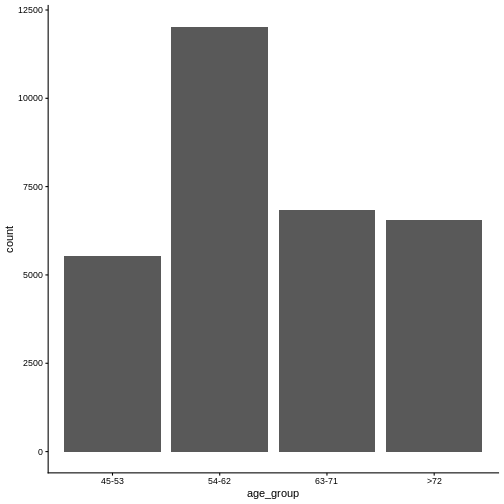
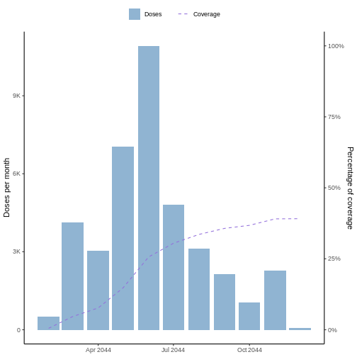
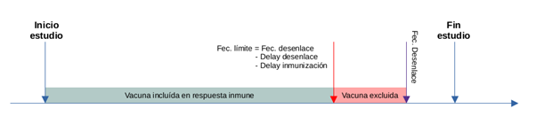
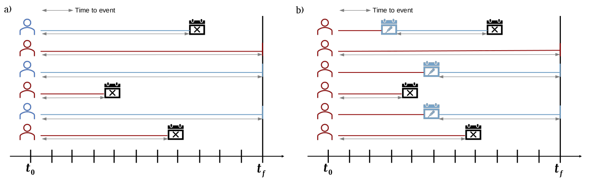
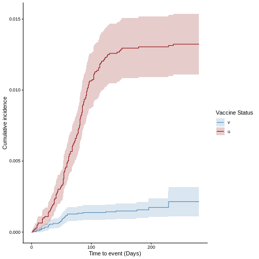
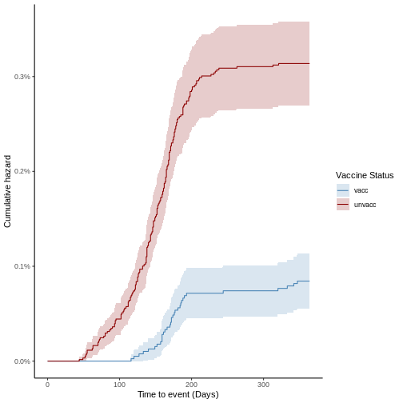
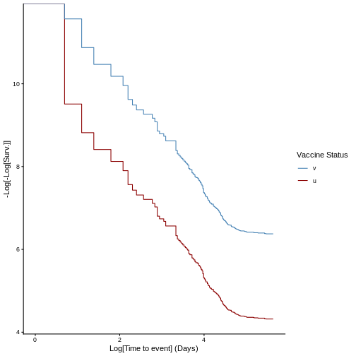
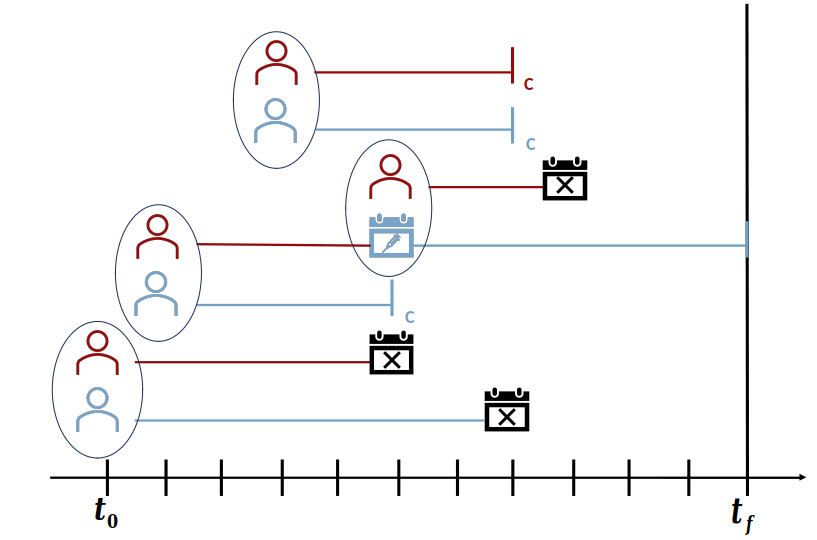

:::::::::::::::::::::::::::::::::::::: questions 
 
- ¿Cómo realizar el cálculo de efectividad vacunal con cohortes usando vaccineff?

::::::::::::::::::::::::::::::::::::::::::::::::

::::::::::::::::::::::::::::::::::::: objectives

Al final de este taller usted podrá: 
 
- Estudiar algunos de los conceptos claves para la implementación de estudios 
observacionales con diseño de cohortes

- Calcular las métricas claves para llevar a cabo un estudio de cohortes

- Discutir las ventajas y desventajas de los métodos de estimación 
no paramétricos y semi-paramétricos de modelos de superviviencia

- Aplicar estrategias de emparejamiento de casos y control y discutir su 
potencial efecto sobre los estudios de cohortes

- Estimar la efectividad vacunal haciendo uso de un diseño de cohortes

::::::::::::::::::::::::::::::::::::::::::::::::


## 1. Introducción

En esta sesión se espera que los participantes se familiaricen con uso del 
paquete de R`vaccineff`. Utilizaremos el diseño de cohortes para estimar la
efectividad vacunal de un conjunto de datos de prueba y analizaremos
los resultados obtenidos.

## 2. Objetivos

* Estudiar algunos de los conceptos claves para la implementación de estudios 
observacionales con diseño de cohortes

* Calcular las métricas claves para llevar a cabo un estudio de cohortes

* Discutir las ventajas y desventajas de los métodos de estimación 
no paramétricos y semi-paramétricos de modelos de superviviencia

* Aplicar estrategias de emparejamiento de casos y control y discutir su 
potencial efecto sobre los estudios de cohortes

* Estimar la efectividad vacunal haciendo uso de un diseño de cohortes

## 3. Conceptos básicos a desarrollar

En esta práctica se desarrollarán los siguientes conceptos:

-   Eficacia y Efectividad vacunal

-   Tiempo de inducción o "delays" en el análisis de efectividad de
    vacunas

-   Diseños observacionales para el estudio de la efectividad vacunal

-   Diseño de cohortes para estimación de la efectividad vacunal

-   Estimador no paramétrico Kaplan-Meier

-   Modelo semi-paramétrico de Cox

-   Riesgos proporcionales

### **3.1. Eficacia vs Efectividad vacunal**

**Eficacia:**

-   Se refiere a la capacidad de lograr un efecto deseado o esperado
    bajo condiciones ideales o controladas.

-   Es una medida teórica. En experimentos clínicos, por ejemplo, la
    eficacia de un medicamento se evalúa en condiciones controladas,
    donde todos los factores externos están cuidadosamente regulados
    para determinar el rendimiento puro del medicamento.

-   Puede considerarse como "lo que puede hacer" una intervención en las
    mejores circunstancias posibles.

**Efectividad:**

-   Se refiere a qué tan bien funciona una intervención en condiciones
    "reales" o prácticas, fuera de un entorno controlado.

-   Es una medida práctica. En el contexto de los medicamentos, la
    efectividad se refiere a qué tan bien funciona un medicamento en el
    "mundo real", donde las condiciones no están tan controladas y hay
    muchos factores variables.

-   Puede considerarse como "lo que realmente hace" una intervención en
    circunstancias típicas o cotidianas.

+-----------------------------------------------------------------------+
| Un ejemplo podría ser un medicamento que en experimentos clínicos (en |
| condiciones ideales) mostró una eficacia del 95% en prevenir el       |
| desenlace. Sin embargo, cuando se usó en el contexto general,         |
| considerando factores como la adherencia al tratamiento,              |
| interacciones con otros medicamentos y variabilidad en la población,  |
| su efectividad fue del 85%. Aquí, la eficacia muestra el potencial    |
| del medicamento bajo condiciones ideales, mientras que la efectividad |
| muestra cómo funciona en situaciones cotidianas.                      |
+-----------------------------------------------------------------------+

En el caso de las vacunas la efectividad hace referencia a la
disminución proporcional de casos de una enfermedad o evento en una
población vacunada comparada con una población no vacunada, en
condiciones del mundo real.

### **3.2. Tiempo de inducción**

El tiempo de inducción o *"delay"* se refiere al periodo necesario para
que la vacuna administrada induzca una respuesta inmune protectora
frente a la infección o la enfermedad provocada por un patógeno. Si
ocurre una infección entre el momento de la vacunación y el momento
donde se prevé exista una respuesta inmune protectora, ocurrirá la
infección de manera natural y no se considera un fallo de la vacuna en
cuestión, puesto que la persona inmunizada aún no contaba con la
protección conferida por la vacuna.

### **3.3. Diseños observacionales para el estudio de la efectividad vacunal**

Por múltiples razones, los estudios observacionales son los más
utilizados en la estimación de la efectividad vacunal. Existen múltiples
diseños, entre ellos: diseño de cohortes, diseño de casos y controles,
diseño de test-negativo, diseño "screening-method". La elección del
diseño, dependerá de la disponibilidad de información y los recursos
disponibles para llevar a cabo el estudio.

### **3.4. Diseño de cohorte para el estudio de la efectividad vacunal**

El término cohorte se refiere a un grupo de personas que comparten una
característica común. En los estudios con diseño de cohorte, existen dos
o más poblaciones que difieren en una característica o exposición y se
realiza un seguimiento a ambos grupos para evaluar la aparición de uno o
más desenlaces de interés y comparar la incidencia de los eventos entre
ambos grupos. Para el caso de los estudios de la efectividad de vacunas,
la exposición de interés corresponde a la aplicación de la vacuna y los
desenlaces pueden incluir:

-   Infección: contagio con el patógeno de interés tras una exposición a
    alguien infeccioso

-   Enfermedad: desarrollo de signos y síntomas relacionados con la
    infección con un patógeno. Puede tener diferentes grados de
    severidad, requerir ingreso a hospitalización, UCI o incluso
    conducir a la muerte.

-   A la hora de llevar a cabo estos estudios se debe garantizar que las
    personas incluidas en cada población no tengan el desenlace de
    interés que será evaluado durante el seguimiento. Así mismo, es
    importante que el seguimiento se lleve a cabo de manera igual de
    rigurosa y por el mismo tiempo en ambos grupos.

La efectividad vacunal corresponde a la reducción relativa del riesgo de
desarrollar la infección y/o enfermedad. En los estudios de cohorte se
puede estimar el riesgo relativo, los *odds ratio* o los *hazard ratio*
que expresa el riesgo que tiene la cohorte no expuesta comparado con la
cohorte de los expuestos. La efectividad vacunal será, por lo tanto, el
complemento del riesgo proporcional en la cohorte de expuestos.

Veamos esto con un ejemplo: para evaluar la efectividad de una vacuna
para prevenir el desarrollo de enfermedad en una población, al cabo del
seguimiento la incidencia en la cohorte vacunada fue de 1 por 1000
habitantes y en la cohorte no vacunada fue de 5 por 1000 habitantes. En
este caso, tenemos que el riesgo relativo en la población vacunada fue
0.001/0.005 = 0,2. Es decir, la población vacunada tuvo una incidencia
correspondiente al 20% de la incidencia de la población no vacunada.
Esta reducción se puede atribuir a la vacuna y para estimarla usaríamos
el complemento, que corresponde a 1 - 0,2= 0,8. Es decir que la
reducción que se observó corresponde a un 80% y se puede atribuir a la
vacuna, por lo tanto, la efectividad de la vacunación fue del 80% para
evitar la enfermedad.

### **3.5. Métodos estadísticos para análisis de efectividad vacunal**

En el diseño de cohortes se utilizan principalmente dos métodos: Estimación no 
paramétrica de Kapplan-Meier y Modelo semi-paramétrico de Cox

##### **Estimador Kaplan-Meier**

El estimador Kaplan-Meier utiliza las tasas de incidencia de
un evento para cuantificar la probabilidad de supervivencia $S(t)$ de forma no paramétrica, 
es decir, sin una representación matemática funcional. En general, 
la incidencia acumulada de cada grupo permite cuantificar el riesgo de presentar
el evento como $1 - S(t)$. Asimismo, la comparación entre el riesgo de ambos
grupos en un punto del tiempo determina el riesgo relativo entre grupos ($RR$). 
A partir de esta se estima la efectividad vacunal como:
$$V_{EFF} = 1 - RR$$

##### **Modelo de Regresión de Cox**

El modelo Cox, permite estimar de forma semi-paramétrica la función de 
riesgo instantáneo $\lambda(t|x_i)$ de un individuo $i$ en terminos de sus 
características, las cuales se asocian a un conjunto de covariables
$x_1, x_2, ..., x_n$, con lo cual se tiene:

$$\lambda(t|x_i) = \lambda_0(t) \exp(\beta_1 x_{i1} + \beta_2 x_{i2} + ....+\beta_n x_{in})$$
donde $\beta_1, \beta_2, ..., \beta_n$ son los coeficientes de la regresión
y $\lambda_0$ es una función basal no especificada, por lo que el modelo se 
asume como semi-paramétrico. En el caso en el que la función de riesgo instantáneo
es completamente especificada, es decir, se  conoce la forma funcional de 
$\lambda_0(t)$, es posible calcular matemáticamente la probabilidad de 
supervivencia. Sin embargo, ninguna de estas funciones puede ser estimada 
directamente del modelo de Cox. Por el contrario, con este se busca estimar 
el *hazard ratio*, una medida de riesgos comparativa entre dos individuos $i$ y
$j$ con características $x_{i1}, x_{i2}, ..., x_{in}$ y 
$x_{j1}, x_{j2}, ..., x_{jn}$, respectivamente. En este orden, al evaluar el 
riesgo de un individuo con respecto al otro se tiene:

$$HR = \frac{\lambda(t|x_i)}{\lambda(t|x_j)} = \frac{\lambda_0(t)\exp(\beta x_{i})}{\lambda_0(t)\exp(\beta x_{j})} = \exp(\beta(x_i-x_j))$$
**Riesgos proporcionales:** Nótese que la dependencia temporal de las funciones 
de riesgo instantáneo individuales se canceló dentro de la expresion anterior 
para el Hazard ratio, por tanto se dice que los individuos $i$ y $j$ exhiben 
*riesgos proporcionales* en el tiempo. Esta hipótesis constituye un pilar 
importante de los estudios de efectividad bajo diseño de cohorte.

En el contexto de los estudios de cohorte, el modelo de Cox puede utilizarse 
para estimar el riesgo comparativo entre ambos grupos de presentar un desenlace 
de interés. En este sentido la pertenecia a un grupo se utiliza como covariable
dentro de la regresión. Particularmente, para el cálculo de la efectividad 
vacunal se puede utilizar el $HR$ de forma análoga al caso discutido para el
estimador Kaplan-Meier, con lo que se define:

$$V_{EFF} = 1 - HR$$

## 4. Caso de uso del paquete

Para esta sesión se trabajará con el conjunto de datos de ejemplo incluido en 
el paquete `vaccineff`. Adicionalmente, se utilizarán algunas funciones de los
paquetes `ggplot2` y `cowplot` para vizualizar algunos resultados.

Para installar `vaccineff` ejecute las siguientes líneas en R:


``` r
# if(!require("pak")) install.packages("pak")
# pak::pak("epiverse-trace/vaccineff@dev")
```

Posteriormente, para cargar los paquetes en el espacio de trabajo y el set de 
datos de ejemplo del `vaccineff` ejecute:


``` r
library("vaccineff")
library("ggplot2")
library("cowplot")
data(cohortdata)
head(cohortdata)
```

``` output
        id sex age death_date death_other_causes vaccine_date_1 vaccine_date_2
1 04edf85a   M  50       <NA>               <NA>           <NA>           <NA>
2 c5a83f56   M  66       <NA>               <NA>           <NA>           <NA>
3 82991731   M  81       <NA>               <NA>           <NA>           <NA>
4 afbab268   M  74       <NA>               <NA>     2021-03-30     2021-05-16
5 3faf2474   M  54       <NA>               <NA>     2021-06-01     2021-06-22
6 97df7bdc   M  79       <NA>               <NA>     2021-03-21     2021-05-02
  vaccine_1 vaccine_2
1      <NA>      <NA>
2      <NA>      <NA>
3      <NA>      <NA>
4    BRAND2    BRAND2
5    BRAND1    BRAND1
6    BRAND2    BRAND2
```

Este tabla contiene información de una epidemia simulada ocurrida en 2044 sobre 
una población hipotética, compuesta por 100.000 habitantes, que recibió
dos dosis de una vacuna para disminuir el riesgo de muerte por una
enfermedad respiratoria viral. Sobre esta población se realizó
seguimiento por 1 año, entre el 1 de enero y 31 de diciembre de 2044. En
el conjunto de datos se presenta la información desagregada para cada
uno de los participantes.

### **4.1 Funciones básicas de exploración de datos**

#### **4.1.1 Grupo etario**

Para agrupar la población por grupo etario y graficar la distribución
por edad utilizaremos la función "get_age_group". Para esto, ejectute el
siguiente comando en R:


``` r
cohortdata$age_group <- get_age_group(
  data = cohortdata,
  col_age = "age",
  max_val = 80,
  min_val = 0,
  step = 9)
```

Esta función permite agrupar la población en intervalos etarios a partir
de la variable "age" del conjunto de datos. En particular, para
construir la agrupación por decenios se asigna el ancho del intervalo
con step = 9, el mínimo valor de edad en 0 con "min_val" y el máximo
valor en 80 con "max_val". Esto significa que cualquier registro con
edad mayor o igual a 80 años se agrupará en "\>80"

Puede graficar de forma rápida la distribución etaria asociada a la
variable "age_group" utilizando la función "geom_bar" de la librería
ggplot2. Para esto, ejecute el siguiente comando en R:


``` r
ggplot(data = cohortdata,
  aes(x = age_group)) +
  geom_bar() +
  theme_classic()
```



#### **4.1.2. Cobertura vacunal en las cohortes**

En un conjunto de datos típico de un estudio de cohorte se tiene
información desagregada por persona de la(s) dosis aplicada(s) durante
el seguimiento. En este sentido, es importante dimensionar el nivel de
cobertura en la vacunación alcanzado durante el seguimiento. vaccineff
ofrece la función `make_vaccineff_data` y `plot` que permiten llevar a cabo esta tarea
con facilidad. Para esto, ejecute el siguiente comando en R:


``` r
# Create `vaccineff_data`
vaccineff_data <- make_vaccineff_data(
  data_set = cohortdata,
  outcome_date_col = "death_date",
  censoring_date_col = "death_other_causes",
  vacc_date_col = "vaccine_date_2", # date of last dose
  end_cohort = as.Date("2021-12-31")
)

# Plot the vaccine coverage of the total population
plot(vaccineff_data)
```



Esta función calcula la cobertura con base a la última dosis, la cual se
especifica en el parámetro "vacc_date_col". En particular, en el ejemplo
anterior se utiliza la [segunda dosis]{.underline} del conjunto de datos
de ejemplo ("vaccine_date_2"). 
<!-- Además, es posible agrupar el conteo de
dosis y el cálculo de cobertura en días, meses y años utilizando el
parámetro "unit" y personalizar los colores de la gráfica con los
parámetros "doses_count_color" y "coverage_color". El parámetro
"date_interval" se utiliza para personalizar el intervalo de datos que
se quiere observar, en caso de usar "FALSE" la función toma las fechas
mínima y máxima de la tabla. Finalmente, el parámetro "cumulative"
permite graficar el conteo de dosis de forma acumulada en el tiempo. -->

La función `make_vaccineff_data()` genera nuevas columnas en la base de datos de cohorte. La columna `immunization_date` describe la fecha de inmunización según la úlima dosis. La columna `t0_follow_up` describe la fecha del inicio del periodo de seguimiento que, por defecto, es la fecha de inicio del estudio o última dosis de vacunación. La fecha de inicio del estudio está definida por la mínima fecha de inmunización.


``` r
# New columns: immunization_date, vaccine_status, t0_follow_up
head(vaccineff_data$cohort_data) 
```

``` output

// linelist object
        id sex age death_date death_other_causes vaccine_date_1 vaccine_date_2
1 04edf85a   M  50       <NA>               <NA>           <NA>           <NA>
2 c5a83f56   M  66       <NA>               <NA>           <NA>           <NA>
3 82991731   M  81       <NA>               <NA>           <NA>           <NA>
4 afbab268   M  74       <NA>               <NA>     2021-03-30     2021-05-16
5 3faf2474   M  54       <NA>               <NA>     2021-06-01     2021-06-22
6 97df7bdc   M  79       <NA>               <NA>     2021-03-21     2021-05-02
  vaccine_1 vaccine_2 age_group immunization_date vaccine_status t0_follow_up
1      <NA>      <NA>     45-53              <NA>              u   2021-03-11
2      <NA>      <NA>     63-71              <NA>              u   2021-03-11
3      <NA>      <NA>       >72              <NA>              u   2021-03-11
4    BRAND2    BRAND2       >72        2021-05-16              v   2021-05-16
5    BRAND1    BRAND1     54-62        2021-06-22              v   2021-06-22
6    BRAND2    BRAND2       >72        2021-05-02              v   2021-05-02

// tags: outcome_date_col:death_date, censoring_date_col:death_other_causes, vacc_date_col:vaccine_date_2, immunization_date_col:immunization_date, vacc_status_col:vaccine_status, t0_follow_up_col:t0_follow_up 
```

#### **4.1.3. Definir la exposición: cohorte vacunada y cohorte no vacunada**

La columna `vaccine_status` categoriza cada uno de los
sujetos según su estado vacunal, vacunados como "v" y no vacunados como
"u" (unvaccinated, en inglés) para cada uno de los
registros de acuerdo con su estado de vacunación, el cual se determina a partir
de la variable `"immunization_date"`.


### **4.2 Seguimiento de la cohorte y tiempos al evento**

Para llevar a cabo la estimación de la efectividad vacunal primero debe 
definir la fecha de inicio y fin del seguimiento de cohortes, esto con base
en su exploración de las bases de datos. Para el caso particular del conjunto
de datos ejemplo contenidos es `vaccineff` se utiliza en la funcion `make_vaccineff_data()` el argumento `end_cohort`.

Para determinar la fecha de immunización, de un individuo `vaccineff::make_vaccineff_data()` calcula la fecha de inmunización 
seleccionando la vacuna que cumpla con el criterio de *fecha límite* 
presentado en la siguiente figura.



#### **4.2.2 Tiempo de inducción del efecto *(delay)***

En la figura anterior se introdujo el concepto de *delay*. 
El *delay de la immunización* se refiere
al tiempo que se espera que transcurra antes de considerar que existe inmunidad
protectora. Esta variable puede controlarse en la función
mediante el parámetro `immunization_delay`.
El valor que se asigne a esta depende de la naturaleza del estudio. 
En particular, para nuestra epidemia ejemplo utilizaremos `immunization_delay = 14`.

Para actualizar el objeto `vaccineff_data` agregue el argumento `immunization_delay = 14` en la anterior función y ejecútela:


``` r
# Create `vaccineff_data`
vaccineff_data <- make_vaccineff_data(
  data_set = cohortdata,
  outcome_date_col = "death_date",
  censoring_date_col = "death_other_causes",
  vacc_date_col = "vaccine_date_2",
  end_cohort = as.Date("2021-12-31"),
  # Time in days before the patient is considered immune. Default is 0.
  immunization_delay = 14
)
```

Al ejecutar este comando, se le sumará el *delay* a las fechas de las columnas `immunization_date` y `t0_follow_up` que corresponde la fecha 14 días posteriores 
a la última dosis de
cualquiera de las dos vacunas utilizadas en el caso de estudio, que cumpla con
el criterio de *fecha límite*. Puede evidenciar la nueva columna en el conjunto 
de datos.


``` r
# Updated columns: immunization_date, t0_follow_up
head(vaccineff_data$cohort_data)
```

``` output

// linelist object
        id sex age death_date death_other_causes vaccine_date_1 vaccine_date_2
1 04edf85a   M  50       <NA>               <NA>           <NA>           <NA>
2 c5a83f56   M  66       <NA>               <NA>           <NA>           <NA>
3 82991731   M  81       <NA>               <NA>           <NA>           <NA>
4 afbab268   M  74       <NA>               <NA>     2021-03-30     2021-05-16
5 3faf2474   M  54       <NA>               <NA>     2021-06-01     2021-06-22
6 97df7bdc   M  79       <NA>               <NA>     2021-03-21     2021-05-02
  vaccine_1 vaccine_2 age_group immunization_date vaccine_status t0_follow_up
1      <NA>      <NA>     45-53              <NA>              u   2021-03-25
2      <NA>      <NA>     63-71              <NA>              u   2021-03-25
3      <NA>      <NA>       >72              <NA>              u   2021-03-25
4    BRAND2    BRAND2       >72        2021-05-30              v   2021-05-30
5    BRAND1    BRAND1     54-62        2021-07-06              v   2021-07-06
6    BRAND2    BRAND2       >72        2021-05-16              v   2021-05-16

// tags: outcome_date_col:death_date, censoring_date_col:death_other_causes, vacc_date_col:vaccine_date_2, immunization_date_col:immunization_date, vacc_status_col:vaccine_status, t0_follow_up_col:t0_follow_up 
```


#### **4.2.3 Definir el desenlace: estado vivo vs estado fallecido**

El desenlace para este ejercicio va a ser la condición vital al final
del estudio. En otros ejercicios el desenlace de interés podría ser la
hospitalización o la infección, dependiendo del conjunto de datos
utilizado.

Tenga en cuenta que en conjunto de datos del caso de estudio todas las
defunciones son debidas a la infección por el virus de interés. Para
definir el desenlace de interés de acuerdo a la condición vital de los
participantes en la cohorte, en la funcion `make_vaccineff_data()` 
el argumento `outcome_date_col`.

#### **4.2.4. Calcular el tiempo al evento (desde exposición hasta desenlace)**

Ahora, calcule para cada una de las personas el tiempo que fue seguido
en el estudio. Recuerde que el seguimiento se hace igual para ambas
cohortes (vacunada y no vacunada) y finaliza cuando termina el estudio o
cuando se presenta el desenlace de interés. Para obtener este dato
ejecute el siguiente comando en R:


``` r
# Estimate the Vaccine Effectiveness (VE)
ve <- estimate_vaccineff(vaccineff_data = vaccineff_data, at = 350)
```

Al ejecutar este comando se calcula la efectividad vacunal. 
Este cálculo se basa en el estimador de Kaplan-Meier y 
en el modelo de Cox para riesgos proporcionales del paquete `{survival}`. 
El argumento `at` define el el número de días en los que se estima la efectividad vacunal desde el inicio del periodo de seguimiento.

En la figura a continuación se presenta un esquema
de los dos métodos de cálculo del tiempo al evento.



### 4.3. Curvas de riesgo acumulado y supervivencia al desenlace en cada cohorte

Como primera aproximación a la efectividad vacunal, graficaremos la
curva de riesgos acumulados (1 menos la supervivencia de las
poblaciones). Esta nos permite entender de forma cualitativa cuál de las
poblaciones acumula mayor riesgo durante el estudio de cohorte. Y por
tanto, evaluar hipótesis sobre el potencial efecto de la vacunación
sobre la cohorte. Para graficar el riesgo acumulado ejecute el siguiente
comando en R:


``` r
# Cumulative incidence
plot(ve, type = "surv", cumulative = TRUE)
```



A partir de la función anterior también es posible realizar la gráfica
de supervivencia de las cohortes o gráfica de Kaplan-Meier en la cual se
parte del 100% de ambas cohortes en el eje de las ordenadas y en el eje
de las abscisas se representa el tiempo y se observa la disminución que
hay debido a las defunciones en cada cohorte. Tenga en cuenta que este
no es el estimador de Kaplan-Meier, es sólo la gráfica sobre las curvas
de supervivencia y de riesgo acumulado. Para obtener este gráfico, se
ejecuta la misma función y se cambia el argumento "percentage" por
FALSE:


``` r
# Generate Survival plot
plot(ve, type = "surv", cumulative = FALSE)
```



La función `estimate_vaccineff()` crea internamente una tabla Kaplan-Meier.


``` r
head(ve$kaplan_meier)
```

### **4.4. Evaluación de la hipótesis riesgos proporcionales**

Previo a la estimación de la efectividad vacunal es importante testear la 
hipótesis de riesgos proporcionales entre las cohortes de vacunados y no
vacunados, con el fin de identificar posibles sesgos muestrales que afecten la 
validez de los resultados y definir estrategias de cálculo de cohortes dinámicas,
emparejamiento o estratificación, entre otras, que permitar contrarestar este
efecto. Un método cualitativo utilizado ampliamente en la literatura es la 
transformación de la probabilidad de supervivencia mediante la función 
logaritmo natural como $\log[-\log[S(t)]]$. Al graficar esta función contra
el logaritmo del tiempo al evento, es posible identificar si los grupos
representan riesgos proporcionales cuando sus curvas se comportan de forma
aproximadamente paralela.

<!-- A continuación se presentan las gráficas loglog obtenidas al construir 
los tiempos al evento de forma  dinámica (panel de la izquiera) y con punto
de inicio fijo (panel de la derecha). Particularmente, se observa que el 
cálculo dinámico de los tiempos no satisface riesgos proporcionales, 
por lo que pontencialmente necesitará algún tipo de estrategia para contrarestar 
los posibles sesgos muestrales. -->


### **4.5. Estimación de la efectividad vacunal**
#### **Modelo de Cox**

En todos los estudios observacionales de efectividad vacunal de cohorte
se compara el riesgo (o tasa de incidencia) entre los vacunados y no
vacunados de desarrollar el desenlace de interés (infección, enfermedad,
muerte, etc). La medida de riesgo a utilizar dependerá de las
características de la cohorte y puede expresarse en términos de
*relative risk* (RR) o *hazard ratio* (HR).

En este ejercicio utilizaremos el modelo de regresión de riesgos
proporcionales de Cox para estimar el *hazar ratio* y con esta medida
estimar la efectividad mediante

`VE= 1-HR`

Para estimar la efectividad vacunal en términos de HR, ejecute el
siguiente comando en R:


``` r
# Print summary of VE
summary(ve)
```

``` output
Vaccine Effectiveness at 350 days computed as VE = 1 - HR:
    VE lower.95 upper.95
 0.872   0.8122   0.9128

Schoenfeld test for Proportional Hazards assumption:
p-value = 0.0078
```

Podemos usar la función `plot()` para evaluar la hipótesis de riesgos proporcionales:


``` r
# Generate loglog plot to check proportional hazards
plot(ve, type = "loglog")
```



### **4.6 Cohorte dinámica - Emparejamiento poblacional**

El comando anterior arrojó la efectividad vacunal obtenida mediante el model de
Cox. Sin embargo, en la columna PH aparece la palabra rejected. Esto significa
que pese a que las curvas de ambos grupos son paralelas la evaluación de la
hipótesis de riesgos proporcionales haciendo uso del test de *Schoenfeld* 
no es satisfactoria. Esto debido a los potenciales sesgos muestrales inducidos
por la estrategia de vacunación desplegada sobre la población. Una estrategia
para contrarestas dichos sesgos es el emparejamiento dinámico de la población.
En la siguiente figura se presenta un esquema de emparejamiento orientado a
disminuir los sesgos muestrales.



Para realizar el emparejamiento poblacional use los argumentos `match = TRUE` y `exact = c("age", "sex")` para emparejar por edad y sexo exactos:


``` r
# Create `vaccineff_data_matched`
vaccineff_data_matched <- make_vaccineff_data(
  data_set = cohortdata,
  outcome_date_col = "death_date",
  censoring_date_col = "death_other_causes", 
  vacc_date_col = "vaccine_date_2", 
  end_cohort = as.Date("2021-12-31"),
  immunization_delay = 14,
  # Performe cohort matching
  match = TRUE,
  exact = c("age", "sex")
)
```

Por ejemplo, si usamos el argumento `nearest = c("age" = 2)` podemos calibrar el emparejamiento por una distancia de 2 unidades de edad.

En la base de datos emparejada identificamos nuevas columnas como `subclass`, que agrupa con un código a los emparejamientos. 


``` r
head(vaccineff_data_matched$matching$match)
```

``` output

// linelist object
        id sex age death_date death_other_causes vaccine_date_1 vaccine_date_2
1 04edf85a   M  50       <NA>               <NA>           <NA>           <NA>
2 c5a83f56   M  66       <NA>               <NA>           <NA>           <NA>
3 82991731   M  81       <NA>               <NA>           <NA>           <NA>
4 afbab268   M  74       <NA>               <NA>     2021-03-30     2021-05-16
5 3faf2474   M  54       <NA>               <NA>     2021-06-01     2021-06-22
6 97df7bdc   M  79       <NA>               <NA>     2021-03-21     2021-05-02
  vaccine_1 vaccine_2 age_group immunization_date vaccine_status subclass
1      <NA>      <NA>     45-53              <NA>              u     6226
2      <NA>      <NA>     63-71              <NA>              u     5023
3      <NA>      <NA>       >72              <NA>              u     7170
4    BRAND2    BRAND2       >72        2021-05-30              v        1
5    BRAND1    BRAND1     54-62        2021-07-06              v        2
6    BRAND2    BRAND2       >72        2021-05-16              v        3
  t0_follow_up censoring_after_match
1   2021-07-16                  <NA>
2   2021-05-24                  <NA>
3   2021-05-18                  <NA>
4   2021-05-30                  <NA>
5   2021-07-06                  <NA>
6   2021-05-16                  <NA>

// tags: outcome_date_col:death_date, censoring_date_col:censoring_after_match, vacc_date_col:vaccine_date_2, immunization_date_col:immunization_date, vacc_status_col:vaccine_status, t0_follow_up_col:t0_follow_up 
```

Las salidas de las funciones de `summary()` y `plot()` cambiarán luego de configurado el emparejamiento. Corre nuevamente todo el flujo de trabajo escrito en este episodio con el objeto `vaccineff_data_matched`, incluyendo el gráfico de cobertura y la estimación de la .

:::::::::::::::::::::::: spoiler


``` r
# Print summary of vaccineff data object
summary(vaccineff_data_matched)

# Plot the vaccine coverage of the total population
plot(vaccineff_data_matched)

# Estimate the Vaccine Effectiveness (VE)
ve_matched <- estimate_vaccineff(vaccineff_data = vaccineff_data_matched, at = 350)

# Generate Survival plot
plot(ve_matched, type = "surv", cumulative = FALSE)
# plot(ve, type = "surv", percentage = TRUE, cumulative = FALSE)

# Cumulative incidence
plot(ve_matched, type = "surv", cumulative = TRUE)

# Print summary of VE
summary(ve_matched)

# Generate loglog plot to check proportional hazards
plot(ve_matched, type = "loglog")
```

::::::::::::::::::::::::

### **4.7 Próximos características**

* Estimador Kaplan-Meier

* Censura

## 5. Reflexión

En esta sesión se llevó a cabo una estimación básica de la efectividad vacunal
mediante un estudio de cohorte, haciendo uso de los estimador Kaplan-Meier y 
del modelo de Cox. Adicionalmente, se estudió la hipótesis de riesgos 
proporcionales para los grupos vacunado y no vacunado comparando la 
construcción de tiempos al evento de forma dinámica y fija. Se observó que
pese a que la hipótesis de riesgos proporcionales se corrobora gráficamente
en la consrucción de los tiempos al evento con fecha de inicio fija, al evaluar
el modelo de riesgos proporcionales de Cox el test de Schoenfeld rechaza
esta hipótesis. En general la decisión sobre aceptar o no los resultados 
es altamente dependiente del acceso a información adicional relevante que 
permita realizar ajustes a la estimación y capturar dinámicas relevantes.

***

## Reto

[Reto](https://docs.google.com/document/d/1_33E0LufZP7FNO9Q491aFquV26eS4p2h/edit?usp=sharing&ouid=108718106243006326200&rtpof=true&sd=true)

***

::::::::::::::::::::::::::::::::::::: keypoints 

- Estudiar algunos de los conceptos claves para la implementación de estudios 
observacionales con diseño de cohortes

- Calcular las métricas claves para llevar a cabo un estudio de cohortes

- Discutir las ventajas y desventajas de los métodos de estimación 
no paramétricos y semi-paramétricos de modelos de superviviencia

- Aplicar estrategias de emparejamiento de casos y control y discutir su 
potencial efecto sobre los estudios de cohortes

- Estimar la efectividad vacunal haciendo uso de un diseño de cohortes

::::::::::::::::::::::::::::::::::::::::::::::::


### Sobre este documento

Este documento ha sido diseñado por David Santiago Quevedo para el Curso Internacional: Análisis de Brotes y Modelamiento en Salud Pública, Bogotá 2023. TRACE-LAC/Javeriana.

#### Contribuciones

- David Santiago Quevedo

- Santiago Loaiza

- Zulma Cucunubá
