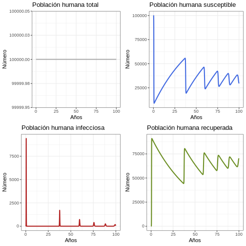
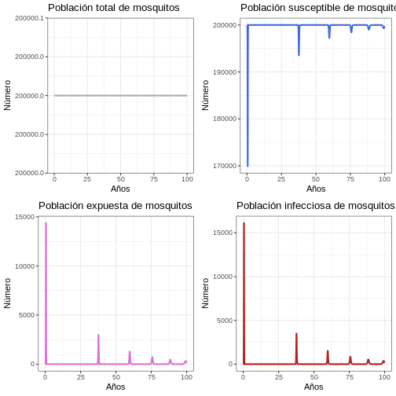
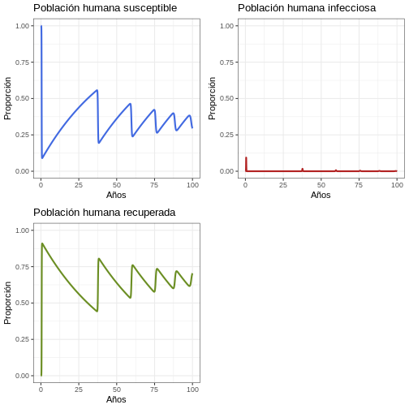
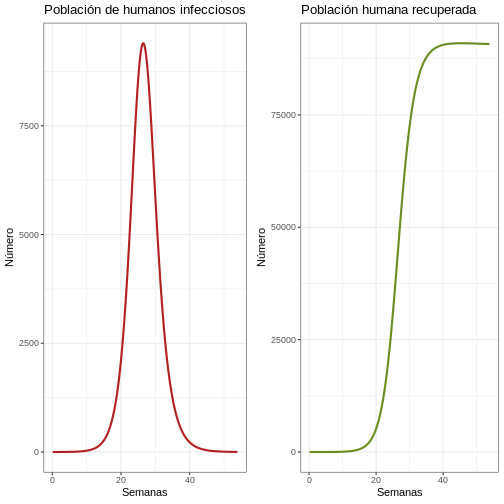

:::::::::::::::::::::::::::::::::::::: questions 

### Pregunta introductoria 

- ¿Cómo construir un modelo simplificado de zika?

::::::::::::::::::::::::::::::::::::::::::::::::

::::::::::::::::::::::::::::::::::::: objectives

# Objetivos 

Al final de este taller usted podrá:

-	Aplicar conceptos como parámetros, $R_0$ e inmunidad de rebaño, aprendidos en la sesión A del taller
- Traducir fórmulas matemáticas de las interacciones entre los parámetros del modelo a código de R
-	Realizar un modelo simple en R para una enfermedad transmitida por vector
-	Discutir cambios en las proyecciones del modelo cuando se instauran diferentes estrategias de control de la infección

::::::::::::::::::::::::::::::::::::::::::::::::


## 1. Introducción

En este taller usted aplicará los conceptos básicos del **modelamiento de Enfermedades Transmitidas por Vectores (ETV)** mediante el uso del lenguaje R con énfasis en el funcionamiento de los métodos, utilizando como ejemplo un modelo básico de infección por un arbovirus: el virus del Zika.

## 2. Agenda

-   Instrucciones (5 mins) 
-   Desarrollo taller Zika Parte B  (45 mins con acompañamiento de monitores) 
-   Revisión grupal del código (10 mins) 
-   Revisión de resultados (20 mins) 
-   Descanso (25 mins) 
-   Discusión  final (60 mins)


## 3. Conceptos básicos a desarrollar

En esta práctica se desarrollarán los siguientes conceptos:

-   Modelo SIR para ETV Zika
-   Parametrización de un modelo dinámico
-   Evaluación de un modelo dinámico
-   Parametrización de intervenciones de control (fumigación, mosquiteros y vacunación) para una ETV


## 4. Paquetes requeridos

Cargue los paquetes necesarios ingresando en R los siguientes comandos:


``` r
library(deSolve)   # Paquete deSolve para resolver las ecuaciones diferenciales
library(tidyverse) # Paquetes ggplot2 y dplyr de tidyverse
library(cowplot) # Paquete gridExtra para unir gráficos.
```

- Si desea puede tomar notas en el script de R, para esto se recomienda usar el símbolo de comentario _#_ después de cada línea de código (ver ejemplo arriba). O podría utilizar un archivo Rmd para tener un aspecto similar al del taller.

## 5. Compartimentos del modelo básico de Zika

- $S_h$ : Humanos susceptibles
- $I_h$ : Humanos infecciosos
- $R_h$ : Humanos recuperados de la infección (inmunizados frente a nueva infección)
- $S_v$ : Vectores susceptibles
- $E_v$ : Vectores expuestos
- $I_v$ : Vectores infecciosos   

## 6. Parámetros del modelo

Ahora se usarán los parámetros que discutimos en la parte A del taller. Si aún no los tiene, estos se pueden encontrar en la guía de aprendizaje de la parte A del taller.

::::::::::::::::::::::::::::::::::::: challenge  

## Desafío 1 
 
Busque los valores de los parámetros del modelo y diligéncielos en el recuadro de abajo. Tenga en cuenta que todos los parámetros usados tienen la misma unidad de tiempo (días).


``` r
Lv       <-        # Esperanza de vida de los mosquitos (en días)
Lh       <-        # Esperanza de vida de los humanos (en días)
PIh      <-        # Periodo infeccioso en humanos (en días)
PIv      <-        # Periodo infeccioso en vectores (en días)
PEI      <-        # Período extrínseco de incubación en mosquitos adultos (en días)
muv      <-        # Tasa per capita de mortalidad del vector (1/Lv)
muh      <-        # Tasa per capita de mortalidad del hospedador (1/Lh)
alphav   <-        # Tasa per capita de natalidad del vector
alphah   <-        # Tasa per capita de natalidad del hospedador
gamma    <-        # Tasa de recuperación en humanos (1/PIh)
delta    <-        # Tasa extrínseca de incubación (1/PEI)
ph       <-        # Probabilidad de transmisión del vector al hospedador dada una picadura por un mosquito infeccioso a un humano susceptible
pv       <-        # Probabilidad de transmisión del hospedador al vector dada una picadura por un mosquito susceptible a un humano infeccioso
Nh       <-        # Número de humanos
m        <-        # Densidad de mosquitos hembra por humano
Nv       <-        # Número de vectores (m * Nh)
R0       <-        # Número reproductivo básico
b        <-        sqrt((R0 * muv*(muv+delta) * (muh+gamma)) /
                   (m * ph * pv * delta)) # Tasa de picadura
betah    <-        # Coeficiente de transmisión del mosquito al humano
betav    <-        # Coeficiente de transmisión del humano al mosquito
TIME     <-        # Número de años que se va a simular 
```
:::::::::::::::::::::::::::::::::


:::::::::::::::::::::::::::::::::::::::::::::::::::::::::::::::::::: instructor

## Solución 1 
 

``` r
# Parámetros
ph       <- 0.7       # Probabilidad de transmisión del vector al hospedador dada una picadura por un mosquito infeccioso a un humano susceptible
pv       <- 0.7       # Probabilidad de transmisión del hospedador al vector dada una picadura por un mosquito susceptible a un humano infeccioso
Lv       <- 10        # Esperanza de vida de los mosquitos (en días)
Lh       <- 50 * 365  # Esperanza de vida de los humanos (en días)
Iph      <- 7         # Periodo infeccioso en humanos (en días)
IP       <- 6         # Periodo infeccioso en vectores (en días)
EIP      <- 8.4       # Período extrínseco de incubación en mosquitos adultos
muv      <- 1/Lv      # Tasa per capita de mortalidad del vector (1/Lv)
muh      <- 1/Lh      # Tasa per capita de mortalidad del hospedador (1/Lh)
alphav   <- muv       # Tasa per capita de natalidad del vector
alphah   <- muh       # Tasa per capita de natalidad del hospedador
gamma    <- 1/Iph     # Tasa de recuperación en humanos
delta    <- 1/EIP     # Tasa extrínseca de incubación


# Tamaño de la población
Nh       <- 100000   # Número de humanos
m        <- 2         # Proporción vector a humano
Nv       <- m * Nh    # Número de vectores
R0       <- 3         # Número reproductivo
b        <- sqrt((R0 * muv*(muv+delta) * (muh+gamma)) /
                   (m * ph * pv * delta)) # tasa de picadura

betah    <- ph*b     # Coeficiente de transmisión del mosquito al humano
betav    <- pv*b     # Coeficiente de transmisión del humano al mosquito

TIME     <- 100       # Número de años a simular

```

::::::::::::::::::::::::::::::::::::::::::::::::::::::::::::::::::::::::::::::::


## 7. Ecuaciones del modelo

Para este modelo emplearemos las siguientes ecuaciones diferenciales:

### 7.1 Humanos

$$\ \frac{dSh}{dt}  = \alpha_h N_h - \beta_h \frac {I_v}{N_h}S_h - \mu_h  S_h $$


$$\ \frac{dIh}{dt}  = \beta_h \frac {I_v}{N_h}S_h - (\gamma + \mu_h) I_h $$\

$$\ \frac{dRh}{dt}  = \gamma I_h  - \mu_h R_h$$

### 7.2 Vectores

$$\ \frac{dSv}{dt}  = \alpha_v N_v  - \beta_v \frac{ I_h} {N_h}S_v  - \mu_v Sv$$

$$\ \frac{dE_v}{dt}  = \beta_v \frac{I_h} {N_h}S_v- (\delta + \mu_v) Ev$$\


$$\ \frac{dI_v}{dt}  = \delta Ev - \mu_v I_v$$

## 8. Fórmula para calcular $R_0$ (Número reproductivo básico)

Fórmula necesaria para estimar $R_0$:

$$ R_0 = \frac{mb^2 p_h p_v \delta}{\mu_v (\mu_v+\delta)(\mu_h+\gamma)} $$


## 9. Modelo en R

Es hora de implementar el modelo en R. Para lograrlo, usaremos la función `ode` del paquete _desolve_. Para el ejercicio se emplearán 4 argumentos de la función esta función: el primero son las condiciones iniciales del modelo (argumento `y`); el segundo es la secuencia temporal donde se ejecutará el modelo (argumento `times`); el tercero es una función que contiene las ecuaciones diferenciales que entrarán al sistema (argumento `fun`); por último un vector que contiene los parámetros con los que se calculará el sistema (argumento `parms`). 


``` r
# NO la copie a R sólo tiene fines ilustrativos.
ode(y      = # Condiciones iniciales,
    times  = # Tiempo,
    fun    = # Modelo o función que lo contenga,
    parms  = # Parámetros
)
```

::::::::::::::::::::::::::::::::::::: challenge  


## Desafío 2 
 
En esta sección se empezará por crear la función (argumento `fun`), para ello es necesario traducir las ecuaciones del modelo a R. Abajo encontrará la función ya construida, por favor reemplace los parámetros faltantes (Cambie *PAR* por los parámetro correspondientes) en las  ecuaciones:


``` r
arbovmodel <- function(t, x, params) {
  
  Sh <- x[1]    # Humanos susceptibles
  Ih <- x[2]    # Humanos infecciosos 
  Rh <- x[3]    # Humanos recuperados
  Sv <- x[4]    # Vectores susceptibles
  Ev <- x[5]    # Vectores expuestos
  Iv <- x[6]    # Vectores infecciosos
  
  with(as.list(params), # entorno local para evaluar derivados
       {
         # Humanos
         dSh   <-  PAR * Nh - PAR * (Iv/Nh) * Sh - PAR * Sh   
         dIh   <-  PAR * (Iv/Nh) * Sh - (PAR + PAR) * Ih
         dRh   <-  PAR * Ih  - PAR * Rh
         
         # Vectores
         dSv  <-  alphav * Nv - PAR * (Ih/Nh) * Sv - PAR * Sv 
         dEv  <-  PAR * (Ih/Nh) * Sv - (PAR + PAR)* Ev
         dIv  <-  PAR * Ev - PAR * Iv
         
         dx   <- c(dSh, dIh, dRh, dSv, dEv, dIv)
         list(dx)
       }
  )
}
```
:::::::::::::::::::::::::::::::::

:::::::::::::::::::::::::::::::::::::::::::::::::::::::::::::::::::: instructor

## Solución 2 
 

``` r
arbovmodel <- function(t, x, params) {
  
  Sh <- x[1]    # Humanos susceptibles
  Ih <- x[2]    # Humanos infecciosos 
  Rh <- x[3]    # Humanos recuperados
  Sv <- x[4]    # Vectores susceptibles
  Ev <- x[5]    # Vectores expuestos
  Iv <- x[6]    # Vectores infecciosos
  
  with(as.list(params), # entorno local para evaluar derivados
       {
         # Humanos
         dSh   <-  alphah * Nh - betah * (Iv/Nh) * Sh - muh * Sh
         dIh   <-  betah * (Iv/Nh) * Sh  - (gamma + muh) * Ih
         dRh   <-  gamma * Ih  - muh * Rh
         
         # Vectores
         dSv   <-  alphav * Nv - betav * (Ih/Nh) * Sv - muv * Sv 
         dEv   <-  betav * (Ih/Nh) * Sv - (delta + muv)* Ev
         dIv   <-  delta * Ev - muv * Iv
         
         dx    <- c(dSh, dIh, dRh, dSv, dEv, dIv)
         list(dx)
       }
  )
}
```
::::::::::::::::::::::::::::::::::::::::::::::::::::::::::::::::::::::::::::::::

## 10. Resuelva el Sistema

En esta sección se crearán los tres argumentos faltantes para usar la función `ode` y se creará un objeto de clase `data.frame` con los resultados de la función `ode`. Por favor complete y comente el código para:

-   Los VALORES de las condiciones iniciales del sistema.

-   Los ARGUMENTOS de la función **`ode`** en el paquete **deSolve**.

::::::::::::::::::::::::::::::::::::: challenge   

## Desafío 3 
 

``` r
# Secuencia temporal (times)
times  <- seq(1, 365 * TIME , by = 1)
# Los parámetros (parms)
params <- c(
  muv      = muv,     
  muh      = muh, 
  alphav   = alphav,
  alphah   = alphah,
  gamma    = gamma,   
  delta    = delta,   
  betav    = betav,       
  betah    = betah,   
  Nh       = Nh,      
  Nv       = Nv
)
# Condiciones iniciales del sistema (y)
xstart <- c(Sh = VALOR?,        # COMPLETE Y COMENTE
            Ih = VALOR?,        # COMPLETE Y COMENTE
            Rh = VALOR?,        # COMPLETE Y COMENTE
            Sv = VALOR?,        # COMPLETE Y COMENTE
            Ev = VALOR?,        # COMPLETE Y COMENTE
            Iv = VALOR?)        # COMPLETE Y COMENTE
# Resuelva las ecuaciones
out <- as.data.frame(ode(y      = ARGUMENTO?,   # COMPLETE Y COMENTE
                         times  = ARGUMENTO?,   # COMPLETE Y COMENTE
                         fun    = ARGUMENTO?,   # COMPLETE Y COMENTE
                         parms  = ARGUMENTO?))  # COMPLETE Y COMENTE
```
:::::::::::::::::::::::::::::::::


:::::::::::::::::::::::::::::::::::::::::::::::::::::::::::::::::::: instructor
## Solución 3 
 

``` r
# ----------- Resuelva el modelo
#Tiempo
times  <- seq(1, 365 * TIME , by = 1)
# Especifique los parámetros
params <- c(
  muv      = muv,     
  muh      = muh, 
  alphav   = alphav,
  alphah   = alphah,
  gamma    = gamma,   
  delta    = delta,   
  betav    = betav,       
  betah    = betah,   
  Nh       = Nh,      
  Nv       = Nv
)
# Condiciones iniciales del sistema
xstart<- c(Sh = Nh ,      # Número inicial de Sh en T0
           Ih = 0,        # Número inicial de Ih en T0
           Rh = 0,        # Número inicial de Rh en T0
           Sv = Nv-1,     # Número inicial de Sv en T0
           Ev = 0,        # Número inicial de Ev en T0
           Iv = 1)        # Número inicial de Iv en TO
# Resuelva las ecuaciones
out <- as.data.frame(ode(y      = xstart,     # Condiciones iniciales
                         times  = times,      # Tiempo
                         fun    = arbovmodel, # Modelo
                         parms  = params))    # Parámetros
```
::::::::::::::::::::::::::::::::::::::::::::::::::::::::::::::::::::::::::::::::
 
## 11. Resultados 

::::::::::::::::::::::::::::::::::::: challenge 

## Desafío 4 
 

Para tener una visualización más significativa de los resultados, convierta las unidades de tiempo de *días* a *años* y a *semanas*.


``` r
# Cree las opciones de tiempo para años y semanas 
out$years <- 
out$weeks <- 
```
:::::::::::::::::::::::::::::::::

:::::::::::::::::::::::::::::::::::::::::::::::::::::::::::::::::::: instructor

## Solución 4 
 

``` r
# Cree las opciones de tiempo a mostrar 
out$years <- out$time / 365
out$weeks <- out$time / 7
```
::::::::::::::::::::::::::::::::::::::::::::::::::::::::::::::::::::::::::::::::

Observe el comportamiento del modelo en distintas escalas de tiempo (semanas y años):

### 11.1 Comportamiento General (Población humana) 
 

``` r
# Revise el comportamiento general del modelo para 100 años
p1h <- ggplot(data = out, aes(y = (Rh + Ih + Sh), x = years)) +
  geom_line(color = 'grey68', size = 1) +
  ggtitle('Población humana total') +
  theme_bw() + ylab('Número') + xlab('Años')
p2h <- ggplot(data = out, aes(y = Sh, x = years)) +
  geom_line(color = 'royalblue', size = 1) +
  ggtitle('Población humana susceptible') +
  theme_bw() + ylab('Número') + xlab('Años')
p3h <- ggplot(data = out, aes(y = Ih, x = years)) +
  geom_line(color = 'firebrick', size = 1) +
  ggtitle('Población humana infecciosa') +
  theme_bw() + ylab('Número') + xlab('Años')
p4h <- ggplot(data = out, aes(y = Rh, x = years)) +
  geom_line(color = 'olivedrab', size = 1) +
  ggtitle('Población humana recuperada') +
  theme_bw() + ylab('Número') + xlab('Años')
plot_grid(p1h, p2h, p3h, p4h, ncol = 2)
```



### 11.2 Comportamiento General (Población de vectores) 
 

``` r
# Revise el comportamiento general del modelo
p1v <- ggplot(data = out, aes(y = (Sv + Ev + Iv), x = years)) +
  geom_line(color = 'grey68', size = 1) +
  ggtitle('Población total de mosquitos') +
  theme_bw() + ylab('Número') + xlab('Años')
p2v <- ggplot(data = out, aes(y = Sv, x = years)) +
  geom_line(color = 'royalblue', size = 1) +
  ggtitle('Población susceptible de mosquitos') +
  theme_bw() + ylab('Número') + xlab('Años')
p3v <- ggplot(data = out, aes(y = Ev, x = years)) +
  geom_line(color = 'orchid', size = 1) +
  ggtitle('Población expuesta de mosquitos') +
  theme_bw() + ylab('Número') + xlab('Años')
p4v <- ggplot(data = out, aes(y = Iv, x = years)) +
  geom_line(color = 'firebrick', size = 1) +
  ggtitle('Población infecciosa de mosquitos') +
  theme_bw() + ylab('Número') + xlab('Años')
plot_grid(p1v, p2v, p3v, p4v, ncol = 2)
```



### 11.3 Proporción 
 
Por favor dé una mirada más cuidadosa a las proporciones y discútalas 
 

``` r
p1 <- ggplot(data = out, aes(y = Sh/(Sh+Ih+Rh), x = years)) +
  geom_line(color = 'royalblue', size = 1) +
  ggtitle('Población humana susceptible') +
  theme_bw() + ylab('Proporción') + xlab('Años') +
  coord_cartesian(ylim = c(0,1))
p2 <- ggplot(data = out, aes(y = Ih/(Sh+Ih+Rh), x = years)) +
  geom_line(color = 'firebrick', size = 1) +
  ggtitle('Población humana infecciosa') +
  theme_bw() + ylab('Proporción') + xlab('Años') +
  coord_cartesian(ylim = c(0,1))
p3 <- ggplot(data = out, aes(y = Rh/(Sh+Ih+Rh), x = years)) +
  geom_line(color = 'olivedrab', size = 1) +
  ggtitle('Población humana recuperada') +
  theme_bw() + ylab('Proporción') + xlab('Años') +
  coord_cartesian(ylim = c(0,1))
plot_grid(p1, p2, p3, ncol = 2) 
```



### 11.4 La primera epidemia 
 

``` r
# Revise la primera epidemia
dat <- out %>% filter(weeks < 54)
p1e <- ggplot(dat, aes(y = Ih, x = weeks)) +
  geom_line(color = 'firebrick', size = 1) +
  ggtitle('Población de humanos infecciosos') +
  theme_bw() + ylab('Número') + xlab('Semanas')
p2e <- ggplot(dat, aes(y = Rh, x = weeks)) +
  geom_line(color = 'olivedrab', size = 1) +
  ggtitle('Población humana recuperada') +
  theme_bw() + ylab('Número') + xlab('Semanas')
plot_grid(p1e, p2e)
```




### 11.5 Algunos aspectos por discutir 
 
-   ¿Qué tan sensible es el modelo a cambios en el $R_0$?
-   ¿Qué razones hay (según el modelo) para el intervalo de tiempo entre estas epidemias simuladas?
-   ¿Cómo se puede calcular la tasa de ataque?

### 11.6 Modele una o más intervenciones de control

Ahora, utilizando este modelo básico, modelar por grupos el impacto de las siguientes intervenciones:

1.  Grupo 1. Fumigación contra mosquitos
2.  Grupo 2. Mosquiteros/angeos
3.  Grupo 3. Vacunación que previene frente a infecciones

Para cada intervención: 

a) Indique en qué parte del modelo haría los cambios.

b) De acuerdo a la literatura que explique estas intervenciones y describa cómo parametrizará el modelo. ¿Todas estas intervenciones son viables en la actualidad? 


## Sobre este documento

### Contribuciones

-   Zulma Cucunuba & Pierre Nouvellet: Versión inicial
-   Kelly Charinga & Zhian N. Kamvar: Edición
-   José M. Velasco-España: Traducción de Inglés a Español y Edición
-   Andree Valle-Campos: Ediciones menores

Contribuciones son bienvenidas vía [pull requests](https://github.com/reconhub/learn/pulls). El archivo fuente del documento original puede ser encontrado [**aquí**](https://raw.githubusercontent.com/reconhub/learn/master/content/post/practical-vbd.Rmd).

### Asuntos legales

**Licencia**: [CC-BY](https://creativecommons.org/licenses/by/3.0/) **Copyright**: Zulma Cucunuba & Pierre Nouvellet, 2017

<!-- ## Referencias -->


::::::::::::::::::::::::::::::::::::: keypoints 

## Puntos clave 

Revise si al final de esta lección adquirió estas competencias:

-	Aplicar conceptos como parámetros, $R_0$ e inmunidad de rebaño, aprendidos en la sesión A del taller
- Traducir fórmulas matemáticas de las interacciones entre los parámetros del modelo a código de R
-	Realizar un modelo simple en R para una enfermedad transmitida por vector
-	Discutir cambios en las proyecciones del modelo cuando se instauran diferentes estrategias de control de la infección

::::::::::::::::::::::::::::::::::::::::::::::::
